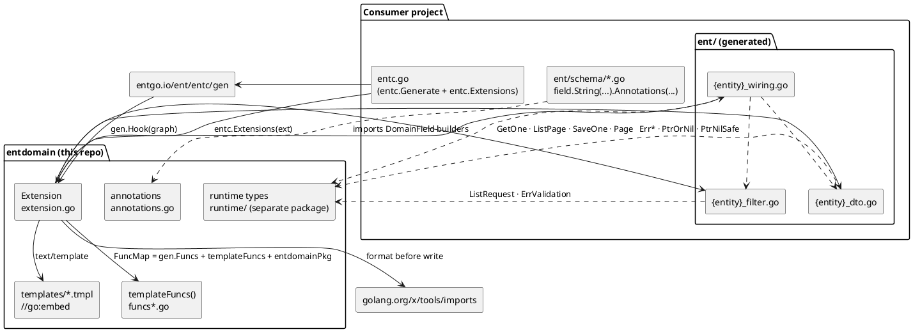
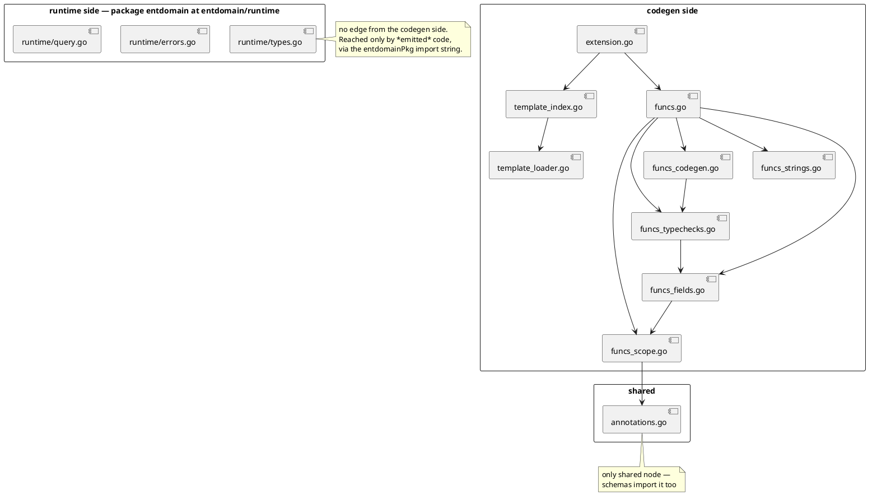
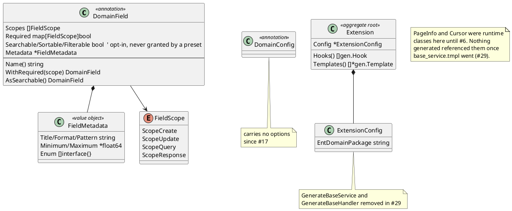
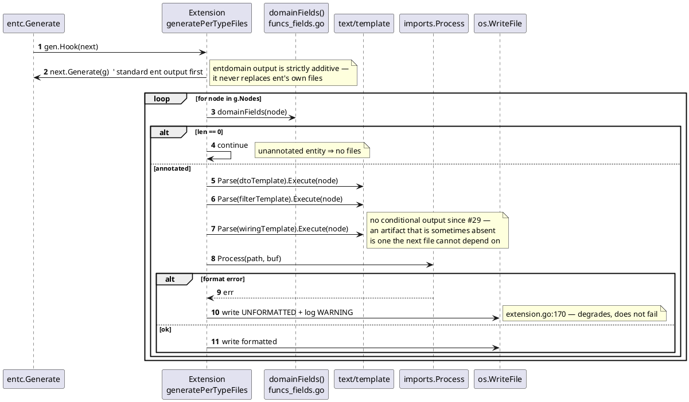
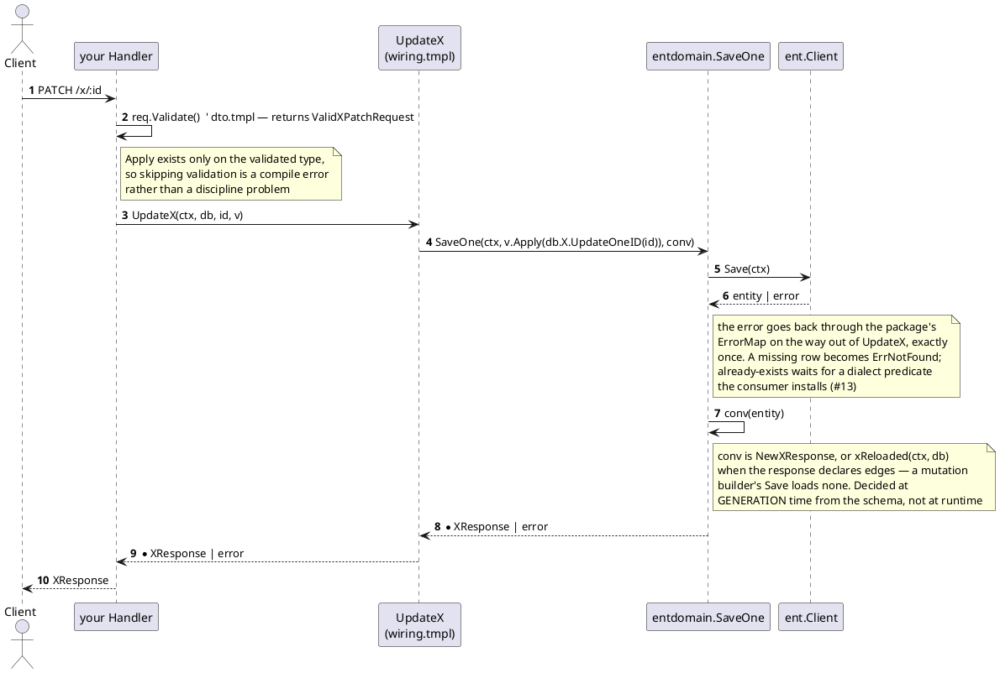

# EntDomain — Architecture

> Derived from source only (`git ls-files`, commit `7b7effe`). Where a prose doc in this repo contradicts the code, the code is recorded here and the discrepancy is listed in §7.

## 1. Project Overview

An [Ent](https://entgo.io) codegen extension: it reads `DomainField` and `DomainEdge` annotations off ent schema fields and edges and writes HTTP DTOs, a query surface, and one wiring function per operation into the consumer's `ent/` package.

| | |
|---|---|
| Language / toolchain | Go 1.23 (`go.mod` — `toolchain go1.23.3`) |
| Direct dependencies | `entgo.io/ent v0.14.4`, `golang.org/x/tools v0.30.0` (only for `imports.Process`) |
| Emitted code depends on | nothing beyond ent and this package. The identifier's import is derived per entity from `$.ID.Type` (`funcs_imports.go`); an `int` key needs none |
| Shape | one flat package, no `main`, no internal packages, no example app |
| Size | 1,541 LOC non-test Go · 3,186 LOC test Go · 664 lines of templates |
| Test coverage | 81.1% of statements (`go test -coverprofile`); suite is **red** — see §7 |
| Storage / deploy target | none — this is a library + codegen plugin |

## 2. Architecture Overview



The module has **two identities, and since #15 they are two packages**. `github.com/githonllc/entdomain` is the plugin `entc` loads at codegen time; `github.com/githonllc/entdomain/runtime` is the small library the emitted code links against (`entdomain.ErrNotFound`, `entdomain.Page`, `entdomain.PtrOrNil`) — same package NAME, so every call site is unchanged, different import path.

They shared one package until #15, and the cost was not stylistic: `template_index.go` declares package-level vars calling `mustLoadTemplate`, so a binary that imported the package for a sentinel error embedded five templates and ran the loader at init. `go list -deps` now reports 0 `entgo.io` packages for the runtime (62 total, all stdlib) against 15 for the generator, and `TestRuntimePackageIsGeneratorFree` holds it there — with a control that fails if the probe itself breaks, so it cannot decay into a vacuous absence check.

Two invariants carry the design:

- **Annotations are advisory to the HTTP layer only.** `annotations.go:3-7` and the header of `templates/dto.tmpl` both say it; the code enforces it structurally, because scopes are consumed *only* by the field-selection funcs that build request/response structs (`funcs_fields.go`). No generated function filters by scope — the wiring takes a `*Client` from the caller and can touch any column, which is why row-level visibility belongs in an ent interceptor rather than here.
- **Generation is per-`gen.Type`, keyed on annotation presence.** `extension.go:75` skips any node with zero `domainFields`, which is why unannotated entities in a mixed schema produce no files at all.

The extension deliberately does **not** use Ent's `GraphTemplate` mechanism: `Extension.Templates()` returns an empty slice (`extension.go:60`) and all output is written by one `gen.Hook`.

## 3. Module Breakdown & Boundaries

Modules are file-level, not directory-level — the whole thing is `package entdomain`.

| Module | Files | Responsibility | Public interface | Depends on |
|---|---|---|---|---|
| Extension | `extension.go` | hook registration, per-type render + write | `NewExtensionWithOptions`, `With*` options, `Extension` | templates, funcs, `x/tools/imports` |
| Template store | `template_loader.go`, `template_index.go`, `templates/*.tmpl` | embed + load templates at init | (unexported vars) | `embed` |
| Template funcs | `funcs.go` + `funcs_fields.go`, `funcs_scope.go`, `funcs_typechecks.go`, `funcs_codegen.go`, `funcs_strings.go` | the FuncMap templates call | `templateFuncs()` (unexported) | annotations, `gen` |
| Annotations | `annotations.go`, `annotations_edge.go`, `softdelete.go` | `DomainField`, `FieldScope`, fluent builders, `SoftDeleteMixin` | ~30 exported builders | `entgo.io/ent/schema` (mixin only) |
| Runtime (**separate package**, `runtime/`) | `runtime/types.go`, `runtime/errors.go`, `runtime/errors_map.go`, `runtime/query.go`, `runtime/filter.go`, `runtime/softdelete_context.go` | types the emitted code links against | `ListRequest`, `Page`, `ListPage`, `GetOne`, `SaveOne`, `Err*`, `Ptr*`, `With{Soft,Hard}Delete*` | stdlib only |



Boundary rules the code actually holds to:

- `getDomainFieldAnnotation` (`funcs_scope.go`) is the **single** reader of `field.Annotations["DomainField"]`; every other module goes through it. It exists because the annotation is a `*DomainField` during codegen but a `map[string]interface{}` when loaded from a serialized schema, and it normalizes both via a JSON round-trip.
- The codegen side never imports the runtime side. The coupling is a **string**: `WithEntDomainPackage` → `funcs["entdomainPkg"]` → the `import` line in the emitted file (`extension.go:190`). Renaming a runtime symbol therefore breaks consumers at *their* compile time, silently here.

No circular dependencies. One layering oddity is listed in §7.

## 4. Core Domain Model



Builders are **value receivers returning copies**, so chaining is the only usage that works:

```go
// annotations.go — DomainField.WithRequired
func (d DomainField) WithRequired(scope FieldScope) DomainField {
	if d.Required == nil {
		d.Required = make(map[FieldScope]bool)
	}
	d.Required[scope] = true
	return d
}
```

There is no persistence model. The "schema" this project owns is the shape of the emitted structs:

```go
// templates/dto.tmpl — {{ $.Name }}UpdateRequest (every field a pointer → true partial update)
type {{ $.Name }}UpdateRequest struct {
{{- range $f := $updateFields }}
	{{ $f.StructField }} *{{ $f.Type }} `json:"{{ $f.StorageKey }},omitempty"`
{{- end }}
}
```

```go
// templates/dto.tmpl — {{ $.Name }}ListResponse (the same four fields as entdomain.Page)
type {{ $.Name }}ListResponse struct {
	Data  []*{{ $.Name }}Response  `json:"data"`
	Total int                      `json:"total"`
	Page  int                      `json:"page"`
	Size  int                      `json:"size"`
}
```

## 5. Key Flows

### 5.1 Generation



Templates are loaded at **package init**, not at generation time:

```go
// template_index.go
var dtoTemplate = mustLoadTemplate("dto")
var filterTemplate = mustLoadTemplate("filter")
var wiringTemplate = mustLoadTemplate("wiring")
```

`mustLoadTemplate` panics on a missing file (`template_loader.go`), so a renamed or deleted `.tmpl` fails on *import* of the package, not when someone runs `go generate`.

### 5.2 The emitted request path (what consumers run)



There is no hook indirection any more, and no override points. A consumer who
needs different behaviour writes their own function and stops calling the
generated one — the operations they did not replace keep working, because
nothing is registered anywhere. `internal/fixtures/wiring/e2e` asserts exactly
that, alongside the behaviour of every generated operation against SQLite.

What went with the base service (#29): `SetSelf` dispatch, whose every failure
mode was silent; the `uuid.UUID` hardcoding; the convention-based soft delete,
which was write-only and disabled downstream delete hooks; and
`XEntToResponse`, which swallowed the not-loaded-edge error and returned nil.

## 6. Design & Conventions

| Convention | Evidence |
|---|---|
| Functional options over config structs | `extension.go` — `Option func(*ExtensionConfig)`, `NewExtensionWithOptions(opts ...Option)` |
| Fluent immutable builders | `annotations.go` — every `With*`/`As*` has a value receiver returning `DomainField` |
| Sentinel errors + `Is*` predicates, never string matching | `runtime/errors.go` — `ErrNotFound` + `IsNotFound(err) { return errors.Is(...) }` |
| Errors wrapped with `%w` at the generated boundary | `dto.tmpl` — `fmt.Errorf("%w: %s is required", entdomain.ErrValidation, …)` in the generated `Validate()`. `wiring.tmpl` — every exported operation returns through `ErrorMap.MapError`, declared once per package by `errors.tmpl` (#13) |
| Codegen helpers split by concern, registered in one map | `funcs.go` — the registry is the only thing templates can see |
| Test fixtures built by hand, never from a live schema | `test_helpers_test.go` — `newStringField`, `newTestType`, `assertContains` |
| Emitted code asserts on substrings, not compilation | `funcs_codegen_test.go` — `TestFieldPredicate_*` |

Cross-cutting concerns are mostly *absent by design* — no logging (one `log.Printf` in `writeFile`), no auth, no caching, no concurrency. `.claude/skills/entdomain/SKILL.md` describes tenant and soft-delete interceptors; those live in a **consumer** project (`internal/database/`), not here.

Soft delete is annotation-detected, and lives at ent's interceptor layer rather than in generated code at all (#18). `entdomain.SoftDeleteMixin` (`softdelete.go`) declares the `deleted_at` field plus a `DomainSoftDelete` marker; ent merges a mixin's annotations into the schema's own (`entc/load/schema.go:314`), so embedding the mixin is what makes `isSoftDeletable` true:

```go
// funcs_softdelete.go — isSoftDeletable
return softDeleteAnnotation(node) != nil
```

It replaced a convention: a field literally named `deleted_at` used to make the generated service write a tombstone itself. That convention could not tell an entity opting in from one that merely owns a column with that name, and it only ever reached the write path, so reads still returned tombstoned rows. Its host went with the base service (#29), and the wiring's `DeleteX` / `DeleteBatchXs` now issue ordinary ent deletes (`OpDeleteOne` / `OpDelete`) for the hook to rewrite.

The convention it replaced (`hasSoftDelete`: a `Nillable` `time.Time` field literally named `deleted_at`) could not tell an entity that opted in from one that merely owned a column with that name. `templates/softdelete.tmpl` is one of the two templates rendered over a `*gen.Graph` rather than a `*gen.Type` (the other is `templates/errors.tmpl`): it emits one type switch for the whole schema, plus the `RegisterSoftDelete` line a consumer calls.

Enum predicates need two branches because Go type assertions do not match underlying types — the comment in `funcs_codegen.go:187` records the reasoning, and the emitted code tries `person.Gender` before falling back to `string`.

## 7. Onboarding Guide

### Adding a field capability end to end

`.AsSearchable()` is the worked example, because it was the standing case of an
annotation that was stored and ignored, and #27 is the commit that changed that.
The route it took is the route any new field capability takes:

1. `annotations.go` — field already exists on `DomainField`; no change. (A genuinely new knob is added here, and `TestEveryAnnotationKnobIsConsumedOrDeclaredPending` fails until it is either consumed or declared pending with an issue.)
2. `funcs_filter.go` — a selector or predicate reading it, next to `queryFields`.
3. `funcs.go` — register it in `templateFuncs()`. **A helper in `funcs_*.go` is invisible to templates unless it is there** — and one registered but invoked by no template fails `TestTemplateInvocationsAreRegistered`, so the registration and the template edit are one commit.
4. `templates/*.tmpl` — a field-shaped capability usually lands in two places (the struct and the code that reads it); both must agree or the emitted file will not compile. Declare the imports the new output uses: `TestTemplatesDeclareTheirImports` fails if goimports has to add or remove one.
5. `schema_conflicts.go` — if the knob can contradict the ent schema, refuse there rather than emitting a call ent never wrote.
6. `funcs_filter_test.go` — table test with `newStringField("x", ptr(DefaultField().AsSearchable()))`.
7. Add or extend a fixture under `internal/fixtures/` — `TestCodegenFixtures` is the only thing here that compiles emitted output.

### Reading order

1. `doc.go` — the two-role framing
2. `extension.go` — `generatePerTypeFiles`, then `writeFile`, then `templateFuncMap`
3. `annotations.go` — `FieldScope`, `DomainField`, the preset builders
4. `templates/dto.tmpl` — the smallest complete output
5. `funcs_fields.go` — how scopes become struct fields
6. `funcs_scope.go` — `getDomainFieldAnnotation`, the dual-format gate
7. `funcs_filter.go` + `templates/filter.tmpl` — how the query markers become filter parameters and a sort allow-list
8. `templates/wiring.tmpl` — one free function per operation, and the comments explaining why each body is a single call
9. `runtime/query.go` — `GetOne`, `ListPage`, `SaveOne`: the generic half the wiring calls
10. `funcs_softdelete.go` + `templates/softdelete.tmpl` — a graph-level generator, and the feature with its own behavioural proof (`internal/softdeleteproof`)
11. `runtime/errors_map.go` + `templates/errors.tmpl` — the other graph-level generator: why the runtime takes predicates as function values, and why uniqueness is a third one the consumer installs
11. `funcs_imports.go` — how each template declares its own imports, including the identifier's
12. `funcs_codegen.go` — `fieldValueExpr`, the whole file since #7

### Risk areas & discrepancies

| Finding | Evidence | Impact |
|---|---|---|
| ~~`cursor.go` is orphaned from generated code~~ **resolved (#6)** | `cursor.go` and `cursor_test.go` deleted; `ListRequest.Cursor` and the `PageInfo` field in `{Entity}ListResponse` removed with them | pagination is offset-only in the published API as well as in generated code. `TestCursorSymbolsStayOutOfThePackage` and `TestNoTemplateEmitsCursorMetadata` pin it |
| **`{Entity}ListResponse` is emitted but unused** | `dto.tmpl`; the wiring returns `entdomain.Page[…]` instead | two list-response shapes ship, only one of which any generated function produces |
| Formatting failure is non-fatal | `extension.go:170` logs a warning and writes unformatted source | a broken template yields a broken-but-written `.go` file |

The declared-only surface is no longer established by grepping. `TestEveryAnnotationKnobIsConsumedOrDeclaredPending` (`annotation_surface_test.go`) derives every exported knob by reflection over `DomainField`, `FieldMetadata`, `DomainEdge`, `DomainConfig` and the scope vocabulary, then decides reachability by toggling each and asking whether any *registered* template function returns anything different. 20 of the 27 knobs change nothing. The seven that reach generation are `DomainField.Scopes`, `DomainField.Required`, `DomainEdge.Scopes`, `DomainEdge.JSONKey`, `ScopeCreate`, `ScopeUpdate` and `ScopeResponse`.

Each of the 20 carries a written pending status naming an issue, and the test fails in both directions — an unlisted dead knob and a listed knob that has come alive both break the build. #17 deleted `UniqueLookup`/`RangeLookup` (redundant with the operator table #27 derives from ent's `$field.Ops`) and `DomainConfig.EntityName` (no reader, no successor); `FieldMetadata` stayed, because `annotations.go:44` labels it RESERVED for spec generation, which is a stated forward contract rather than an unfalsifiable promise. `Sensitive` was a third shape again — a security promise in its godoc — so #3 deleted it outright.

⚠️ Needs verification: everything about *emitted* code in §5.2 and §4 is read off the templates, not off compiled output — this repo contains no ent project, so no generated file was ever compiled during this analysis.
