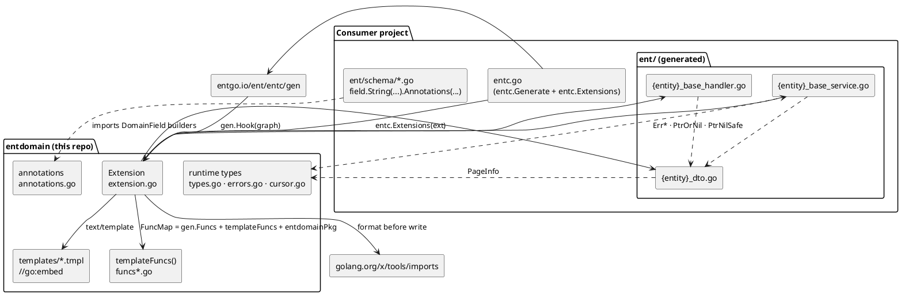
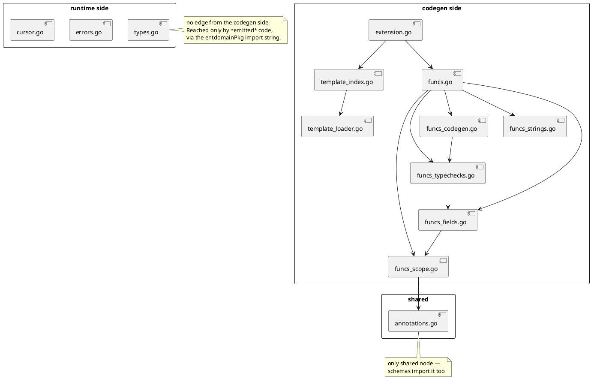
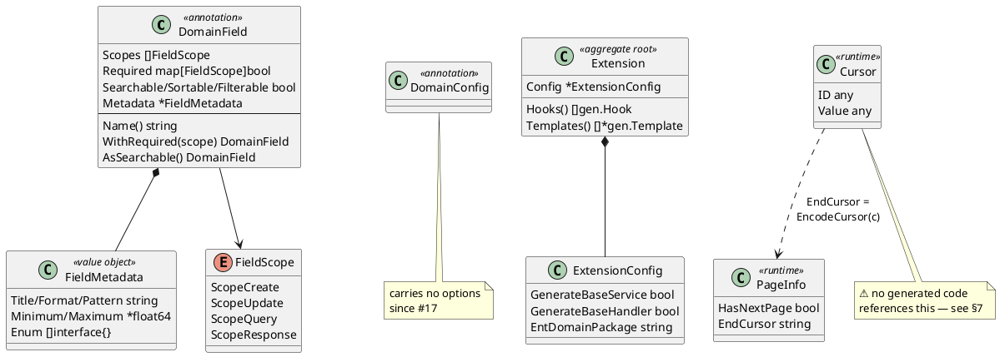
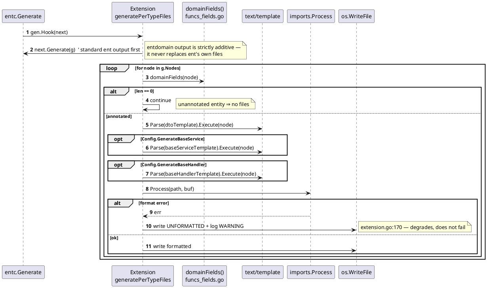
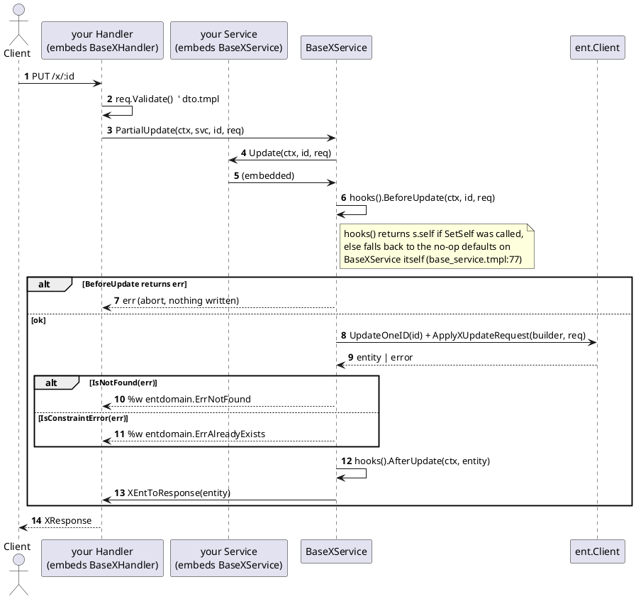

# EntDomain — Architecture

> Derived from source only (`git ls-files`, commit `7b7effe`). Where a prose doc in this repo contradicts the code, the code is recorded here and the discrepancy is listed in §7.

## 1. Project Overview

An [Ent](https://entgo.io) codegen extension: it reads `DomainField` annotations off ent schema fields and writes HTTP DTOs, a CRUD service with hooks, and a response-conversion handler into the consumer's `ent/` package.

| | |
|---|---|
| Language / toolchain | Go 1.23 (`go.mod` — `toolchain go1.23.3`) |
| Direct dependencies | `entgo.io/ent v0.14.4`, `golang.org/x/tools v0.30.0` (only for `imports.Process`) |
| Emitted code depends on | `github.com/google/uuid` (hardcoded in `templates/base_service.tmpl:17`) |
| Shape | one flat package, no `main`, no internal packages, no example app |
| Size | 1,541 LOC non-test Go · 3,186 LOC test Go · 664 lines of templates |
| Test coverage | 81.1% of statements (`go test -coverprofile`); suite is **red** — see §7 |
| Storage / deploy target | none — this is a library + codegen plugin |

## 2. Architecture Overview



The package has **two runtime identities that share one import path**. At codegen time it is a plugin loaded by `entc`; at application runtime it is the small library the emitted code links against (`entdomain.ErrNotFound`, `entdomain.PageInfo`, `entdomain.PtrOrNil`). `doc.go` states this explicitly, and the code confirms it: nothing in `extension.go` is reachable from a running server, and nothing in `errors.go`/`types.go` is reachable from codegen.

Two invariants carry the design:

- **Annotations are advisory to the HTTP layer only.** `annotations.go:3-7` and the header of `templates/dto.tmpl` both say it; the code enforces it structurally, because scopes are consumed *only* by the field-selection funcs that build request/response structs (`funcs_fields.go`). No generated service method filters by scope — `Base{Entity}Service` holds a raw `*Client` and can touch any column.
- **Generation is per-`gen.Type`, keyed on annotation presence.** `extension.go:75` skips any node with zero `domainFields`, which is why unannotated entities in a mixed schema produce no files at all.

The extension deliberately does **not** use Ent's `GraphTemplate` mechanism: `Extension.Templates()` returns an empty slice (`extension.go:60`) and all output is written by one `gen.Hook`.

## 3. Module Breakdown & Boundaries

Modules are file-level, not directory-level — the whole thing is `package entdomain`.

| Module | Files | Responsibility | Public interface | Depends on |
|---|---|---|---|---|
| Extension | `extension.go` | hook registration, per-type render + write | `NewExtensionWithOptions`, `With*` options, `Extension` | templates, funcs, `x/tools/imports` |
| Template store | `template_loader.go`, `template_index.go`, `templates/*.tmpl` | embed + load templates at init | (unexported vars) | `embed` |
| Template funcs | `funcs.go` + `funcs_fields.go`, `funcs_scope.go`, `funcs_typechecks.go`, `funcs_codegen.go`, `funcs_strings.go` | the FuncMap templates call | `templateFuncs()` (unexported) | annotations, `gen` |
| Annotations | `annotations.go` | `DomainField`, `FieldScope`, fluent builders | ~30 exported builders | — |
| Runtime | `types.go`, `errors.go`, `cursor.go` | types the emitted code links against | `ListRequest`, `PageInfo`, `Cursor`, `Err*`, `Ptr*` | stdlib only |



Boundary rules the code actually holds to:

- `getDomainFieldAnnotation` (`funcs_scope.go`) is the **single** reader of `field.Annotations["DomainField"]`; every other module goes through it. It exists because the annotation is a `*DomainField` during codegen but a `map[string]interface{}` when loaded from a serialized schema, and it normalizes both via a JSON round-trip.
- The codegen side never imports the runtime side. The coupling is a **string**: `WithEntDomainPackage` → `funcs["entdomainPkg"]` → the `import` line in the emitted file (`extension.go:190`). Renaming a runtime symbol therefore breaks consumers at *their* compile time, silently here.

No circular dependencies. One layering oddity is listed in §7.

## 4. Core Domain Model



Builders are **value receivers returning copies**, so chaining is the only usage that works:

```go
// annotations.go — DomainField.WithRequired
func (d DomainField) WithRequired(scope FieldScope) DomainField {
	if d.Required == nil {
		d.Required = make(map[FieldScope]bool)
	}
	d.Required[scope] = true
	return d
}
```

There is no persistence model. The "schema" this project owns is the shape of the emitted structs:

```go
// templates/dto.tmpl — {{ $.Name }}UpdateRequest (every field a pointer → true partial update)
type {{ $.Name }}UpdateRequest struct {
{{- range $f := $updateFields }}
	{{ $f.StructField }} *{{ $f.Type }} `json:"{{ $f.StorageKey }},omitempty"`
{{- end }}
}
```

```go
// templates/dto.tmpl — {{ $.Name }}ListResponse (only place PageInfo is emitted)
type {{ $.Name }}ListResponse struct {
	Data     []*{{ $.Name }}Response  `json:"data"`
	Total    int                      `json:"total"`
	Page     int                      `json:"page"`
	Size     int                      `json:"size"`
	PageInfo *entdomain.PageInfo      `json:"pageInfo,omitempty"`
}
```

## 5. Key Flows

### 5.1 Generation



Templates are loaded at **package init**, not at generation time:

```go
// template_index.go
var dtoTemplate = mustLoadTemplate("dto")
var baseServiceTemplate = mustLoadTemplate("base_service")
var baseHandlerTemplate = mustLoadTemplate("base_handler")
```

`mustLoadTemplate` panics on a missing file (`template_loader.go`), so a renamed or deleted `.tmpl` fails on *import* of the package, not when someone runs `go generate`.

### 5.2 The emitted request path (what consumers run)



The hook indirection is the one genuinely clever mechanism, and it is four lines:

```go
// templates/base_service.tmpl — Base{{ $.Name }}Service.hooks()
func (s *Base{{ $.Name }}Service) hooks() Base{{ $.Name }}ServiceHooks {
	if s.self != nil {
		return s.self
	}
	return s
}
```

The base struct satisfies its own hook interface with no-ops, so `SetSelf` is optional and forgetting it degrades to "no hooks" instead of a nil panic — but also silently, which is the trade-off.

Two deliberate holes, both documented in the template: `DeleteBatch` skips Before/After hooks entirely (`base_service.tmpl:198`), and `ListWithCursor` orders by ID only.

## 6. Design & Conventions

| Convention | Evidence |
|---|---|
| Functional options over config structs | `extension.go` — `Option func(*ExtensionConfig)`, `NewExtensionWithOptions(opts ...Option)` |
| Fluent immutable builders | `annotations.go` — every `With*`/`As*` has a value receiver returning `DomainField` |
| Sentinel errors + `Is*` predicates, never string matching | `errors.go` — `ErrNotFound` + `IsNotFound(err) { return errors.Is(...) }` |
| Errors wrapped with `%w` at the generated boundary | `base_service.tmpl:141` — `fmt.Errorf("%w: %v", entdomain.ErrAlreadyExists, err)` |
| Codegen helpers split by concern, registered in one map | `funcs.go` — the registry is the only thing templates can see |
| Test fixtures built by hand, never from a live schema | `test_helpers_test.go` — `newStringField`, `newTestType`, `assertContains` |
| Emitted code asserts on substrings, not compilation | `funcs_codegen_test.go` — `TestFieldPredicate_*` |

Cross-cutting concerns are mostly *absent by design* — no logging (one `log.Printf` in `writeFile`), no auth, no caching, no concurrency. `.claude/skills/entdomain/SKILL.md` describes tenant and soft-delete interceptors; those live in a **consumer** project (`internal/database/`), not here.

Soft delete is convention-detected, not annotated:

```go
// funcs_typechecks.go — hasSoftDelete
if field.Name == "deleted_at" && isTimeField(field) && field.Nillable {
```

Enum predicates need two branches because Go type assertions do not match underlying types — the comment in `funcs_codegen.go:187` records the reasoning, and the emitted code tries `person.Gender` before falling back to `string`.

## 7. Onboarding Guide

### Adding a field capability end to end

Say you want `.AsSearchable()` to actually reach the generated code (today it is stored and ignored):

1. `annotations.go` — field already exists on `DomainField`; no change.
2. `funcs_fields.go` — a new selector reading it, next to `responseFields`.
3. `funcs.go` — register the selector in `templateFuncs()`. **A helper in `funcs_*.go` is invisible to templates unless it is there** — and one registered but invoked by no template fails `TestTemplateInvocationsAreRegistered`, so the registration and the template edit are one commit.
4. `templates/dto.tmpl` + `templates/base_service.tmpl` — a field-shaped capability usually lands in two places (the struct and its converter); both must agree or the emitted file will not compile.
5. `funcs_fields_test.go` — table test with `newStringField("x", ptr(DefaultField()))`.
6. Add or extend a fixture under `internal/fixtures/` — `TestCodegenFixtures` is the only thing here that compiles emitted output.

### Reading order

1. `doc.go` — the two-role framing
2. `extension.go` — `generatePerTypeFiles`, then `writeFile`, then `templateFuncMap`
3. `annotations.go` — `FieldScope`, `DomainField`, the preset builders
4. `templates/dto.tmpl` — the smallest complete output
5. `funcs_fields.go` — how scopes become struct fields
6. `funcs_scope.go` — `getDomainFieldAnnotation`, the dual-format gate
7. `templates/base_service.tmpl` — hooks, CRUD, `Apply*Request`, `EntToResponse`
8. `funcs_typechecks.go` — the conventions (`deleted_at`, UUID, complex types)
9. `templates/base_handler.tmpl` — 60 lines, the whole handler contract
10. `funcs_codegen.go` — `setFieldCallReq`, the whole file since #7

### Risk areas & discrepancies

| Finding | Evidence | Impact |
|---|---|---|
| **`cursor.go` is orphaned from generated code** | `ListWithCursor` does `uuid.Parse(cursor)` and returns `entity.ID.String()` (`base_service.tmpl:223,248`); `EncodeCursor`/`DecodeCursor`/`Cursor` appear in no template | two incompatible cursor formats ship in one package; `ListRequest.Cursor` documents the base64 one |
| **`ListRequest` is never emitted** | no template references it | consumers must wire pagination input themselves |
| **BaseService is UUID-only** | `uuid.UUID` hardcoded in every hook and CRUD signature (`base_service.tmpl`) | int/string primary keys are now refused at generation time by `unsupportedIDType` (`schema_conflicts.go`) instead of producing uncompilable services; widening the set is #29 |
| Formatting failure is non-fatal | `extension.go:170` logs a warning and writes unformatted source | a broken template yields a broken-but-written `.go` file |

The declared-only surface is no longer established by grepping. `TestEveryAnnotationKnobIsConsumedOrDeclaredPending` (`annotation_surface_test.go`) derives every exported knob by reflection over `DomainField`, `FieldMetadata`, `DomainEdge`, `DomainConfig` and the scope vocabulary, then decides reachability by toggling each and asking whether any *registered* template function returns anything different. 20 of the 27 knobs change nothing. The seven that reach generation are `DomainField.Scopes`, `DomainField.Required`, `DomainEdge.Scopes`, `DomainEdge.JSONKey`, `ScopeCreate`, `ScopeUpdate` and `ScopeResponse`.

Each of the 20 carries a written pending status naming an issue, and the test fails in both directions — an unlisted dead knob and a listed knob that has come alive both break the build. #17 deleted `UniqueLookup`/`RangeLookup` (redundant with the operator table #27 derives from ent's `$field.Ops`) and `DomainConfig.EntityName` (no reader, no successor); `FieldMetadata` stayed, because `annotations.go:44` labels it RESERVED for spec generation, which is a stated forward contract rather than an unfalsifiable promise. `Sensitive` was a third shape again — a security promise in its godoc — so #3 deleted it outright.

⚠️ Needs verification: everything about *emitted* code in §5.2 and §4 is read off the templates, not off compiled output — this repo contains no ent project, so no generated file was ever compiled during this analysis.
