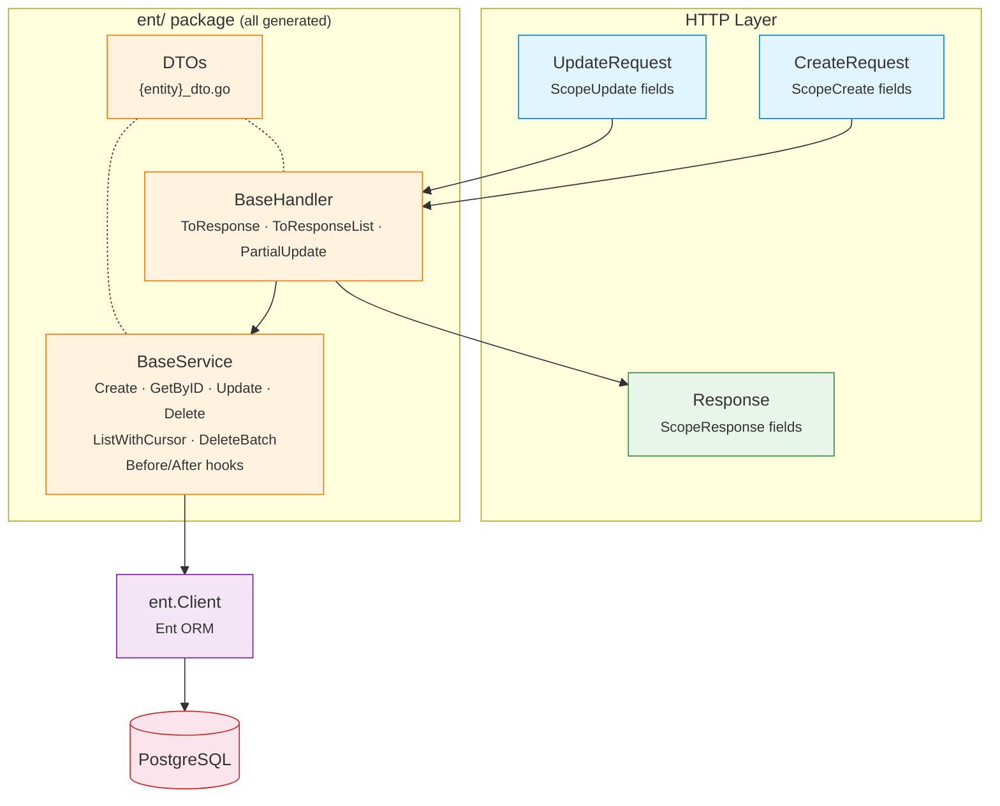

# EntDomain

[](https://pkg.go.dev/github.com/githonllc/entdomain)
[](https://goreportcard.com/report/github.com/githonllc/entdomain)
[](https://opensource.org/licenses/MIT)

An [Ent](https://entgo.io) extension that generates HTTP request/response DTOs, base service structs, and base handler structs from annotated schemas.


> ### Status: prototype under redesign
>
> This library works, but its shape is being reconsidered. The direction is settled and
> **no part of it is implemented yet** — what is documented below is what exists today,
> not what is planned.
>
> - **Direction and rationale** — [`DESIGN-v2.md`](DESIGN-v2.md). It also records the
>   claims its own first draft got wrong, because knowing which intuitions fail in this
>   codebase is design material.
> - **Known defects** — [`QUALITY-REVIEW.md`](QUALITY-REVIEW.md), 41 findings from three
>   independent reviews.
> - **How it fits together** — [`ARCHITECTURE.md`](ARCHITECTURE.md).
> - **Work items** — epic [#23](https://github.com/githonllc/entdomain/issues/23).
>
> Read [Known limitations](#known-limitations) before adopting this. Some of them are
> traps rather than gaps, and one annotation documents a guarantee it does not provide.
>
> `go test ./...` is **red on a clean checkout** ([#2](https://github.com/githonllc/entdomain/issues/2)).

## Features

- **Annotation-driven** — mark field scopes with concise builders (`DefaultField`, `InputOnlyField`, `OutputOnlyField`, etc.)
- **HTTP DTOs** — generates `CreateRequest`, `UpdateRequest`, `Response`, `ListResponse` per entity
- **BaseService** — CRUD operations with Before/After hooks, builder helpers, and entity→response conversion
- **BaseHandler** — response conversion helpers and partial update support
- **Soft-delete detection** — automatically generates `UpdateOneID().SetDeletedAt(now)` for entities with a `deleted_at` field
- **Cursor pagination** — ID-based keyset pagination in BaseService
- **Source provenance** — generated files include schema name, template path, and regeneration command

## Requirements

- Go 1.23+
- [Ent](https://entgo.io) v0.14+

## Installation

```bash
go get github.com/githonllc/entdomain
```

## Setup

Wire the extension in your `entc.go`:

```go
//go:build ignore

package main

import (
    "log"

    "entgo.io/ent/entc"
    "entgo.io/ent/entc/gen"
    "github.com/githonllc/entdomain"
)

func main() {
    ext := entdomain.NewExtensionWithOptions(
        entdomain.WithEntDomainPackage("github.com/githonllc/entdomain"),
        entdomain.WithBaseService(true),
        entdomain.WithBaseHandler(true),
    )

    if err := entc.Generate("./schema", &gen.Config{
        Target:  "../ent",
        Package: "your/module/ent",
    }, entc.Extensions(ext)); err != nil {
        log.Fatal(err)
    }
}
```

Then run:

```bash
go generate ./...
```

## Annotation Builders

### Base Builders

```go
entdomain.DefaultField()                      // create, update, query, response
                                              // also marks the field searchable, filterable and sortable
entdomain.InputOnlyField()                    // create + update only (e.g., password)
entdomain.OutputOnlyField()                   // response only (e.g., timestamps, state)
entdomain.CreateOnlyField()                   // create + response (immutable after creation)
entdomain.NewDomainField()                    // no scopes (tracked by ent but not in any HTTP struct)
entdomain.DomainFieldWithScopes(scopes...)    // custom scope combination
```

### Fluent Builder API

```go
field.String("email").
    Annotations(
        entdomain.DefaultField().
            WithRequired(entdomain.ScopeCreate),
    )
```

### Migrating from `AsSensitive()`

**Security-relevant.** `DomainField.Sensitive` and `AsSensitive()` **have been
removed.** They never did anything: response field selection reads the scope
list and nothing else, so a field marked sensitive was emitted into the
generated `Response` struct and serialised to JSON like any other field. If you
called `AsSensitive()` on a field that also carried `ScopeResponse` — which
`DefaultField()` grants — that field has been in your API responses all along.
**Audit your responses for it; removing the call changes no behaviour, because
there was none.**

```go
// before — compiles, promises nothing, leaks
field.String("password").
    Annotations(entdomain.DefaultField().AsSensitive())

// after — the scope list is the mechanism, and it is enforced
field.String("password").
    Annotations(entdomain.InputOnlyField())
```

`InputOnlyField()` grants `ScopeCreate` and `ScopeUpdate` only. Withholding
`ScopeResponse` is what keeps a field out of the response, and it is the only
thing that ever did. Any custom combination works the same way:
`entdomain.DomainFieldWithScopes(entdomain.ScopeCreate)`.

The marker was removed rather than implemented because in a one-dimensional
scope model it adds a promise without adding a capability. The one meaning it
could carry that scopes cannot — visible to some callers but not others — needs
an audience dimension this package does not have
([#3](https://github.com/githonllc/entdomain/issues/3)).

### Edge Annotations

Edges carry their own annotation. Exposure used to be derived from the edge's
foreign-key field, which conflated two different decisions — "put `author_id` in
the response" and "put a nested `author` object in the response" — and made
exposure depend on which table holds the column. A to-many edge has no field on
this entity at all, so under that rule it could never be exposed.

```go
entdomain.Edge()                       // no scopes
entdomain.Edge().InResponse()          // the nested object appears in Response
entdomain.Edge().InResponse().As("written_by")  // override the JSON key
```

```go
func (Post) Edges() []ent.Edge {
    return []ent.Edge{
        // author_id (the scalar) is controlled by the field annotation;
        // author (the nested object) by this one. They are independent.
        edge.From("author", User.Type).
            Ref("posts").Unique().Required().Field("author_id").
            Annotations(entdomain.Edge().InResponse()),
    }
}
```

Like the field builders, every edge builder takes a value receiver and returns a
copy, so a partially configured annotation is safe to reuse as a base.

> **Trap, now refused.** Declaring a self-referential pair in the chained form
> `edge.To("children", X.Type).From("parent")...Annotations(a)` attaches the
> annotation to the **inverse edge only**. The assoc edge is left bare — which
> is also how you say *do not expose this* — so `children` used to vanish from
> the response and the eager-load plan with no message anywhere.
>
> A self-referential pair annotated on **one end only** is now a generation
> error naming both ends and the fix. Declare the two edges separately and
> annotate each:
>
> ```go
> edge.To("children", X.Type).
>     Annotations(entdomain.Edge().InResponse()),
> edge.From("parent", X.Type).Ref("children").Unique().Field("parent_id").
>     Annotations(entdomain.Edge().InResponse()),
> ```
>
> To expose **one end only on purpose**, annotate the other end with a bare
> `entdomain.Edge()`. It grants no scope, so the output is identical to leaving
> it unannotated; what it adds is that the decision is written down, which is
> what tells it apart from the end the chained form forgets.
>
> The check is confined to pairs whose two ends sit in one `Edges()` slice —
> only a self-referential pair can. Across two entities, exposing one direction
> only is the ordinary case and is never refused.

## Runtime: generic CRUD

The algorithms every entity shares are written once in Go rather than once per
entity in a template. The entity-specific parts arrive as type parameters and
function values, so **this half imports no ent package** and the identifier type
is not hardcoded.

```go
// Query is the subset of an ent query builder pagination needs. Q is
// self-referential because ent's chainable methods return the concrete builder.
type Query[Q, P, O, E any] interface {
    Where(...P) Q
    Order(...O) Q
    Limit(int) Q
    Offset(int) Q
    All(context.Context) ([]*E, error)
    Count(context.Context) (int, error)
}

type Page[R any] struct {
    Data  []*R `json:"data"`
    Total int  `json:"total"`
    Page  int  `json:"page"`
    Size  int  `json:"size"`
}

func ListPage[Q Query[Q, P, O, E], P, O, E, R any](
    ctx context.Context, q Q, ps []P, os []O, r ListRequest,
    to func(*E) (*R, error),
) (*Page[R], error)

func GetOne[E, R, ID any](
    ctx context.Context,
    get func(context.Context, ID) (*E, error),
    to func(*E) (*R, error),
    id ID,
) (*R, error)
```

Type arguments are inferred at the call site — none are written by hand:

```go
// ID is uuid.UUID here...
user, err := entdomain.GetOne(ctx, db.User.Get, NewUserResponse, id)

// ...and int here. Same function.
tag, err := entdomain.GetOne(ctx, db.Tag.Get, NewTagResponse, tagID)

page, err := entdomain.ListPage(ctx, db.User.Query(),
    filter.Predicates(), orderOpts, req, NewUserResponse)
```

### Pagination bounds

`ListPage` uses **offset pagination**. The cost, stated rather than glossed: it
is O(n) deep, costs a `COUNT` per page, and can skip or repeat rows under
concurrent writes.

```go
const (
    entdomain.DefaultPageSize = 20    // used when no usable size was requested
    entdomain.MaxPageSize     = 1000  // the ceiling — decided here and nowhere else
)

func (r ListRequest) Limit() int   // requested size, clamped to MaxPageSize; never <= 0
func (r ListRequest) Offset() int  // (Page-1) * Limit(); never negative
func (r ListRequest) SortKey(allow []string, def string) (key string, desc bool, err error)
func (r *ListRequest) Validate() error
```

The zero value of `ListRequest` is usable as-is. **There is no `SetDefaults()`** —
a defaulting call nothing forces you to make is a call you can forget, and
forgetting it was how a zero page size reached a query. Read the effective
values through `Limit()` and `Offset()`, never off the fields; those two are
what `ListPage` calls.

`MaxPageSize` is the single home of the ceiling, with a single reaction to
crossing it: **`Limit()` clamps**. `Validate()` says nothing about `Size` or
`Page`, because `Limit()`/`Offset()` sit on the only path into `ListPage` and so
apply whether or not anyone calls `Validate()` — a ceiling that fires only when
you opt in is advice, not a bound. `Page.Size` reports the size actually used,
so clamping is visible; if an oversized request should be a `400` in your API,
compare against `MaxPageSize` yourself.

The `validate` struct tags on `Size`, `Page` and `Order` deliberately carry **no
rules at all**. A tag cannot reference a constant and cannot express a
case-insensitive comparison, so every rule spelled there is a second spelling
that can only drift from the code enforcing it — `max=100` had already drifted
from `MaxPageSize`=1000, and `oneof=asc desc` from `SortKey()`'s case-insensitive
comparison. `Validate()`, `Limit()` and `Offset()` are the homes.

`Validate()` is left with what nothing downstream repairs: `Order` must be
`asc`, `desc` or empty, **compared case-insensitively**. `SortKey()` reads
`Order` with `EqualFold` and sits on the only path into `ListPage`, so it is
what actually decides the direction — `Validate()` therefore rejects exactly
what `SortKey()` will not honour and no more. `"DESC"` sorts descending and so
validates; `"descc"` is rejected, because `SortKey()` would quietly read it as
ascending and reverse your results. Errors wrap `ErrValidation`.

### Migrating from `SetDefaults()`

`ListRequest.SetDefaults()` **has been removed.** A zero-value `ListRequest` is
now usable as-is.

```go
// before
req.SetDefaults()
if err := req.Validate(); err != nil { /* ... */ }

// after — nothing to call
if err := req.Validate(); err != nil { /* ... */ }
```

`Limit()` and `Offset()` do the defaulting and clamping themselves, on the only
path into `ListPage`. Read effective values through them rather than off the
fields; `req.Size` may still be `0`, but `req.Limit()` is never `0`. If you
relied on `SetDefaults()` mutating the request before serialising it back, set
`req.Size = req.Limit()` explicitly.

`Validate()` no longer rejects out-of-range `Size` or `Page` either — those are
clamped, not refused. If your API returned `400` for `size=5000`, compare
against `MaxPageSize` yourself.

### Error mapping

`ErrorMapper` turns a persistence layer's errors into this package's sentinels.
It takes predicates as function values, so the runtime still imports no ent
package. The generated wiring is one line:

```go
var mapper = entdomain.NewErrorMapper(ent.IsNotFound, ent.IsConstraintError)

// ...
if err != nil {
    return nil, mapper.MapError(err)   // missing row -> ErrNotFound
}
```

**Uniqueness needs its own predicate**, and this is not a convenience —
`ent.IsConstraintError` returns true for a duplicate key *and* a foreign-key
violation alike:

```
UNIQUE constraint failed: tags.name (2067)
FOREIGN KEY constraint failed (787)
```

Mapping it straight to `ErrAlreadyExists` therefore reports a foreign-key
violation as a duplicate. The distinction lives in the driver error wrapped by
`*ent.ConstraintError` and is dialect-specific, so the library does not guess
it — supply it, or get no already-exists classification at all:

```go
var mapper = entdomain.NewErrorMapper(ent.IsNotFound, ent.IsConstraintError).
    WithUniqueViolation(func(err error) bool {              // SQLite
        return strings.Contains(err.Error(), "UNIQUE constraint failed")
    })
```

Anything the mapper cannot classify — including a constraint violation of an
unidentified kind — is returned unchanged: unclassified, never swallowed, and
never labelled with a sentinel that was not established. Both the sentinel and
the original error stay in the chain, so `errors.Is` finds either.

`SortKey` checks the requested field against an allow-list. That list is the
whole point: an unchecked sort field is an injection site, an unindexed-scan
trigger, and — combined with paging — an ordering oracle over columns the caller
was never meant to read. An unknown field yields `ErrValidation`.

## Schema Example

```go
package schema

import (
    "time"

    "entgo.io/ent"
    "entgo.io/ent/schema/field"
    "github.com/githonllc/entdomain"
)

type User struct {
    ent.Schema
}

func (User) Fields() []ent.Field {
    return []ent.Field{
        field.String("name").
            NotEmpty().
            Annotations(
                entdomain.DefaultField().
                    WithRequired(entdomain.ScopeCreate),
            ),

        field.String("email").
            Optional().
            Annotations(entdomain.DefaultField()),

        field.Time("created_at").
            Default(time.Now).
            Immutable().
            Annotations(entdomain.OutputOnlyField()),
    }
}
```

## Architecture



**Key principle**: Scopes only control HTTP-layer struct generation. The service layer operates directly on ent entities with full ORM capabilities.

## Generated Code

For each annotated schema, up to three files are generated (all in the `ent/` package):

| File | Contains |
|------|----------|
| `{entity}_dto.go` | `CreateRequest`, `UpdateRequest`, `Validate()` methods, and the response half below |
| `{entity}_base_service.go` | `BaseService` with CRUD, Before/After hooks, `Apply*Request` builders, `EntToResponse` |
| `{entity}_base_handler.go` | `BaseHandler` with `ToResponse`, `ToResponseList`, `PartialUpdate` |

### Responses, summaries and eager-load plans

The response half of `{entity}_dto.go` is four declarations:

| Declaration | Purpose |
|---|---|
| `{Entity}Response` | the full response: response-scoped scalars, plus one field per edge annotated `InResponse()` |
| `{Entity}Summary` | the same scalars and **no edges**; this is what an edge field holds |
| `New{Entity}Response(e) (*{Entity}Response, error)` | conversion; reads edge state through `<Edge>OrErr()` |
| `New{Entity}Summary(e) *{Entity}Summary` | conversion; cannot fail, because a summary reads no edges |
| `{Entity}QueryWithResponseEdges(q) q` | the eager-load plan, derived from the response type's own edge set |

Three properties follow, and each is asserted in `internal/fixtures/edges`:

- **A loaded edge with no related row is an explicit `null`, not a missing key.**
  No edge field is `omitempty`. `loadedTypes` is unexported, so a nil pointer
  cannot separate *not loaded* from *loaded and absent*; they are separated here
  instead, and a client can tell "there is none" from "nobody asked".
- **A not-loaded edge is an error.** `New{Entity}Response` returns it rather than
  shipping a response that reads as "this post has no author". The error is cheap
  because the eager-load plan is generated from the same edge set, so generated
  wiring cannot forget an edge — it only ever catches a hand-rolled query. Note
  that `client.{Entity}.Get` loads no edges and therefore cannot serve a response
  type that declares any; go through `Query` with the plan applied.
- **Expansion is bounded by the type system, not by a depth counter.** A summary
  has no edge fields, so `New{Entity}Response` calls summary constructors and a
  summary constructor calls nothing. There is no second level for a cycle to
  close through. The cost is stated rather than hidden: a three-level tree comes
  back one level deep, and a deeper one needs another round trip per level.

```go
q := ent.PostQueryWithResponseEdges(client.Post.Query())
p, err := q.Where(post.IDEQ(id)).Only(ctx)
if err != nil {
    return err
}
resp, err := ent.NewPostResponse(p) // err is non-nil only if an edge was not loaded
```

### BaseService Pattern

Generated `Base{Entity}Service` provides CRUD operations with hook extension points. Embed it and override hooks for custom logic:

```go
type myUserService struct {
    ent.BaseUserService
}

func NewMyUserService(db *ent.Client) *myUserService {
    s := &myUserService{
        BaseUserService: ent.BaseUserService{DB: db},
    }
    s.SetSelf(s) // enable hook dispatch to this struct
    return s
}

func (s *myUserService) BeforeCreate(ctx context.Context, req *ent.UserCreateRequest) error {
    // custom validation
    return nil
}

func (s *myUserService) AfterCreate(ctx context.Context, entity *ent.User) (*ent.User, error) {
    // publish event, etc.
    return entity, nil
}
```

## Typed Errors

BaseService wraps Ent errors with standard sentinel values:

```go
var (
    entdomain.ErrNotFound      // entity not found
    entdomain.ErrAlreadyExists // uniqueness constraint violation
    entdomain.ErrValidation    // validation failed
)
```

## Field Scopes

Scopes control which HTTP-layer DTOs include a field. They do **not** restrict service layer access.

| Scope | Description |
|-------|-------------|
| `ScopeCreate` | Field appears in `CreateRequest` |
| `ScopeUpdate` | Field appears in `UpdateRequest` |
| `ScopeResponse` | Field appears in `Response` |
| `ScopeQuery` | **Nothing yet.** Reserved for the generated query parameters of [#27](https://github.com/githonllc/entdomain/issues/27). Most preset builders grant it; today it changes no generated byte |

## Annotation surface: what is consumed, and what is not

Every exported annotation setting is listed here, and the list is not
maintained by hand. `TestEveryAnnotationKnobIsConsumedOrDeclaredPending`
derives the settings by reflection over the annotation types and decides
reachability by toggling each one and checking whether any registered template
function returns anything different. A setting that reaches generation and one
that does not are therefore distinguishable from the outside — which is the
whole point, since accepting a setting silently and ignoring it is what this
table exists to prevent.

**Consumed by generation today:**

| Setting | Effect |
|---|---|
| `DomainField.Scopes` | Selects which request/response struct the field lands in |
| `DomainField.Required` | Emits `validate:"required"` and the `Validate()` check for that scope |
| `DomainEdge.Scopes`, set by `Edge().InResponse()` | Puts the nested object in the response type |
| `DomainEdge.JSONKey`, set by `.As("key")` | Overrides the edge's JSON key |

Seven of the twenty-seven settings, counting the scope constants separately.
Everything else below is accepted and stored, and changes nothing that is
generated.

**Accepted but not consumed yet.** Each is kept for a stated reason with a
tracking issue, and the test above fails if one silently becomes reachable
without this table being updated:

| Setting | Waiting on |
|---|---|
| `Searchable`, `Sortable`, `Filterable` | [#27](https://github.com/githonllc/entdomain/issues/27) — filter structs, free-text search and the sort allow-list |
| `ScopeQuery` | [#27](https://github.com/githonllc/entdomain/issues/27). It must not appear in a tagged release before that lands |
| `Metadata` and all of `FieldMetadata` (`Title`, `Format`, `Pattern`, `Minimum`, `Maximum`, `MinLength`, `MaxLength`, `Enum`, `ReadOnly`, `WriteOnly`, `Deprecated`, `Tags`), set through `WithTitle`, `WithFormat`, `WithPattern`, `WithRange`, `WithLength`, `WithEnum`, `AsReadOnly`, `AsWriteOnly`, `AsDeprecated`, `WithTags` | OpenAPI/Swagger spec generation, which no issue implements yet. Declared RESERVED in `annotations.go` |
| `Validation`, `Description`, `Example` | Undecided. They have no reader and no successor; raised on [#17](https://github.com/githonllc/entdomain/issues/17) |

**Removed.** `AsUniqueLookup()` / `AsRangeLookup()` and their `UniqueLookup` /
`RangeLookup` fields are gone, along with `DomainConfig.EntityName`. The lookup
markers were meant to generate `FindByX` methods; nothing generated them, and
[#27](https://github.com/githonllc/entdomain/issues/27) derives its operator
set from ent's own per-type operator table instead, which makes them redundant
rather than merely unimplemented. `EntityName` had no reader and no successor.
Deleting these calls changes no behaviour, because there was none.

## Field shapes: how ent modifiers and scopes interact

A scope says where a field appears in the HTTP layer. An ent modifier
(`Optional()`, `Nillable()`, `Immutable()`, a `GoType`) decides what ent itself
generates. When the two meet, the outcome is one of exactly two things, and it
is predictable from this table.

The governing rule: **anything that can be generated correctly is generated;
only a combination that has no correct output at all is refused, and a refusal
names the entity, the field and both conflicting facts.**

| Schema shape | What is generated |
|---|---|
| `Optional()` | `*T` in create/update requests and in the response |
| `Optional().Nillable()` | `*T` everywhere, including in a create request where the field is `WithRequired(ScopeCreate)` — the create setter ent emits is `SetNillable<X>(*T)`, so "required" is enforced by the generated `Validate()`, which rejects a nil pointer, not by the absence of a pointer |
| `Immutable()` **+ `ScopeUpdate`** | **Generation fails.** ent's update builders iterate `MutableFields`, which excludes immutable fields, so `Set<X>` does not exist on `<Entity>UpdateOne` and no template can emit a call that compiles. Use `CreateOnlyField()` / `OutputOnlyField()`, or drop `Immutable()` |
| `Immutable()` without `ScopeUpdate` | Generated normally; the field is settable on create and readable in responses |
| `field.Enum(...)`, optional or required | Generated normally; the Go type is the enum type in the entity's own package |
| `field.JSON(...)` over a slice or map | Generated normally; an optional one is converted with `entdomain.PtrNilSafe`, since `entdomain.PtrOrNil` is `[T comparable]` |
| A named `GoType` whose underlying type is a slice or map | Same as the line above. The decision is made from the type's reflect kind, not from how it is spelled, so `type Tags []string` is recognised as a slice |
| A named `GoType` over a comparable type (string, int, struct of comparables) | Generated normally, via `entdomain.PtrOrNil` |
| A primary key that is not `uuid.UUID`, **with `WithBaseService` or `WithBaseHandler`** | **Generation fails.** Both templates declare every identifier as `uuid.UUID`, so the emitted service cannot compile against the entity. The refusal names the entity and the actual id type. Give the entity a `field.UUID("id", uuid.UUID{})` key, or generate DTOs only |
| A primary key that is not `uuid.UUID`, DTO generation only | Generated normally. `dto.tmpl` renders the id through `$.ID.Type`, so it is correct for any identifier type |

Note that `DefaultField()` grants `ScopeUpdate`, so an immutable field carrying
the default annotation hits the refusal above. That is deliberate: the
alternative — quietly dropping the field from the update request — removes it
from the PATCH API without a word, where neither `encoding/json` nor the
generated `Validate()` can observe the missing key, and an API client discovers
it in production.

Every row is covered by a fixture under `internal/fixtures/` that is generated
and then compiled by `TestCodegenFixtures`.

## Extension Options

```go
entdomain.WithBaseService(true)              // generate BaseService (default: false)
entdomain.WithBaseHandler(true)              // generate BaseHandler (default: false)
entdomain.WithEntDomainPackage("custom/path") // override entdomain import path
```

## Known limitations

Verified against the source, not inferred from docs. Each links to the issue tracking it.

**Twenty of the twenty-seven exported annotation settings are accepted, stored and
ignored.** Which is which is no longer guesswork: "Annotation surface" above lists every one, and the list is derived by a test
rather than maintained by hand, so a setting cannot quietly join or leave it
([#17](https://github.com/githonllc/entdomain/issues/17)).

**Every preset builder except `InputOnlyField` also marks the field searchable, filterable
and sortable, and grants `ScopeQuery`.** Inert today. It matters for what comes next:
sorting by an arbitrary column is an unindexed-scan trigger and, combined with paging, an
ordering oracle. When these markers are implemented, defaulting them to on would make the
allow-list meaningless ([#27](https://github.com/githonllc/entdomain/issues/27)).

**Soft delete silently disables downstream deletion hooks.** The generated delete is
rewritten as an update, which carries an update operation flag. A consumer hook registered
for the delete operations therefore never fires at all — this is not two mechanisms
conflicting, it is one silently replacing the other
([#12](https://github.com/githonllc/entdomain/issues/12)).

**The generated service supports exactly one identifier type: `uuid.UUID`.** It is
hardcoded in every hook signature, every CRUD method and the cursor round-trip of
`base_service.tmpl` and `base_handler.tmpl`. Any other primary key is now **refused at
generation time**, naming the entity and its actual id type, rather than emitting a service
that does not compile. DTO-only generation is unaffected. Widening the supported set is
[#29](https://github.com/githonllc/entdomain/issues/29).

**Hook dispatch fails silently when misused.** Forgetting the `SetSelf` call, or
misspelling a hook method, compiles cleanly and the hook never runs
([#16](https://github.com/githonllc/entdomain/issues/16)).

**Package import panics on Windows.** Template lookup joins paths with the OS separator
while the embedded filesystem always uses forward slashes, so loading fails at package
initialisation ([#4](https://github.com/githonllc/entdomain/issues/4)).

**Only the field shapes with a fixture are known to compile.** `TestCodegenFixtures`
generates and compiles every schema under `internal/fixtures/`, which now covers the
nillable, immutable, enum, JSON/map and named-`GoType` shapes above, plus the non-UUID
identifier refusal ([#8](https://github.com/githonllc/entdomain/issues/8),
[#10](https://github.com/githonllc/entdomain/issues/10)). Edges and soft delete have no
fixture yet; a template change touching them is still unverified until one exists.

## Contributing

See [CONTRIBUTING.md](CONTRIBUTING.md) for development setup and guidelines.

## License

[MIT](LICENSE)
