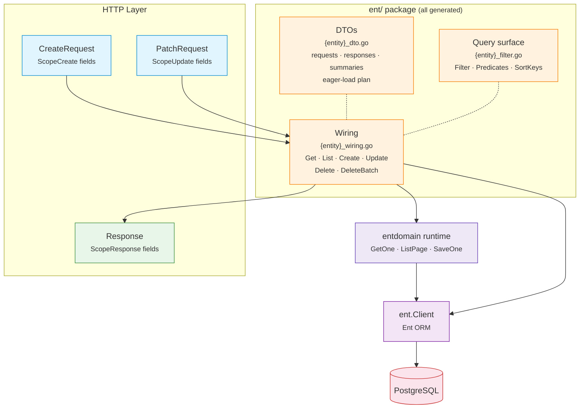

# EntDomain

[](https://pkg.go.dev/github.com/githonllc/entdomain)
[](https://goreportcard.com/report/github.com/githonllc/entdomain)
[](https://opensource.org/licenses/MIT)

An [Ent](https://entgo.io) extension that generates HTTP request/response DTOs, a query surface, and one wiring function per operation from annotated schemas.


> ### Status: prototype under redesign
>
> This library works, but its shape is being reconsidered. The direction is settled and
> **no part of it is implemented yet** — what is documented below is what exists today,
> not what is planned.
>
> - **Direction and rationale** — [`DESIGN-v2.md`](DESIGN-v2.md). It also records the
>   claims its own first draft got wrong, because knowing which intuitions fail in this
>   codebase is design material.
> - **Known defects** — [`QUALITY-REVIEW.md`](QUALITY-REVIEW.md), 41 findings from three
>   independent reviews.
> - **How it fits together** — [`ARCHITECTURE.md`](ARCHITECTURE.md).
> - **Work items** — epic [#23](https://github.com/githonllc/entdomain/issues/23).
>
> Read [Known limitations](#known-limitations) before adopting this. Some of them are
> traps rather than gaps, and one annotation documents a guarantee it does not provide.
>
> `go test ./...`, `make check`, `gofmt -l .` and `make lint` are **green on a clean
> checkout**. The red suite this line used to warn about was fixed in
> [#2](https://github.com/githonllc/entdomain/issues/2).

## Features

- **Annotation-driven** — mark field scopes with concise builders (`DefaultField`, `InputOnlyField`, `OutputOnlyField`, etc.)
- **HTTP DTOs** — generates `CreateRequest`, `PatchRequest`, `Response`, `ListResponse` per entity
- **Explicit presence** — a patch request tells an omitted key from an explicit `null` from a value, and a field omitted on create is never written, so the schema's `Default()` still applies
- **Query surface** — a filter struct with one parameter per operator ent derives, a free-text `q`, and a sort allow-list
- **Wiring** — one free function per operation, each a single call into a generic runtime written once
- **Any identifier type** — the id comes from the schema in every template and reaches the runtime as a type parameter
- **Soft delete at the ent layer** — embed `entdomain.SoftDeleteMixin`, register one line at client construction, and deleted rows disappear from *every* read, including `client.User.Query()` calls that touch nothing generated here
- **Source provenance** — generated files include schema name, template path, and regeneration command

## Requirements

- Go 1.23+
- [Ent](https://entgo.io) v0.14+

## Installation

```bash
go get github.com/githonllc/entdomain
```

One module, **two import paths**, and which one you need depends on what the file does:

| Import | Used by | Links |
|---|---|---|
| `github.com/githonllc/entdomain` | `entc.go` and your schema files — the annotation builders, `Edge()`, `SoftDeleteMixin`, the extension | ent's codegen packages, the source formatter, the embedded templates |
| `github.com/githonllc/entdomain/runtime` | generated code and your service/handler code — `ListPage`, `GetOne`, `SaveOne`, `ListRequest`, the error sentinels, `ErrorMapper`, `WithSoftDeleted` | the standard library, and nothing else |

The runtime package is still **named** `entdomain`, so every call site reads
`entdomain.ListPage` whichever path it arrived by. A file needing both imports
both and aliases one.

## Setup

Wire the extension in your `entc.go`:

```go
//go:build ignore

package main

import (
    "log"

    "entgo.io/ent/entc"
    "entgo.io/ent/entc/gen"
    "github.com/githonllc/entdomain"
)

func main() {
    ext := entdomain.NewExtensionWithOptions(
        // The RUNTIME path — this is what generated files import. It is also
        // the default, so the option only exists for a vendored copy.
        entdomain.WithEntDomainPackage("github.com/githonllc/entdomain/runtime"),
    )

    if err := entc.Generate("./schema", &gen.Config{
        Target:  "../ent",
        Package: "your/module/ent",
    }, entc.Extensions(ext)); err != nil {
        log.Fatal(err)
    }
}
```

Then run:

```bash
go generate ./...
```

## Annotation Builders

### Base Builders

```go
entdomain.DefaultField()                      // create, update, query, response
                                              // also marks the field searchable, filterable and sortable
entdomain.InputOnlyField()                    // create + update only (e.g., password)
entdomain.OutputOnlyField()                   // response only (e.g., timestamps, state)
entdomain.CreateOnlyField()                   // create + response (immutable after creation)
entdomain.NewDomainField()                    // no scopes (tracked by ent but not in any HTTP struct)
entdomain.DomainFieldWithScopes(scopes...)    // custom scope combination
```

### Fluent Builder API

```go
field.String("email").
    Annotations(
        entdomain.DefaultField().
            WithRequired(entdomain.ScopeCreate),
    )
```

### Migrating from `AsSensitive()`

**Security-relevant.** `DomainField.Sensitive` and `AsSensitive()` **have been
removed.** They never did anything: response field selection reads the scope
list and nothing else, so a field marked sensitive was emitted into the
generated `Response` struct and serialised to JSON like any other field. If you
called `AsSensitive()` on a field that also carried `ScopeResponse` — which
`DefaultField()` grants — that field has been in your API responses all along.
**Audit your responses for it; removing the call changes no behaviour, because
there was none.**

```go
// before — compiles, promises nothing, leaks
field.String("password").
    Annotations(entdomain.DefaultField().AsSensitive())

// after — the scope list is the mechanism, and it is enforced
field.String("password").
    Annotations(entdomain.InputOnlyField())
```

`InputOnlyField()` grants `ScopeCreate` and `ScopeUpdate` only. Withholding
`ScopeResponse` is what keeps a field out of the response, and it is the only
thing that ever did. Any custom combination works the same way:
`entdomain.DomainFieldWithScopes(entdomain.ScopeCreate)`.

The marker was removed rather than implemented because in a one-dimensional
scope model it adds a promise without adding a capability. The one meaning it
could carry that scopes cannot — visible to some callers but not others — needs
an audience dimension this package does not have
([#3](https://github.com/githonllc/entdomain/issues/3)).

### Migrating from `WithValidation()`

`DomainField.Validation` and `WithValidation()` **have been removed, with no
replacement**, because `Validate()` on the generated request types supersedes
them.

```go
// before — a rule nothing in this package enforced
field.String("name").
    Annotations(entdomain.DefaultField().
        WithValidation(map[string]interface{}{"min": 1, "max": 100}))

// after — delete the call; the rule belongs in Validate()
field.String("name").
    Annotations(entdomain.DefaultField())
```

Removing the call changes no behaviour, because there was none: nothing read
the map. Where the rule now goes is `Validate()` on the generated
`{Entity}CreateRequest` / `{Entity}PatchRequest`, which is the only door to
`Apply` on a `Valid{Entity}…Request`
([#26](https://github.com/githonllc/entdomain/issues/26)) — so a rule written
there cannot be skipped, which is exactly what an ignored annotation could not
promise.

### `WithDescription()` and `WithExample()` moved onto the metadata block

**Both builders still exist and still chain. Only where the value is stored
changed**, from `DomainField` to `FieldMetadata`. Schema code needs no edit:

```go
// unchanged — still compiles, still chains
field.String("email").
    Annotations(entdomain.DefaultField().
        WithDescription("Primary contact address").
        WithExample("user@example.com"))
```

What changed is the read side, for anyone inspecting an annotation directly:

```go
d := entdomain.DefaultField().WithDescription("Primary contact address")

d.Description            // before
d.Metadata.Description   // after
```

They moved because they are OpenAPI schema fields, and every sibling —
`Title`, `Format`, `Pattern`, `Enum`, `ReadOnly` and the rest — already sat on
`FieldMetadata` under the doc comment reserving that block for spec generation.
Sitting apart from them was an inconsistency, not a placement decision, and it
left them accepted-and-silently-ignored rather than covered by a stated forward
contract. Like every other metadata builder, they allocate a fresh
`*FieldMetadata` per call, so two chains forked from one base annotation stay
independent ([#5](https://github.com/githonllc/entdomain/issues/5)).

### `DomainConfig` removed

The entity-level `DomainConfig` annotation **has been removed**, with no
replacement. Delete it from any `Annotations()` call:

```go
// before
func (User) Annotations() []schema.Annotation {
    return []schema.Annotation{entdomain.DomainConfig{}}
}

// after — drop the method if that was its only entry
```

It had already lost everything it carried: `EntityName` went on
[#17](https://github.com/githonllc/entdomain/issues/17) (generation names every
emitted type from the schema's own name), and
[#29](https://github.com/githonllc/entdomain/issues/29) took the base-service
and base-handler switches along with the templates they selected. What was left
was an annotation a schema could attach with no detectable effect. Nothing in
generation reads entity-level configuration today; if that changes, the new
annotation arrives together with the reader that gives it meaning.

### Edge Annotations

Edges carry their own annotation. Exposure used to be derived from the edge's
foreign-key field, which conflated two different decisions — "put `author_id` in
the response" and "put a nested `author` object in the response" — and made
exposure depend on which table holds the column. A to-many edge has no field on
this entity at all, so under that rule it could never be exposed.

```go
entdomain.Edge()                       // no scopes
entdomain.Edge().InResponse()          // the nested object appears in Response
entdomain.Edge().InResponse().As("written_by")  // override the JSON key
```

```go
func (Post) Edges() []ent.Edge {
    return []ent.Edge{
        // author_id (the scalar) is controlled by the field annotation;
        // author (the nested object) by this one. They are independent.
        edge.From("author", User.Type).
            Ref("posts").Unique().Required().Field("author_id").
            Annotations(entdomain.Edge().InResponse()),
    }
}
```

Like the field builders, every edge builder takes a value receiver and returns a
copy, so a partially configured annotation is safe to reuse as a base.

> **Trap, now refused.** Declaring a self-referential pair in the chained form
> `edge.To("children", X.Type).From("parent")...Annotations(a)` attaches the
> annotation to the **inverse edge only**. The assoc edge is left bare — which
> is also how you say *do not expose this* — so `children` used to vanish from
> the response and the eager-load plan with no message anywhere.
>
> A self-referential pair annotated on **one end only** is now a generation
> error naming both ends and the fix. Declare the two edges separately and
> annotate each:
>
> ```go
> edge.To("children", X.Type).
>     Annotations(entdomain.Edge().InResponse()),
> edge.From("parent", X.Type).Ref("children").Unique().Field("parent_id").
>     Annotations(entdomain.Edge().InResponse()),
> ```
>
> To expose **one end only on purpose**, annotate the other end with a bare
> `entdomain.Edge()`. It grants no scope, so the output is identical to leaving
> it unannotated; what it adds is that the decision is written down, which is
> what tells it apart from the end the chained form forgets.
>
> The check is confined to pairs whose two ends sit in one `Edges()` slice —
> only a self-referential pair can. Across two entities, exposing one direction
> only is the ordinary case and is never refused.

## Runtime: generic CRUD

```go
import "github.com/githonllc/entdomain/runtime" // package name: entdomain
```

The algorithms every entity shares are written once in Go rather than once per
entity in a template. The entity-specific parts arrive as type parameters and
function values, so **this half imports no ent package** and the identifier type
is not hardcoded.

### Migrating to the runtime subpackage

**The runtime types have moved out of `github.com/githonllc/entdomain` into
`github.com/githonllc/entdomain/runtime`. The root package no longer declares
them, and there are no deprecation aliases**
([#15](https://github.com/githonllc/entdomain/issues/15)).

```go
// before
import "github.com/githonllc/entdomain"

// after — in generated code, and in any file that calls the runtime
import entdomain "github.com/githonllc/entdomain/runtime"
```

The alias is what `goimports` writes, because the package name no longer matches
the last element of the path. It is not required for compilation — an unaliased
import still binds `entdomain` — but leaving it off means the next `goimports`
run produces a diff.

Nothing else changes. The new package is still `package entdomain`, so
`entdomain.ListPage`, `entdomain.ErrValidation` and `entdomain.WithSoftDeleted`
read exactly as before; the migration is one import line per file. Schema files
and `entc.go` keep importing the root path and need no edit at all — the
annotation builders, `Edge()` and `SoftDeleteMixin` did not move.

Regenerating does the generated half for you: `WithEntDomainPackage`'s default
is now the runtime path.

**What moved:** `ListRequest`, `Page`, `Query`, `Saver`, `ListPage`, `GetOne`,
`SaveOne`, `AppendIf`, `AppendIfSlice`, `ErrNotFound`, `ErrAlreadyExists`,
`ErrValidation`, `IsNotFound`, `IsAlreadyExists`, `IsValidation`, `ErrorMapper`,
`NewErrorMapper`, `DefaultPageSize`, `MaxPageSize`, `Ptr`, `PtrOrNil`,
`PtrNilSafe`, `WithSoftDeleted`, `SoftDeletedIncluded`, `WithHardDelete`,
`HardDeleteRequested`.

**What stayed:** `DomainField` and every builder, `DomainEdge`/`Edge()`, the
`Scope*` constants, `SoftDeleteMixin`, `DomainSoftDelete`, `SoftDeleteField`,
`Extension` and the options. All of it is read at generation time, and a schema
that imported the root path keeps compiling untouched.

**Why no aliases.** A root package that re-exported the runtime would keep the
coupling this split exists to remove: a consumer who imported it for
`ErrNotFound` would still link ent's codegen packages, the source formatter and
five embedded templates, and would still run the template loader during package
initialisation. The module carries no version tag, so there is no released
surface to preserve. `go list -deps` on the runtime package now reports **0**
`entgo.io` packages out of 62 — all standard library — against **15** for the
generator; `TestRuntimePackageIsGeneratorFree` is the checked-in guard, and it
carries a control that fails if the probe itself stops working.

```go
// Query is the subset of an ent query builder pagination needs. Q is
// self-referential because ent's chainable methods return the concrete builder.
type Query[Q, P, O, E any] interface {
    Where(...P) Q
    Order(...O) Q
    Limit(int) Q
    Offset(int) Q
    All(context.Context) ([]*E, error)
    Count(context.Context) (int, error)
}

type Page[R any] struct {
    Data  []*R `json:"data"`
    Total int  `json:"total"`
    Page  int  `json:"page"`
    Size  int  `json:"size"`
}

func ListPage[Q Query[Q, P, O, E], P, O, E, R any](
    ctx context.Context, q Q, ps []P, os []O, r ListRequest,
    to func(*E) (*R, error),
) (*Page[R], error)

func GetOne[E, R, ID any](
    ctx context.Context,
    get func(context.Context, ID) (*E, error),
    to func(*E) (*R, error),
    id ID,
) (*R, error)

// Saver is the mutation-builder subset. Both *<T>Create and *<T>UpdateOne
// carry it, so one routine serves create and update.
type Saver[E any] interface {
    Save(context.Context) (*E, error)
}

func SaveOne[B Saver[E], E, R any](
    ctx context.Context, b B, to func(*E) (*R, error),
) (*R, error)
```

Type arguments are inferred at the call site — none are written by hand:

```go
// ID is uuid.UUID here...
user, err := entdomain.GetOne(ctx, db.User.Get, NewUserResponse, id)

// ...and int here. Same function.
tag, err := entdomain.GetOne(ctx, db.Tag.Get, NewTagResponse, tagID)

page, err := entdomain.ListPage(ctx, db.User.Query(),
    filter.Predicates(), orderOpts, req, NewUserResponse)
```

### Pagination bounds

`ListPage` uses **offset pagination**. The cost, stated rather than glossed: it
is O(n) deep, costs a `COUNT` per page, and can skip or repeat rows under
concurrent writes.

```go
const (
    entdomain.DefaultPageSize = 20    // used when no usable size was requested
    entdomain.MaxPageSize     = 1000  // the ceiling — decided here and nowhere else
)

func (r ListRequest) Limit() int   // requested size, clamped to MaxPageSize; never <= 0
func (r ListRequest) Offset() int  // (Page-1) * Limit(); never negative
func (r ListRequest) SortKey(allow []string, def string) (key string, desc bool, err error)
func (r *ListRequest) Validate() error
```

The zero value of `ListRequest` is usable as-is. **There is no `SetDefaults()`** —
a defaulting call nothing forces you to make is a call you can forget, and
forgetting it was how a zero page size reached a query. Read the effective
values through `Limit()` and `Offset()`, never off the fields; those two are
what `ListPage` calls.

`MaxPageSize` is the single home of the ceiling, with a single reaction to
crossing it: **`Limit()` clamps**. `Validate()` says nothing about `Size` or
`Page`, because `Limit()`/`Offset()` sit on the only path into `ListPage` and so
apply whether or not anyone calls `Validate()` — a ceiling that fires only when
you opt in is advice, not a bound. `Page.Size` reports the size actually used,
so clamping is visible; if an oversized request should be a `400` in your API,
compare against `MaxPageSize` yourself.

The `validate` struct tags on `Size`, `Page` and `Order` deliberately carry **no
rules at all**. A tag cannot reference a constant and cannot express a
case-insensitive comparison, so every rule spelled there is a second spelling
that can only drift from the code enforcing it — `max=100` had already drifted
from `MaxPageSize`=1000, and `oneof=asc desc` from `SortKey()`'s case-insensitive
comparison. `Validate()`, `Limit()` and `Offset()` are the homes.

`Validate()` is left with what nothing downstream repairs: `Order` must be
`asc`, `desc` or empty, **compared case-insensitively**. `SortKey()` reads
`Order` with `EqualFold` and sits on the only path into `ListPage`, so it is
what actually decides the direction — `Validate()` therefore rejects exactly
what `SortKey()` will not honour and no more. `"DESC"` sorts descending and so
validates; `"descc"` is rejected, because `SortKey()` would quietly read it as
ascending and reverse your results. Errors wrap `ErrValidation`.

### Migrating from `SetDefaults()`

`ListRequest.SetDefaults()` **has been removed.** A zero-value `ListRequest` is
now usable as-is.

```go
// before
req.SetDefaults()
if err := req.Validate(); err != nil { /* ... */ }

// after — nothing to call
if err := req.Validate(); err != nil { /* ... */ }
```

`Limit()` and `Offset()` do the defaulting and clamping themselves, on the only
path into `ListPage`. Read effective values through them rather than off the
fields; `req.Size` may still be `0`, but `req.Limit()` is never `0`. If you
relied on `SetDefaults()` mutating the request before serialising it back, set
`req.Size = req.Limit()` explicitly.

`Validate()` no longer rejects out-of-range `Size` or `Page` either — those are
clamped, not refused. If your API returned `400` for `size=5000`, compare
against `MaxPageSize` yourself.

### Migrating from the cursor codec and `PageInfo`

**`Cursor`, `PageInfo`, `EncodeCursor`, `DecodeCursor` and the `ListRequest.Cursor`
field have all been removed, and generated `{Entity}ListResponse` no longer
carries a `PageInfo` field.** This package publishes offset pagination and
nothing else ([#6](https://github.com/githonllc/entdomain/issues/6)).

None of them ever did anything. No generated code called the codec, and the one
generated lister that encoded a cursor — `ListWithCursor` on the base service —
went away with the base service itself. `ListRequest.Cursor` was documented as
"when `Cursor` is set, keyset pagination is used" and **no code anywhere branched
on it**: a caller who set it got offset page one, silently, on every request.
That is the failure this removal is about. `DecodeCursor` was also lossy above
2^53 — `ID any` came back from `json.Unmarshal` as a `float64`, and the
`f == float64(int64(f))` check used to repair it is already true of a truncated
value, so it could not detect its own defect.

```go
// before
req := entdomain.ListRequest{Cursor: token, Size: 20}   // token was ignored
page, err := ent.ListArticles(ctx, db, filter, req)

// after
req := entdomain.ListRequest{Page: 2, Size: 20}
page, err := ent.ListArticles(ctx, db, filter, req)
```

**Wire format.** `{Entity}ListResponse` loses its fifth field:

```jsonc
// before                              // after
{                                      {
  "data": [ /* … */ ],                   "data": [ /* … */ ],
  "total": 42,                           "total": 42,
  "page": 1,                             "page": 1,
  "size": 20,                            "size": 20
  "pageInfo": {                        }
    "hasNextPage": true,
    "endCursor": "eyJpZCI6…"
  }
}
```

The field was `json:"pageInfo,omitempty"` and **nothing generated ever set it**,
so no response this library actually produced carried a `pageInfo` key. The
break is to the published Go struct, not to any payload that was ever sent:
code that reads `resp.PageInfo` stops compiling, code that reads the JSON does
not change. `{Entity}ListResponse` keeps the same four fields as
`entdomain.Page[{Entity}Response]`, which is what `ent.List{Entities}` returns.

**If you need keyset paging**, write the query — the generated filter, order
options and converter are all still there to hand to it, as shown under
[Migrating from `BaseService` and `BaseHandler`](#migrating-from-baseservice-and-basehandler).
Do not revive the deleted codec: it never had a caller to be compatible with,
and adding a cursor back later is an additive change, which is exactly the
asymmetry that made removing it the cheap direction.

### Error mapping

`ErrorMapper` turns a persistence layer's errors into this package's sentinels.
It takes predicates as function values, so the runtime still imports no ent
package.

**You do not construct one.** Generation emits `ent/entdomain_errors.go`, one
file for the package, holding the mapper every generated operation returns
through:

```go
// generated
var ErrorMap = entdomain.NewErrorMapper(IsNotFound, IsConstraintError)
```

`IsNotFound` and `IsConstraintError` there are *ent's*, generated into the same
package — the framework does not export them, because `NotFoundError` and
`ConstraintError` are generated per project. That one line is the only place the
two halves can meet.

One variable for the package, not a parameter per call, is what makes
`entdomain.IsNotFound(err)` answer the same way whichever operation failed:

```go
_, err := ent.GetArticle(ctx, db, id)
if entdomain.IsNotFound(err) { /* 404 — and identically for Update, Delete, … */ }
```

**Uniqueness needs its own predicate**, and this is not a convenience —
`ent.IsConstraintError` returns true for a duplicate key *and* a foreign-key
violation alike:

```
UNIQUE constraint failed: tags.name (2067)
FOREIGN KEY constraint failed (787)
```

Mapping it straight to `ErrAlreadyExists` therefore reports a foreign-key
violation as a duplicate. The distinction lives in the driver error wrapped by
`*ent.ConstraintError` and is dialect-specific, so the library does not guess
it — install it on the generated mapper, or get no already-exists
classification at all:

```go
func init() {
    ent.ErrorMap = ent.ErrorMap.WithUniqueViolation(func(err error) bool { // SQLite
        return strings.Contains(err.Error(), "UNIQUE constraint failed")
    })
}
```

**Forgetting that line is safe, and that is the whole design.** Not-found keeps
working; only already-exists is given up, so a duplicate key comes back
unclassified and an HTTP layer answers `500` instead of `409`. That direction is
deliberate — a `500` on a duplicate is recoverable, a `409` on a foreign-key
failure sends the caller to fix something that is not wrong. Assign it where the
client is built, before the first request: it is an ordinary package-level
variable with no synchronisation of its own.

Anything the mapper cannot classify — including a constraint violation of an
unidentified kind — is returned unchanged: unclassified, never swallowed, and
never labelled with a sentinel that was not established. Both the sentinel and
the original error stay in the chain, so `errors.Is` finds either.

`SortKey` checks the requested field against an allow-list. That list is the
whole point: an unchecked sort field is an injection site, an unindexed-scan
trigger, and — combined with paging — an ordering oracle over columns the caller
was never meant to read. An unknown field yields `ErrValidation`.

## Schema Example

```go
package schema

import (
    "time"

    "entgo.io/ent"
    "entgo.io/ent/schema/field"
    "github.com/githonllc/entdomain"
)

type User struct {
    ent.Schema
}

func (User) Fields() []ent.Field {
    return []ent.Field{
        field.String("name").
            NotEmpty().
            Annotations(
                entdomain.DefaultField().
                    WithRequired(entdomain.ScopeCreate),
            ),

        field.String("email").
            Optional().
            Annotations(entdomain.DefaultField()),

        field.Time("created_at").
            Default(time.Now).
            Immutable().
            Annotations(entdomain.OutputOnlyField()),
    }
}
```

## Architecture



**Key principle**: Scopes only control HTTP-layer struct generation. Nothing generated restricts what the consumer's own code may do with an ent entity.

## Generated Code

For each annotated schema, three files are generated (all in the `ent/` package):

| File | Contains |
|------|----------|
| `{entity}_dto.go` | `CreateRequest`, `PatchRequest`, their `Validate()`/`Apply` pair, and the response half below |
| `{entity}_filter.go` | `{Entity}Filter` with its `Predicates()`, `{Entity}SortKeys` and `{Entity}Order` — the query half below |
| `{entity}_wiring.go` | one free function per operation, each handing this entity's artifacts to the runtime — the wiring half below |

Two more used to be generated behind the opt-in switches `WithBaseService` and
`WithBaseHandler`. Both are gone; see
[Migrating from `BaseService` and `BaseHandler`](#migrating-from-baseservice-and-basehandler).
A generation run **deletes** `{entity}_base_service.go` and
`{entity}_base_handler.go` from the target directory if it finds them there, so
upgrading does not leave code behind that compiles against a service the library
no longer describes.

Plus two files for the schema as a whole, each written only when it has
something to say:

| File | Written when | Contains |
|------|--------------|----------|
| `entdomain_errors.go` | at least one entity is annotated | `ErrorMap`, the classifier every generated operation returns through — see [Error mapping](#error-mapping) |
| `entdomain_softdelete.go` | at least one entity embeds `entdomain.SoftDeleteMixin` | `RegisterSoftDelete`, the query traverser and the delete-rewriting hook — see [Soft delete](#soft-delete) |

Every generated file opens with `// Code generated by entdomain extension …` on
its **first line** — that line, and only that line, is what marks the file as
this extension's to overwrite or delete. **`{entity}_dto.go`'s header changed
in [#66](https://github.com/githonllc/entdomain/issues/66)**: it used to cite
`backend/pkg/entdomain/templates/dto.tmpl` and a schema path under
`entschema/schema/`, both left over from the repository this extension was
extracted from and neither existing in any consumer's tree. Regenerating
rewrites those two lines in every DTO file; nothing else changes and no
consumer code needs editing.

### Create and patch requests

The request half of `{entity}_dto.go` is two request types, each paired with a
validated form that is the only thing the builder writer accepts:

| Declaration | Purpose |
|---|---|
| `{Entity}CreateRequest` | create-scoped fields; a value type when ent requires the field and cannot default it, `*T` otherwise |
| `{Entity}PatchRequest` | update-scoped fields that ent's update builders can set, every one a `*T` |
| `(r) UnmarshalJSON(b) error` | records which keys the payload carried, next to the ordinary decode |
| `(r) Has<Field>() bool` | whether the payload carried that key |
| `(r) Validate() (*Valid{Entity}…Request, error)` | the only way to obtain the validated form |
| `(v) Apply(b) b` | writes the request onto `{Entity}Create` / `{Entity}UpdateOne` |

Four properties follow, and each is asserted in `internal/fixtures/presence`
against real ent builders:

- **A field omitted on create is not written at all**, so the schema's
  `Default()` applies. This is the whole reason presence is recorded rather
  than inferred from the zero value.
- **A patch separates absent, explicit `null` and value.** Absent leaves the
  field alone, `null` emits `Clear<Field>()`, a value emits `Set<Field>()`.
  Only a field the schema declares `Optional()` can be cleared, because ent
  generates `Clear<Field>()` for those and no others; a `null` on anything else
  is rejected with the field named.
- **Reaching `Apply` without validating is a compile error.** `Apply` is defined
  on `Valid{Entity}CreateRequest` / `Valid{Entity}PatchRequest`, which only
  `Validate` can construct. The v1 free functions
  `Apply{Entity}CreateRequest` / `Apply{Entity}UpdateRequest` are gone: they took
  a raw request, which is exactly the path that let validation be skipped.
- **The wire format is unchanged.** Presence lives in an unexported map with no
  marshaller of its own, so requests still marshal and unmarshal as ordinary
  JSON and every reflection-based consumer — validators, form binders, spec
  generators — sees the struct it saw before. A generic `Optional[T]` wrapper
  was considered and rejected for losing exactly this.

A request built in Go rather than decoded recorded no presence, and the two
types default in opposite directions on purpose: a create request reads every
field as supplied, because its struct is the only source of truth there; a patch
request reads every field as absent, so its nil pointers are never mistaken for
an instruction to clear the row. `UnmarshalJSON` always allocates the map, so
neither fallback can fire on a decoded request.

An `Immutable()` field is absent from the patch request, because ent's update
builders iterate `MutableFields` and generate no setter for one. A caller who
names it in a PATCH body gets silence: `encoding/json` discards the key before
any validator can see it. Rejecting that needs `DisallowUnknownFields`, which
lives in the consumer's handler — it is the one case here that cannot be closed
from the generator.

### Migrating from case-insensitive JSON keys

**A payload key that differs from a field's JSON tag only in case is now a
validation error.** It used to be accepted, and the field it named was silently
dropped ([#58](https://github.com/githonllc/entdomain/issues/58),
[ADR-0001](docs/adr/0001-presence-follows-encoding-json-key-matching.md)).

`encoding/json` fills a struct field on an exact match *or* a case-insensitive
one, while presence is recorded by raw payload key. The two disagreed for every
case variant: `{"Nickname":"sam"}` decoded into the `nickname`-tagged field,
`HasNickname()` stayed `false`, `Apply` wrote nothing — and the update returned
success having changed no row. A payload carrying both spellings was worse
still: the later key overwrote the field to `nil` while presence saw the exact
key, so a patch that carried a value **cleared** it.

```go
// before — no error, and the row is unchanged
_ = json.Unmarshal([]byte(`{"Nickname":"sam"}`), &req)  // req.Nickname == "sam"
req.Validate()                                          // ok
valid.Apply(b)                                          // writes nothing

// after — errors.Is(err, entdomain.ErrValidation)
// validation failed: unknown key "Nickname" (did you mean "nickname"?)
err := json.Unmarshal([]byte(`{"Nickname":"sam"}`), &req)
```

`UnmarshalJSON` refuses the key by name and gives the canonical spelling, and it
does so before decoding into the struct, so a rejected request leaves the
receiver untouched. A key that case-folds to **no** tag keeps its old behaviour
and is ignored — refusing those is `DisallowUnknownFields`, which stays in the
consumer's handler exactly as for the `Immutable()` case above. Nothing needs
editing to migrate: a client sending the wrong case was already losing its data,
so this error is the first honest answer it has ever had.

### Responses, summaries and eager-load plans

The response half of `{entity}_dto.go` is four declarations:

| Declaration | Purpose |
|---|---|
| `{Entity}Response` | the full response: response-scoped scalars, plus one field per edge annotated `InResponse()` |
| `{Entity}Summary` | the same scalars and **no edges**; this is what an edge field holds |
| `New{Entity}Response(e) (*{Entity}Response, error)` | conversion; reads edge state through `<Edge>OrErr()` |
| `New{Entity}Summary(e) *{Entity}Summary` | conversion; cannot fail, because a summary reads no edges |
| `{Entity}QueryWithResponseEdges(q) q` | the eager-load plan, derived from the response type's own edge set |

Three properties follow, and each is asserted in `internal/fixtures/edges`:

- **A loaded edge with no related row is an explicit `null`, not a missing key.**
  No edge field is `omitempty`. `loadedTypes` is unexported, so a nil pointer
  cannot separate *not loaded* from *loaded and absent*; they are separated here
  instead, and a client can tell "there is none" from "nobody asked".
- **A not-loaded edge is an error.** `New{Entity}Response` returns it rather than
  shipping a response that reads as "this post has no author". The error is cheap
  because the eager-load plan is generated from the same edge set, so generated
  wiring cannot forget an edge — it only ever catches a hand-rolled query. Note
  that `client.{Entity}.Get` loads no edges and therefore cannot serve a response
  type that declares any; go through `Query` with the plan applied.
- **Expansion is bounded by the type system, not by a depth counter.** A summary
  has no edge fields, so `New{Entity}Response` calls summary constructors and a
  summary constructor calls nothing. There is no second level for a cycle to
  close through. The cost is stated rather than hidden: a three-level tree comes
  back one level deep, and a deeper one needs another round trip per level.

```go
q := ent.PostQueryWithResponseEdges(client.Post.Query())
p, err := q.Where(post.IDEQ(id)).Only(ctx)
if err != nil {
    return err
}
resp, err := ent.NewPostResponse(p) // err is non-nil only if an edge was not loaded
```

### The named list shape, and why it exists

`List{Entities}` returns `*entdomain.Page[{Entity}Response]`, and that stays the
wiring's signature. Alongside it `{entity}_dto.go` emits a named, non-generic
twin plus its converter:

| Declaration | Purpose |
|---|---|
| `{Entity}ListResponse` | the same four offset-pagination fields, under a name that lives in your `package ent` |
| `New{Entity}ListResponse(p) *{Entity}ListResponse` | the conversion; `nil` in, `nil` out |

The name is the point. OpenAPI annotation tooling of the swaggo class has no
syntax for a generic instantiation — there is no way to write
`entdomain.Page[CourierResponse]` in a `@Success` line — so a handler converts at
the transport boundary and annotates the named type:

```go
// ListCouriers godoc
// @Success 200 {object} ent.CourierListResponse
func (h *Handler) ListCouriers(c echo.Context) error {
    page, err := ent.ListCouriers(c.Request().Context(), h.db, filter, req)
    if err != nil {
        return err
    }
    resp := ent.NewCourierListResponse(page)
    return c.JSON(http.StatusOK, resp)
}
```

Converting costs nothing on the wire: `{Entity}ListResponse(*p)` is a plain Go
type conversion, so the payload is byte-for-byte what marshalling the page
produces (asserted in `internal/fixtures/wiring/e2e`). It also carries the shape
contract — a conversion is legal only while the two structs agree on field set,
type and order, so any drift between `Page` and `{Entity}ListResponse` stops
every generated package from compiling. Struct tags are the one thing a
conversion does not check; the golden-JSON test in `internal/fixtures/basic`
guards those.

### Filters, free-text search and the sort allow-list

`{entity}_filter.go` is one artifact for three dimensions of one list endpoint.
A field takes part only if its annotation carries `ScopeQuery` **and** the
marker for that dimension; a field with neither is absent from all three, and no
runtime switch brings it back.

| Declaration | Purpose |
|---|---|
| `{Entity}Filter` | one parameter per operator per `Filterable` field, plus `Q` when any field is `Searchable` |
| `(*{Entity}Filter).Predicates() []predicate.{Entity}` | the ent predicates, combined conjunctively by `Where(...)` |
| `{Entity}SortKeys []string` | the sort allow-list: exactly the `Sortable` fields |
| `{Entity}Order(entdomain.ListRequest) ([]{entity}.OrderOption, error)` | validates the requested key against the allow-list and returns ent's own order builders |

**Operator coverage is whatever ent derives for the field's type**, read from
`$field.Ops` rather than from a table this package keeps. A string gets thirteen
parameters, an enum four, an optional `int` eight plus one, a `time.Time` eight.
Emitting an operator costs nothing at generation time; adding one later means
changing a template, regenerating, and possibly breaking a URL contract.

```go
type RecordFilter struct {
    Title             *string  `form:"title" json:"title,omitempty"`             // EQ
    TitleNEQ          *string  `form:"title_neq" json:"title_neq,omitempty"`
    TitleIn           []string `form:"title_in" json:"title_in,omitempty"`
    // … GT GTE LT LTE Contains HasPrefix HasSuffix EqualFold ContainsFold

    ScoreIsNull *bool `form:"score_is_null" json:"score_is_null,omitempty"`

    Q *string `form:"q" json:"q,omitempty"` // OR across the Searchable fields
}
```

`IsNil` and `NotNil` are the one deliberate departure from one-parameter-per-operator:
they are a single boolean question, and two parameters would admit a request that
contradicts itself.

**The sort allow-list is load-bearing security, not ergonomics.** An unchecked
sort field is an injection site, an unindexed-scan trigger and — combined with
paging — an ordering oracle over columns the caller was never meant to read. The
caller's string is checked against `{Entity}SortKeys` and then thrown away: what
reaches the query is the `By<Field>` builder ent generated for that column,
looked up by an already-validated key. A key outside the list is an
`ErrValidation`, never a silent fallback. There is **no default sort key** —
which column to order by when the caller names none is a policy the schema does
not contain.

```go
os, err := ent.RecordOrder(req)          // ErrValidation if req.SortBy is not allowed
if err != nil {
    return err
}
page, err := entdomain.ListPage(ctx, client.Record.Query(), filter.Predicates(), os, req, ent.NewRecordResponse)
```

Four annotation/schema combinations are **refused at generation time** rather
than emitting a call ent never wrote: a marker on a field withholding
`ScopeQuery`, `Searchable` on a type with no `Contains` predicate, `Filterable`
on a type with no predicates at all, and `Sortable` on a type ent's order
builders skip because it is not comparable.

### Wiring

`{entity}_wiring.go` connects the artifacts above to the runtime. It is **free
functions, not methods on a generated struct**: there is nothing to embed, no
self-reference to install and no fixed set of override points.

| Declaration | Body |
|---|---|
| `Get{Entity}(ctx, db, id)` | `entdomain.GetOne(ctx, {entity}ByID(db), New{Entity}Response, id)` |
| `List{Entities}(ctx, db, f, r)` | `{Entity}Order(r)`, then `entdomain.ListPage(ctx, {Entity}QueryWithResponseEdges(db.{Entity}.Query()), f.Predicates(), order, r, New{Entity}Response)` |
| `Create{Entity}(ctx, db, v)` | `entdomain.SaveOne(ctx, v.Apply(db.{Entity}.Create()), …)` |
| `Update{Entity}(ctx, db, id, v)` | `entdomain.SaveOne(ctx, v.Apply(db.{Entity}.UpdateOneID(id)), …)` |
| `Delete{Entity}(ctx, db, id)` | `db.{Entity}.DeleteOneID(id).Exec(ctx)` |
| `DeleteBatch{Entities}(ctx, db, ids)` | `db.{Entity}.Delete().Where({entity}.IDIn(ids...)).Exec(ctx)`, returning the affected-row count |

The identifier's type comes from the schema; nothing is written for a particular
one. Create and update take the **validated** request, because `Apply` is
defined on that type alone — skipping validation is a compile error, not a
discipline problem. Reads go through `Query` with the generated eager-load plan
rather than through `{Entity}Client.Get`, which applies no plan and therefore
cannot serve a response type that declares edges; for the same reason, an entity
with response edges converts a just-saved row by reading it back.

Every body but one is a single call. `List` is the exception, and the
reason is worth stating rather than hiding: `{Entity}Order` can fail, and
`ListPage` takes resolved order options rather than a fallible producer of them,
so the allow-list check is a statement of its own.

**To replace one operation, write your own function and stop calling the
generated one.** The others keep working; there is no contract to satisfy and
nothing to re-register:

```go
func listMyArticles(ctx context.Context, db *ent.Client, f *ent.ArticleFilter, r entdomain.ListRequest) (*entdomain.Page[ent.ArticleResponse], error) {
    q := ent.ArticleQueryWithResponseEdges(db.Article.Query())
    ps := append(f.Predicates(), article.TenantID(tenantFrom(ctx)))   // policy the schema cannot contain
    return entdomain.ListPage(ctx, q, ps, []article.OrderOption{article.ByTitle()}, r, ent.NewArticleResponse)
}
```

Every one of these functions returns its error through the package's `ErrorMap`,
and each maps exactly once, so a missing row is `entdomain.ErrNotFound` whichever
operation produced it. The sentinel is added to the chain rather than
substituted for it, so ent's own error is still reachable with `errors.As`. See
[Error mapping](#error-mapping) — in particular, uniqueness needs one line from
you and nothing claims `ErrAlreadyExists` until it has it.
### Soft delete

Soft delete lives in ent's own interceptor and hook layer, not in the generated
service. That is not a preference. `Base{Entity}Service.DB` is an exported
`*Client`, so a service that filtered its own queries would be bypassed by one
line of ordinary consumer code:

```go
s.DB.User.Query().All(ctx)   // no generated method in the call path
```

Only an ORM-level interceptor sees that query, and only a mutation hook keyed on
`OpDelete|OpDeleteOne` sees every delete.

**Two steps, and there is no third.**

```go
// 1. ent/schema/doc.go — embed the mixin. This adds the deleted_at column.
func (Doc) Mixin() []ent.Mixin {
    return []ent.Mixin{entdomain.SoftDeleteMixin{}}
}
```

```go
// 2. wherever the client is constructed — install it.
client := ent.NewClient(ent.Driver(drv))
ent.RegisterSoftDelete(client)
```

`RegisterSoftDelete` is generated into your `ent` package, once for the whole
schema, as a type switch over the entities that embed the mixin. After it, every
read excludes deleted rows — direct client queries, `Count`, `Exist`, `Only`,
`Get`, and sub-queries built for eager-loaded edges — and `Delete()` /
`DeleteOneID()` stamp `deleted_at` instead of removing the row. Everything this
project generates goes through that one hook and writes no tombstone of its own:
`Delete{Entity}` in the wiring above, and `Delete`/`DeleteBatch` on the base
service. `internal/softdeleteproof` asserts each of them leaves the row on disk.

**The cost, stated rather than hidden.** A client built without that line filters
nothing, and a delete on it removes the row. There is no compile error for
forgetting it. It is one line in your own wiring on purpose: a filter that
silently removes rows from every query in the process should be visible in setup
code rather than installed by embedding a struct.

**Getting back in, and getting rid of a row.** Two context switches, each doing
exactly one thing:

```go
all, _ := client.Doc.Query().All(entdomain.WithSoftDeleted(ctx))  // includes tombstones
_ = client.Doc.DeleteOneID(id).Exec(entdomain.WithHardDelete(ctx)) // really deletes
```

Neither implies the other, and both are per-call: the context you already had is
unchanged. (ent's published recipe uses a single key for both, so a caller who
wanted to read a tombstone also silently armed a real `DELETE`.)

**No empty import is required, and that is a deliberate design consequence.**
ent generates its schema-stitching runtime in two formats
(`entc/gen/template/runtime.tmpl:12-17,50-63`): a separate `ent/runtime` package
that **must be empty-imported from your main package**
(`import _ "yourproject/ent/runtime"`) when any schema carries hooks, policies or
interceptors, and an in-`ent` format when none does. A soft-delete mixin that
carried its own hook and interceptor would flip your project to the first
format, so adopting this feature would change how your whole project generates
and add an import you would otherwise discover from a runtime panic
(`ent: uninitialized interceptor (forgotten import ent/runtime?)`).

`entdomain.SoftDeleteMixin` therefore declares **only the field and a marker
annotation** — no `Hooks()`, no `Interceptors()`. Both halves are installed on
the client by `RegisterSoftDelete` instead. If your schemas carry hooks for
other reasons the empty import still applies to you; adopting soft delete just
does not add that obligation.

**What decides that an entity is soft-deletable.** Embedding the mixin, and
nothing else. Earlier versions keyed on a field literally named `deleted_at`
that was `Nillable` — so an entity that merely owned a column with that name
acquired row-level filtering it never asked for, and one modifier separated the
two cases. An entity that declares its own `deleted_at` and no mixin is an
ordinary hard-delete entity.

**Downstream `OpDelete` hooks do not fire.** The rewritten mutation carries
`OpUpdate`, and the rewrite re-dispatches through the client rather than calling
the next mutator, so a hook registered after `RegisterSoftDelete` for
`OpDelete|OpDeleteOne` never runs. Register such hooks for `OpUpdate` and test
for a non-nil `deleted_at`, or install them before `RegisterSoftDelete`.

### Migrating from `BaseService` and `BaseHandler`

**`Base{Entity}Service`, `Base{Entity}Handler`, `{Entity}EntToResponse`, and the
options `WithBaseService` / `WithBaseHandler` have all been removed.** Both
options defaulted to `false`, so a consumer who never passed them is unaffected;
delete the calls and the extension compiles again.

Every member has a replacement, and one of them is a bug fix rather than a
rename:

| Removed | Use instead |
|---|---|
| `svc.GetByID(ctx, id)` | `ent.Get{Entity}(ctx, db, id)` — and it applies the eager-load plan, which `Client.Get` never did |
| `svc.Create(ctx, req)` | `ent.Create{Entity}(ctx, db, v)`, where `v, err := req.Validate()` |
| `svc.Update(ctx, id, req)` | `ent.Update{Entity}(ctx, db, id, v)` |
| `svc.Delete(ctx, id)` | `ent.Delete{Entity}(ctx, db, id)` |
| `svc.DeleteBatch(ctx, ids)` | `ent.DeleteBatch{Entities}(ctx, db, ids)`, which also returns the affected-row count |
| `svc.ListWithCursor(ctx, limit, cursor, order)` | `ent.List{Entities}(ctx, db, filter, req)` — **offset paging**; see below |
| `ent.{Entity}EntToResponse(e)` | `ent.New{Entity}Response(e)` — **see below** |
| `h.ToResponse(e)` / `h.ToResponseList(es)` | `ent.New{Entity}Response(e)`, or `ent.List{Entities}`, which already returns `*entdomain.Page[…]` |
| `h.PartialUpdate(ctx, svc, id, req)` | `ent.Update{Entity}(ctx, db, id, v)` |
| `SetSelf` and the `Before*` / `After*` hooks | your own function. There is no contract to satisfy and nothing to register |

**`{Entity}EntToResponse` was not merely redundant — it lost errors.** For an
entity whose response declares edges it called `New{Entity}Response` and, on
error, **returned `nil`**. So a response built from a query that did not load the
edges came back as a nil pointer at the call site instead of an error naming the
edge. `New{Entity}Response` returns `(*{Entity}Response, error)`; handle the
error. This is the reason to migrate even if you never used the hooks.

**Cursor pagination is no longer generated.** `ListWithCursor` was ID-ordered
keyset paging with a documented panic at `limit == 0`; `ent.List{Entities}` is
offset paging through `entdomain.ListPage`, with the page-size ceiling clamped
in one place. If you depend on keyset paging, write the query yourself — the
generated filter, order and converter are all still there to hand to it:

```go
q := ent.ArticleQueryWithResponseEdges(db.Article.Query()).
    Where(article.IDGT(after)).
    Order(article.ByID()).
    Limit(size)
```

**Hooks become ordinary code.** What used to be `BeforeCreate` is a line before
the call, and what used to be `AfterCreate` is a line after it:

```go
func createArticle(ctx context.Context, db *ent.Client, req *ent.ArticleCreateRequest) (*ent.ArticleResponse, error) {
    if err := authorize(ctx, req); err != nil {   // was BeforeCreate
        return nil, err
    }
    v, err := req.Validate()
    if err != nil {
        return nil, err
    }
    resp, err := ent.CreateArticle(ctx, db, v)
    if err != nil {
        return nil, err
    }
    publish(ctx, resp)                            // was AfterCreate
    return resp, nil
}
```

The old mechanism could not have that shape: dispatch went through `SetSelf`, so
forgetting the call — or misspelling a hook method — compiled cleanly and the
hook silently never ran ([#16](https://github.com/githonllc/entdomain/issues/16)).

**`Base{Entity}Handler` existed so handler code would not import `ent`. It never
achieved that**: embedding `ent.Base{Entity}Handler` is itself an `ent` import.
The goal is real and belongs to where the DTO package sits, not to a base type.

**Soft delete is no longer detected by field name.** The generated `Delete`
used to rewrite itself as `UpdateOneID().SetDeletedAt(now)` whenever an entity
owned a Nillable `deleted_at` field. That was write-only — nothing filtered
tombstoned rows out of reads — and it silently disabled every consumer hook
registered for a delete operation, because the mutation it issued was an update
([#12](https://github.com/githonllc/entdomain/issues/12)). `ent.Delete{Entity}`
now calls ent's own delete builder, so an ent mixin or interceptor decides what
deletion means and the read path honours it too
([#18](https://github.com/githonllc/entdomain/issues/18)).

## Typed Errors

The runtime exports the sentinel values generated validation and the error
mapper produce:

```go
var (
    entdomain.ErrNotFound      // entity not found
    entdomain.ErrAlreadyExists // uniqueness constraint violation
    entdomain.ErrValidation    // validation failed
)
```

## Field Scopes

Scopes control which HTTP-layer DTOs include a field. They do **not** restrict service layer access.

| Scope | Description |
|-------|-------------|
| `ScopeCreate` | Field appears in `CreateRequest` |
| `ScopeUpdate` | Field appears in `PatchRequest` |
| `ScopeResponse` | Field appears in `Response` |
| `ScopeQuery` | Field may be reached from the query API: it is eligible for `{Entity}Filter`, the free-text search and the sort allow-list. Eligibility is not exposure — the `Filterable` / `Searchable` / `Sortable` marker decides the dimension, and a field with the scope but no marker appears in none of them |

## Annotation surface: what is consumed, and what is not

Every exported annotation setting is listed here, and the list is not
maintained by hand. `TestEveryAnnotationKnobIsConsumedOrDeclaredPending`
derives the settings by reflection over the annotation types and decides
reachability by toggling each one and checking whether any registered template
function returns anything different. A setting that reaches generation and one
that does not are therefore distinguishable from the outside — which is the
whole point, since accepting a setting silently and ignoring it is what this
table exists to prevent.

**Consumed by generation today:**

| Setting | Effect |
|---|---|
| `DomainField.Scopes` | Selects which request/response struct the field lands in |
| `DomainField.Required` | `WithRequired(ScopeCreate)` makes the create request demand a value ent would have defaulted or allowed to be absent; `WithRequired(ScopeUpdate)` withdraws the field from the set an explicit `null` may clear |
| `DomainEdge.Scopes`, set by `Edge().InResponse()` | Puts the nested object in the response type |
| `DomainEdge.JSONKey`, set by `.As("key")` | Overrides the edge's JSON key |
| `DomainField.Filterable`, set by `.AsFilterable()` | Emits one filter parameter per operator ent derives for the field's type |
| `DomainField.Searchable`, set by `.AsSearchable()` | Adds the field to the `q` free-text disjunction |
| `DomainField.Sortable`, set by `.AsSortable()` | Adds the field to `{Entity}SortKeys`, the sort allow-list |

Eleven of the twenty-six settings, counting the scope constants separately.
Everything else below is accepted and stored, and changes nothing that is
generated.

**Accepted but not consumed yet.** Each is kept for a stated reason with a
tracking issue, and the test above fails if one silently becomes reachable
without this table being updated:

| Setting | Waiting on |
|---|---|
| `Metadata` and all of `FieldMetadata` (`Title`, `Description`, `Format`, `Pattern`, `Minimum`, `Maximum`, `MinLength`, `MaxLength`, `Enum`, `Example`, `ReadOnly`, `WriteOnly`, `Deprecated`, `Tags`), set through `WithTitle`, `WithDescription`, `WithFormat`, `WithPattern`, `WithRange`, `WithLength`, `WithEnum`, `WithExample`, `AsReadOnly`, `AsWriteOnly`, `AsDeprecated`, `WithTags` | OpenAPI/Swagger spec generation, which no issue implements yet. Declared RESERVED in `annotations.go` — **stored, not consumed ([#17](https://github.com/githonllc/entdomain/issues/17))** |

Fifteen settings, all of them the metadata block. There is no third category:
every exported setting is either in the table above it or in this one.

Every builder in that row opens its godoc with the same sentence, so a schema
author calling `WithDescription` sees it without reading this table
([#67](https://github.com/githonllc/entdomain/issues/67)). Wiring one of these
knobs up must delete the disclaimer in the same commit;
`TestPendingKnobBuildersDeclareNoOp` fails while a stale one survives.

**Removed.** `AsUniqueLookup()` / `AsRangeLookup()` and their `UniqueLookup` /
`RangeLookup` fields are gone, along with the whole `DomainConfig` annotation
and `DomainField.Validation`. The lookup
markers were meant to generate `FindByX` methods; nothing generated them, and
[#27](https://github.com/githonllc/entdomain/issues/27) derives its operator
set from ent's own per-type operator table instead, which makes them redundant
rather than merely unimplemented. Deleting these calls changes no behaviour,
because there was none. See the migration notes below for `Validation` and
`DomainConfig`.

## Field shapes: how ent modifiers and scopes interact

A scope says where a field appears in the HTTP layer. An ent modifier
(`Optional()`, `Nillable()`, `Immutable()`, a `GoType`) decides what ent itself
generates. When the two meet, the outcome is one of exactly two things, and it
is predictable from this table.

The governing rule: **anything that can be generated correctly is generated;
only a combination that has no correct output at all is refused, and a refusal
names the entity, the field and both conflicting facts.**

| Schema shape | What is generated |
|---|---|
| `Optional()` | `*T` in create and patch requests and in the response. Clearable in a patch: an explicit `null` emits `Clear<X>()` |
| `Optional().Nillable()` | `*T` everywhere, including in a create request where the field is `WithRequired(ScopeCreate)` — "required" is then enforced by the generated `Validate()`, which rejects a nil pointer, not by the absence of a pointer |
| A field with a schema `Default()` | `*T` in the create request. Omitting it writes nothing, so ent's default applies; writing the zero value unconditionally is what used to defeat it |
| A field ent requires and cannot default | `T` in the create request, always written, and `Validate()` refuses a request that carries no value for it — by presence, not by comparing against the zero value, so `0` and `false` are values rather than omissions |
| `Immutable()` **+ `ScopeUpdate`** | **Generation fails.** ent's update builders iterate `MutableFields`, which excludes immutable fields, so `Set<X>` does not exist on `<Entity>UpdateOne` and no template can emit a call that compiles. Use `CreateOnlyField()` / `OutputOnlyField()`, or drop `Immutable()` |
| `Immutable()` without `ScopeUpdate` | Generated normally; the field is settable on create and readable in responses |
| `field.Enum(...)`, optional or required | Generated normally; the Go type is the enum type in the entity's own package |
| `field.JSON(...)` over a slice or map | Generated normally; an optional one is converted with `entdomain.PtrNilSafe`, since `entdomain.PtrOrNil` is `[T comparable]` |
| A named `GoType` whose underlying type is a slice or map | Same as the line above. The decision is made from the type's reflect kind, not from how it is spelled, so `type Tags []string` is recognised as a slice |
| A named `GoType` over a comparable type (string, int, struct of comparables) | Generated normally, via `entdomain.PtrOrNil` |
| A primary key of any type — `int`, `string`, `uuid.UUID`, a named `GoType` | Generated normally. Every template renders the id through `$.ID.Type` and asks for its import by field, so an `int` key needs no import at all. This used to be **refused** when `WithBaseService` or `WithBaseHandler` was on, because those two templates spelled `uuid.UUID` into every signature; both are gone ([#29](https://github.com/githonllc/entdomain/issues/29)) |

Note that `DefaultField()` grants `ScopeUpdate`, so an immutable field carrying
the default annotation hits the refusal above. That is deliberate: the
alternative — quietly dropping the field from the update request — removes it
from the PATCH API without a word, where neither `encoding/json` nor the
generated `Validate()` can observe the missing key, and an API client discovers
it in production.

Every row is covered by a fixture under `internal/fixtures/` that is generated
and then compiled by `TestCodegenFixtures`.

## Extension Options

```go
entdomain.WithEntDomainPackage("custom/path") // override the RUNTIME import path
                                              // written into generated files
                                              // (default: github.com/githonllc/entdomain/runtime)
```

That is the whole set. `WithBaseService` and `WithBaseHandler` were removed with
the templates they selected — everything else is generated unconditionally for an
annotated entity, because an artifact that is sometimes absent is an artifact the
next generated file cannot depend on.

## Known limitations

Verified against the source, not inferred from docs. Each links to the issue tracking it.

**Twenty of the twenty-seven exported annotation settings are accepted, stored and
ignored.** Which is which is no longer guesswork: "Annotation surface" above lists every one, and the list is derived by a test
rather than maintained by hand, so a setting cannot quietly join or leave it
([#17](https://github.com/githonllc/entdomain/issues/17)).

**No preset builder grants a query marker.** They used to grant all three, which was inert
while nothing consumed them. Now that they generate real parameters and a real allow-list,
defaulting them to on would make essentially every response-visible field orderable, and
sorting by an arbitrary column is an unindexed-scan trigger and, combined with paging, an
ordering oracle. So `AsFilterable()`, `AsSearchable()` and `AsSortable()` are opt-in, per
field. Presets still grant `ScopeQuery`: eligibility is not exposure
([#27](https://github.com/githonllc/entdomain/issues/27)).

**Soft delete disables downstream deletion hooks.** The rewritten mutation carries an
update operation flag, so a consumer hook registered after `RegisterSoftDelete` for the
delete operations never fires. It is now documented rather than silent (see
[Soft delete](#soft-delete)) and it is a property of the rewrite itself, not of where the
rewrite lives ([#18](https://github.com/githonllc/entdomain/issues/18)).

**Soft delete has to be registered, and forgetting it fails open.** `RegisterSoftDelete` is
one line at client construction and nothing enforces it — a client without it returns
deleted rows and hard-deletes on `Delete()`. The alternative was a mixin carrying its own
hook and interceptor, which would oblige every consumer to empty-import `ent/runtime` and
would need reflection to reach the mutation's client; the trade is recorded on
[#18](https://github.com/githonllc/entdomain/issues/18).

**Already-exists is not classified until you install a dialect predicate.** The generated
wiring maps a missing row to `ErrNotFound` everywhere, but `ent.IsConstraintError` is true
for a duplicate key and a foreign-key violation alike, so nothing claims `ErrAlreadyExists`
until `ErrorMap.WithUniqueViolation` is given one — see
[Error mapping](#error-mapping). Forgetting it costs a `409` and never causes a wrong one
([#13](https://github.com/githonllc/entdomain/issues/13)).

**Pagination is offset-only, everywhere.** `ent.List{Entities}` goes through
`entdomain.ListPage`, which is O(n) deep, costs a `COUNT` per page, and can skip or repeat
rows under concurrent writes. There is no keyset alternative in the package: the exported
cursor codec (`Cursor`, `EncodeCursor`, `DecodeCursor`, `PageInfo`) and the
`ListRequest.Cursor` field were removed once nothing generated referred to them
([#6](https://github.com/githonllc/entdomain/issues/6)) — see
[Migrating from the cursor codec and `PageInfo`](#migrating-from-the-cursor-codec-and-pageinfo).

**The generator package still loads every template during package initialisation.**
`template_index.go` declares five package-level vars that call `mustLoadTemplate`, so
importing `github.com/githonllc/entdomain` runs the loader whether or not anything
generates. That is now confined to `entc.go` and schema files: the runtime moved to its
own package, which embeds nothing and reaches neither the loader nor ent
([#15](https://github.com/githonllc/entdomain/issues/15)) — see
[Migrating to the runtime subpackage](#migrating-to-the-runtime-subpackage). The lookup
itself is `path.Join`, not `filepath.Join`, so the Windows panic this bullet used to
describe is gone ([#4](https://github.com/githonllc/entdomain/issues/4)).

**Only the field shapes with a fixture are known to compile.** `TestCodegenFixtures`
generates and compiles every schema under `internal/fixtures/`, which now covers the
nillable, immutable, enum, JSON/map and named-`GoType` shapes above, plus edges,
self-referential edges, the presence model, the query surface, an `int` primary key, the
wiring and the soft-delete mixin ([#8](https://github.com/githonllc/entdomain/issues/8),
[#10](https://github.com/githonllc/entdomain/issues/10)). Two of them have a behavioural
proof as well as a compile proof, each a separate module with a SQLite driver:
`internal/fixtures/wiring/e2e` drives every generated operation against a real database,
and `internal/softdeleteproof` checks that a direct `client.Doc.Query()` excludes deleted
rows and that both generated deletes leave the row on disk.

## Contributing

See [CONTRIBUTING.md](CONTRIBUTING.md) for development setup and guidelines.

## License

[MIT](LICENSE)
