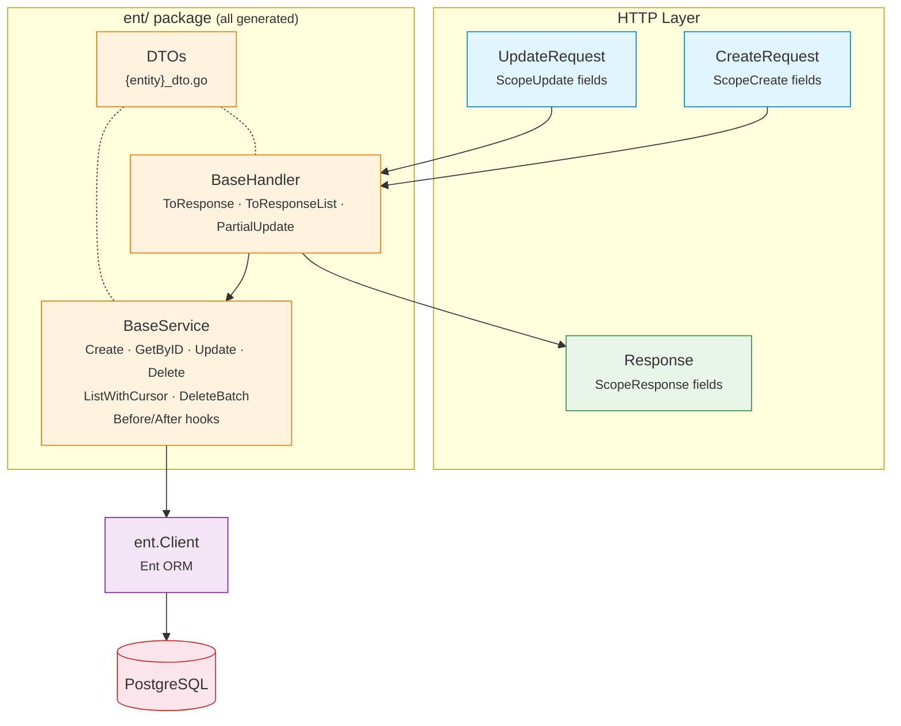

# EntDomain

[](https://pkg.go.dev/github.com/githonllc/entdomain)
[](https://goreportcard.com/report/github.com/githonllc/entdomain)
[](https://opensource.org/licenses/MIT)

An [Ent](https://entgo.io) extension that generates HTTP request/response DTOs, base service structs, and base handler structs from annotated schemas.


> ### Status: prototype under redesign
>
> This library works, but its shape is being reconsidered. The direction is settled and
> **no part of it is implemented yet** — what is documented below is what exists today,
> not what is planned.
>
> - **Direction and rationale** — [`DESIGN-v2.md`](DESIGN-v2.md). It also records the
>   claims its own first draft got wrong, because knowing which intuitions fail in this
>   codebase is design material.
> - **Known defects** — [`QUALITY-REVIEW.md`](QUALITY-REVIEW.md), 41 findings from three
>   independent reviews.
> - **How it fits together** — [`ARCHITECTURE.md`](ARCHITECTURE.md).
> - **Work items** — epic [#23](https://github.com/githonllc/entdomain/issues/23).
>
> Read [Known limitations](#known-limitations) before adopting this. Some of them are
> traps rather than gaps, and one annotation documents a guarantee it does not provide.
>
> `go test ./...` is **red on a clean checkout** ([#2](https://github.com/githonllc/entdomain/issues/2)).

## Features

- **Annotation-driven** — mark field scopes with concise builders (`DefaultField`, `InputOnlyField`, `OutputOnlyField`, etc.)
- **HTTP DTOs** — generates `CreateRequest`, `UpdateRequest`, `Response`, `ListResponse` per entity
- **BaseService** — CRUD operations with Before/After hooks, builder helpers, and entity→response conversion
- **BaseHandler** — response conversion helpers and partial update support
- **Soft-delete detection** — automatically generates `UpdateOneID().SetDeletedAt(now)` for entities with a `deleted_at` field
- **Cursor pagination** — ID-based keyset pagination in BaseService
- **Source provenance** — generated files include schema name, template path, and regeneration command

## Requirements

- Go 1.23+
- [Ent](https://entgo.io) v0.14+

## Installation

```bash
go get github.com/githonllc/entdomain
```

## Setup

Wire the extension in your `entc.go`:

```go
//go:build ignore

package main

import (
    "log"

    "entgo.io/ent/entc"
    "entgo.io/ent/entc/gen"
    "github.com/githonllc/entdomain"
)

func main() {
    ext := entdomain.NewExtensionWithOptions(
        entdomain.WithEntDomainPackage("github.com/githonllc/entdomain"),
        entdomain.WithBaseService(true),
        entdomain.WithBaseHandler(true),
    )

    if err := entc.Generate("./schema", &gen.Config{
        Target:  "../ent",
        Package: "your/module/ent",
    }, entc.Extensions(ext)); err != nil {
        log.Fatal(err)
    }
}
```

Then run:

```bash
go generate ./...
```

## Annotation Builders

### Base Builders

```go
entdomain.DefaultField()                      // create, update, query, response
                                              // also marks the field searchable, filterable and sortable
entdomain.InputOnlyField()                    // create + update only (e.g., password)
entdomain.OutputOnlyField()                   // response only (e.g., timestamps, state)
entdomain.CreateOnlyField()                   // create + response (immutable after creation)
entdomain.NewDomainField()                    // no scopes (tracked by ent but not in any HTTP struct)
entdomain.DomainFieldWithScopes(scopes...)    // custom scope combination
```

### Fluent Builder API

```go
field.String("email").
    Annotations(
        entdomain.DefaultField().
            WithRequired(entdomain.ScopeCreate),
    )
```

### Edge Annotations

Edges carry their own annotation. Exposure used to be derived from the edge's
foreign-key field, which conflated two different decisions — "put `author_id` in
the response" and "put a nested `author` object in the response" — and made
exposure depend on which table holds the column. A to-many edge has no field on
this entity at all, so under that rule it could never be exposed.

```go
entdomain.Edge()                       // no scopes
entdomain.Edge().InResponse()          // the nested object appears in Response
entdomain.Edge().InResponse().As("written_by")  // override the JSON key
```

```go
func (Post) Edges() []ent.Edge {
    return []ent.Edge{
        // author_id (the scalar) is controlled by the field annotation;
        // author (the nested object) by this one. They are independent.
        edge.From("author", User.Type).
            Ref("posts").Unique().Required().Field("author_id").
            Annotations(entdomain.Edge().InResponse()),
    }
}
```

Like the field builders, every edge builder takes a value receiver and returns a
copy, so a partially configured annotation is safe to reuse as a base.

> **Trap.** Declaring a self-referential pair in the chained form
> `edge.To("children", X.Type).From("parent")...Annotations(a)` attaches the
> annotation to the **inverse edge only**. No error is reported and the assoc
> edge silently never appears. Declare the two edges separately.

## Runtime: generic CRUD

The algorithms every entity shares are written once in Go rather than once per
entity in a template. The entity-specific parts arrive as type parameters and
function values, so **this half imports no ent package** and the identifier type
is not hardcoded.

```go
// Query is the subset of an ent query builder pagination needs. Q is
// self-referential because ent's chainable methods return the concrete builder.
type Query[Q, P, O, E any] interface {
    Where(...P) Q
    Order(...O) Q
    Limit(int) Q
    Offset(int) Q
    All(context.Context) ([]*E, error)
    Count(context.Context) (int, error)
}

type Page[R any] struct {
    Data  []*R `json:"data"`
    Total int  `json:"total"`
    Page  int  `json:"page"`
    Size  int  `json:"size"`
}

func ListPage[Q Query[Q, P, O, E], P, O, E, R any](
    ctx context.Context, q Q, ps []P, os []O, r ListRequest,
    to func(*E) (*R, error),
) (*Page[R], error)

func GetOne[E, R, ID any](
    ctx context.Context,
    get func(context.Context, ID) (*E, error),
    to func(*E) (*R, error),
    id ID,
) (*R, error)
```

Type arguments are inferred at the call site — none are written by hand:

```go
// ID is uuid.UUID here...
user, err := entdomain.GetOne(ctx, db.User.Get, NewUserResponse, id)

// ...and int here. Same function.
tag, err := entdomain.GetOne(ctx, db.Tag.Get, NewTagResponse, tagID)

page, err := entdomain.ListPage(ctx, db.User.Query(),
    filter.Predicates(), orderOpts, req, NewUserResponse)
```

### Pagination bounds

`ListPage` uses **offset pagination**. The cost, stated rather than glossed: it
is O(n) deep, costs a `COUNT` per page, and can skip or repeat rows under
concurrent writes.

```go
const (
    entdomain.DefaultPageSize = 20    // used when no usable size was requested
    entdomain.MaxPageSize     = 1000  // the ceiling — decided here and nowhere else
)

func (r ListRequest) Limit() int   // requested size, clamped to MaxPageSize; never <= 0
func (r ListRequest) Offset() int  // (Page-1) * Limit(); never negative
func (r ListRequest) SortKey(allow []string, def string) (key string, desc bool, err error)
```

`MaxPageSize` is the single home of the ceiling: `Limit()` clamps to it and
`Validate()` rejects above it. The `validate` struct tag on `ListRequest.Size`
deliberately carries **no** `max=` clause — a tag cannot reference a constant, so
a number written there can only drift. It previously said `max=100` while
`MaxPageSize` said `1000`, and a third-party tag validator disagreed with
`Validate()` about which sizes were legal.

`SortKey` checks the requested field against an allow-list. That list is the
whole point: an unchecked sort field is an injection site, an unindexed-scan
trigger, and — combined with paging — an ordering oracle over columns the caller
was never meant to read. An unknown field yields `ErrValidation`.

## Schema Example

```go
package schema

import (
    "time"

    "entgo.io/ent"
    "entgo.io/ent/schema/field"
    "github.com/githonllc/entdomain"
)

type User struct {
    ent.Schema
}

func (User) Fields() []ent.Field {
    return []ent.Field{
        field.String("name").
            NotEmpty().
            Annotations(
                entdomain.DefaultField().
                    WithRequired(entdomain.ScopeCreate),
            ),

        field.String("email").
            Optional().
            Annotations(entdomain.DefaultField()),

        field.Time("created_at").
            Default(time.Now).
            Immutable().
            Annotations(entdomain.OutputOnlyField()),
    }
}
```

## Architecture



**Key principle**: Scopes only control HTTP-layer struct generation. The service layer operates directly on ent entities with full ORM capabilities.

## Generated Code

For each annotated schema, up to three files are generated (all in the `ent/` package):

| File | Contains |
|------|----------|
| `{entity}_dto.go` | `CreateRequest`, `UpdateRequest`, `Response`, `ListResponse`, `Validate()` methods |
| `{entity}_base_service.go` | `BaseService` with CRUD, Before/After hooks, `Apply*Request` builders, `EntToResponse` |
| `{entity}_base_handler.go` | `BaseHandler` with `ToResponse`, `ToResponseList`, `PartialUpdate` |

### BaseService Pattern

Generated `Base{Entity}Service` provides CRUD operations with hook extension points. Embed it and override hooks for custom logic:

```go
type myUserService struct {
    ent.BaseUserService
}

func NewMyUserService(db *ent.Client) *myUserService {
    s := &myUserService{
        BaseUserService: ent.BaseUserService{DB: db},
    }
    s.SetSelf(s) // enable hook dispatch to this struct
    return s
}

func (s *myUserService) BeforeCreate(ctx context.Context, req *ent.UserCreateRequest) error {
    // custom validation
    return nil
}

func (s *myUserService) AfterCreate(ctx context.Context, entity *ent.User) (*ent.User, error) {
    // publish event, etc.
    return entity, nil
}
```

## Typed Errors

BaseService wraps Ent errors with standard sentinel values:

```go
var (
    entdomain.ErrNotFound      // entity not found
    entdomain.ErrAlreadyExists // uniqueness constraint violation
    entdomain.ErrValidation    // validation failed
)
```

## Field Scopes

Scopes control which HTTP-layer DTOs include a field. They do **not** restrict service layer access.

| Scope | Description |
|-------|-------------|
| `ScopeCreate` | Field appears in `CreateRequest` |
| `ScopeUpdate` | Field appears in `UpdateRequest` |
| `ScopeResponse` | Field appears in `Response` |

## Extension Options

```go
entdomain.WithBaseService(true)              // generate BaseService (default: false)
entdomain.WithBaseHandler(true)              // generate BaseHandler (default: false)
entdomain.WithEntDomainPackage("custom/path") // override entdomain import path
```

## Known limitations

Verified against the source, not inferred from docs. Each links to the issue tracking it.

**An annotation that does not do what its name says.** `Sensitive` reads as a
data-protection marker. Nothing consults it — the response selector looks only at scopes,
so a field marked sensitive is emitted into responses like any other. Do not rely on it.
It is being removed rather than implemented: with a one-dimensional scope model, "never in
a response" is already expressible by omitting the response scope, so the annotation adds a
promise without adding a capability ([#3](https://github.com/githonllc/entdomain/issues/3)).

**Roughly twenty exported annotation fields are accepted, stored and ignored.** The API
accepts them without complaint, so there is no way to tell from the outside which ones do
anything. Only the scope list and the required map reach a template
([#17](https://github.com/githonllc/entdomain/issues/17)).

**`ScopeQuery` is granted by most preset builders and consumed by nothing.** It is
documented as placing a field in a query-parameter struct that no template emits.

**Every preset builder except `InputOnlyField` also marks the field searchable, filterable
and sortable.** Inert today. It matters for what comes next: sorting by an arbitrary column
is an unindexed-scan trigger and, combined with paging, an ordering oracle. When these
markers are implemented, defaulting them to on would make the allow-list meaningless
([#27](https://github.com/githonllc/entdomain/issues/27)).

**Soft delete silently disables downstream deletion hooks.** The generated delete is
rewritten as an update, which carries an update operation flag. A consumer hook registered
for the delete operations therefore never fires at all — this is not two mechanisms
conflicting, it is one silently replacing the other
([#12](https://github.com/githonllc/entdomain/issues/12)).

**The generated service supports one identifier type.** `uuid.UUID` is hardcoded in method
signatures. Non-UUID primary keys are unsupported
([#29](https://github.com/githonllc/entdomain/issues/29)).

**Hook dispatch fails silently when misused.** Forgetting the `SetSelf` call, or
misspelling a hook method, compiles cleanly and the hook never runs
([#16](https://github.com/githonllc/entdomain/issues/16)).

**Package import panics on Windows.** Template lookup joins paths with the OS separator
while the embedded filesystem always uses forward slashes, so loading fails at package
initialisation ([#4](https://github.com/githonllc/entdomain/issues/4)).

**Generated code is not compiled by any test in this repository.** Template changes are
effectively untested here; several field and edge shapes are known to produce output that
does not build ([#8](https://github.com/githonllc/entdomain/issues/8),
[#10](https://github.com/githonllc/entdomain/issues/10)).

## Contributing

See [CONTRIBUTING.md](CONTRIBUTING.md) for development setup and guidelines.

## License

[MIT](LICENSE)
