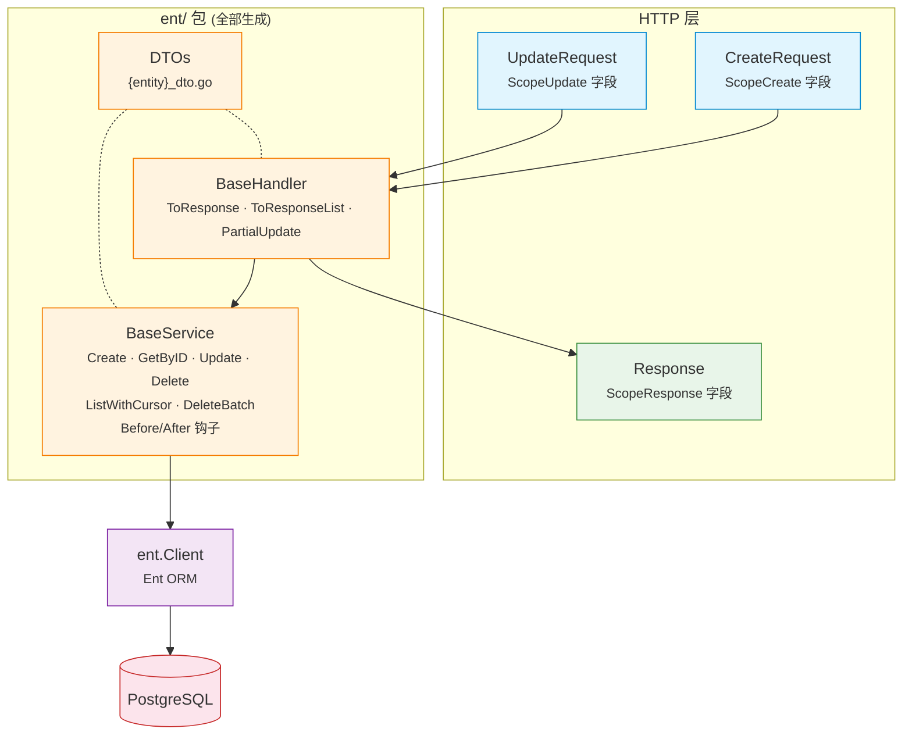

# EntDomain

[](https://pkg.go.dev/github.com/githonllc/entdomain)
[](https://goreportcard.com/report/github.com/githonllc/entdomain)
[](https://opensource.org/licenses/MIT)

一个 [Ent](https://entgo.io) 扩展，从带注解的 schema 自动生成 HTTP 请求/响应 DTO、基础服务和基础处理器。


> ### 状态：原型，正在重新设计
>
> 这个库能用，但它的形态正在被重新考虑。方向已定，**尚未实现任何一部分**——
> 下面记录的是**当前已有的东西**，不是计划中的东西。
>
> - **方向与理由** — [`DESIGN-v2.md`](DESIGN-v2.md)。里面同时记录了初稿自己搞错的断言，
>   因为「哪些直觉在这个代码库里不成立」本身就是设计资料。
> - **已知缺陷** — [`QUALITY-REVIEW.md`](QUALITY-REVIEW.md)，三次独立评审的 41 条发现。
> - **整体结构** — [`ARCHITECTURE.md`](ARCHITECTURE.md)。
> - **工作项** — epic [#23](https://github.com/githonllc/entdomain/issues/23)。
>
> 采用之前请先读[已知限制](#已知限制)。其中有几条是陷阱而不是缺口，
> 并且**有一个注解描述了它并不提供的保证**。
>
> `go test ./...` 在干净 checkout 上是**红的**（[#2](https://github.com/githonllc/entdomain/issues/2)）。

## 特性

- **注解驱动** — 使用简洁的构建器标记字段作用域（`DefaultField`、`InputOnlyField`、`OutputOnlyField` 等）
- **HTTP DTO** — 为每个实体生成 `CreateRequest`、`UpdateRequest`、`Response`、`ListResponse`
- **BaseService** — 带 Before/After 钩子的 CRUD 操作、构建器辅助和实体→响应转换
- **BaseHandler** — 响应转换辅助和部分更新支持
- **软删除检测** — 自动为包含 `deleted_at` 字段的实体生成 `UpdateOneID().SetDeletedAt(now)`
- **游标分页** — BaseService 中基于 ID 的键集分页
- **来源追溯** — 生成的文件包含 schema 名称、模板路径和重新生成命令

## 环境要求

- Go 1.23+
- [Ent](https://entgo.io) v0.14+

## 安装

```bash
go get github.com/githonllc/entdomain
```

## 配置

在 `entc.go` 中注册扩展：

```go
//go:build ignore

package main

import (
    "log"

    "entgo.io/ent/entc"
    "entgo.io/ent/entc/gen"
    "github.com/githonllc/entdomain"
)

func main() {
    ext := entdomain.NewExtensionWithOptions(
        entdomain.WithEntDomainPackage("github.com/githonllc/entdomain"),
        entdomain.WithBaseService(true),
        entdomain.WithBaseHandler(true),
    )

    if err := entc.Generate("./schema", &gen.Config{
        Target:  "../ent",
        Package: "your/module/ent",
    }, entc.Extensions(ext)); err != nil {
        log.Fatal(err)
    }
}
```

然后运行：

```bash
go generate ./...
```

## 注解构建器

### 基础构建器

```go
entdomain.DefaultField()                      // 创建、更新、查询、响应
                                              // 同时把字段标为 searchable / filterable / sortable
entdomain.InputOnlyField()                    // 仅创建和更新（如密码）
entdomain.OutputOnlyField()                   // 仅响应（如时间戳、状态）
entdomain.CreateOnlyField()                   // 创建 + 响应（创建后不可变）
entdomain.NewDomainField()                    // 无作用域（ent 追踪但不在任何 HTTP 结构体中）
entdomain.DomainFieldWithScopes(scopes...)    // 自定义作用域组合
```

### 流式构建器 API

```go
field.String("email").
    Annotations(
        entdomain.DefaultField().
            WithRequired(entdomain.ScopeCreate),
    )
```

### 从 `AsSensitive()` 迁移

**安全相关。** `DomainField.Sensitive` 与 `AsSensitive()` **已删除**。它们从来
没有起过任何作用：响应字段选择只读 scope 列表，别的一概不看，所以标了 sensitive
的字段照样被生成进 `Response` 结构体并序列化成 JSON。如果你在一个同时带
`ScopeResponse` 的字段上调用了 `AsSensitive()`——而 `DefaultField()` 就会授予
`ScopeResponse`——那个字段一直都在你的 API 响应里。**请据此审计你的响应；删掉这个
调用不会改变任何行为，因为它本来就没有行为。**

```go
// 之前——能编译，只有承诺，照样泄露
field.String("password").
    Annotations(entdomain.DefaultField().AsSensitive())

// 之后——scope 列表就是机制，而且它真的生效
field.String("password").
    Annotations(entdomain.InputOnlyField())
```

`InputOnlyField()` 只授予 `ScopeCreate` 和 `ScopeUpdate`。让字段不出现在响应里，
靠的是不给它 `ScopeResponse`，而且从来只有这一条路。自定义组合同理：
`entdomain.DomainFieldWithScopes(entdomain.ScopeCreate)`。

选择删除而不是实现，是因为在一维 scope 模型下它只添加承诺、不添加能力。它唯一
能表达而 scope 表达不了的语义——「对一部分调用者可见、对另一部分不可见」——需要
一个本包并不存在的受众维度
（[#3](https://github.com/githonllc/entdomain/issues/3)）。

### 边注解

边有自己的注解。此前边的暴露与否是从它的外键字段推导的，那把两个不同的决定
混成了一个——"把 `author_id` 放进响应"和"把嵌套的 `author` 对象放进响应"
——并且让暴露与否取决于哪张表持有该列。一对多边在本实体上根本没有字段，
所以在那条规则下永远无法暴露。

```go
entdomain.Edge()                       // 无作用域
entdomain.Edge().InResponse()          // 嵌套对象出现在 Response 中
entdomain.Edge().InResponse().As("written_by")  // 覆盖 JSON key
```

```go
func (Post) Edges() []ent.Edge {
    return []ent.Edge{
        // author_id（标量）由字段注解控制，author（嵌套对象）由这条边注解
        // 控制。两者互相独立。
        edge.From("author", User.Type).
            Ref("posts").Unique().Required().Field("author_id").
            Annotations(entdomain.Edge().InResponse()),
    }
}
```

和字段构建器一样，每个边构建器都是值接收者并返回副本，因此一个配置了一半的
注解可以安全地当作基底复用。

> **陷阱**：用链式写法声明自引用边对
> `edge.To("children", X.Type).From("parent")...Annotations(a)`，注解**只会
> 挂到反向边上**。不会报任何错，正向边就这么静默地永不出现。请把两条边分开声明。

## 运行时：泛型 CRUD

每个实体共有的算法在 Go 里只写一次，而不是在模板里每个实体写一遍。实体相关的
部分以类型参数和函数值的形式传入，因此**这一半不 import 任何 ent 包**，
标识符类型也不再被写死。

```go
// Query 是分页所需的 ent query builder 子集。Q 是自引用的，因为 ent 的链式
// 方法返回的是具体 builder 类型。
type Query[Q, P, O, E any] interface {
    Where(...P) Q
    Order(...O) Q
    Limit(int) Q
    Offset(int) Q
    All(context.Context) ([]*E, error)
    Count(context.Context) (int, error)
}

type Page[R any] struct {
    Data  []*R `json:"data"`
    Total int  `json:"total"`
    Page  int  `json:"page"`
    Size  int  `json:"size"`
}

func ListPage[Q Query[Q, P, O, E], P, O, E, R any](
    ctx context.Context, q Q, ps []P, os []O, r ListRequest,
    to func(*E) (*R, error),
) (*Page[R], error)

func GetOne[E, R, ID any](
    ctx context.Context,
    get func(context.Context, ID) (*E, error),
    to func(*E) (*R, error),
    id ID,
) (*R, error)
```

类型实参在调用点由推导得出，一个都不用手写：

```go
// 这里 ID 是 uuid.UUID……
user, err := entdomain.GetOne(ctx, db.User.Get, NewUserResponse, id)

// ……这里是 int。同一个函数。
tag, err := entdomain.GetOne(ctx, db.Tag.Get, NewTagResponse, tagID)

page, err := entdomain.ListPage(ctx, db.User.Query(),
    filter.Predicates(), orderOpts, req, NewUserResponse)
```

### 分页上界

`ListPage` 使用**偏移分页**。代价直说不粉饰：深翻是 O(n)，每页要付一次
`COUNT`，并且在并发写入下可能跳过或重复行。

```go
const (
    entdomain.DefaultPageSize = 20    // 请求没给出可用的 size 时采用
    entdomain.MaxPageSize     = 1000  // 上界——只在这里决定，别处没有
)

func (r ListRequest) Limit() int   // 请求的 size 夹取到 MaxPageSize；永不 <= 0
func (r ListRequest) Offset() int  // (Page-1) * Limit()；永不为负
func (r ListRequest) SortKey(allow []string, def string) (key string, desc bool, err error)
func (r *ListRequest) Validate() error
```

`ListRequest` 的零值开箱可用。**没有 `SetDefaults()`**——一个没人强制你调的
默认值填充调用，就是一个你会忘记调的调用，而忘记它正是零 size 直达查询的
成因。生效值一律通过 `Limit()` / `Offset()` 读取，不要直接读字段；`ListPage`
调的就是这两个。

`MaxPageSize` 是这个上界唯一的落脚点，越界也只有一种反应：**`Limit()` 夹取**。
`Validate()` 对 `Size` 和 `Page` 一言不发，因为 `Limit()` / `Offset()` 位于
通往 `ListPage` 的唯一路径上，不管有没有人调 `Validate()` 都会生效——只在
主动调用时才触发的上界是建议不是上界。`Page.Size` 会报出真正生效的 size，
所以夹取是可见的；如果在你的 API 里超限就该是 `400`，自己拿它和
`MaxPageSize` 比即可。

`Size`、`Page`、`Order` 的 `validate` tag 里**故意一条规则都不写**。tag 既
引用不了常量，也表达不了大小写不敏感的比较，所以写在那里的每条规则都是第二份
拼写，只会与真正执行它的代码漂开——`max=100` 早就与 `MaxPageSize`=1000 漂开
了，`oneof=asc desc` 也早就与 `SortKey()` 的大小写不敏感比较漂开了。
`Validate()`、`Limit()`、`Offset()` 才是这些规则的落脚点。

`Validate()` 只剩下游修不了的那些：`Order` 必须是 `asc`、`desc` 或空，且
**按大小写不敏感比较**。`SortKey()` 用 `EqualFold` 读 `Order`，又位于通往
`ListPage` 的唯一路径上，所以方向其实是它定的——`Validate()` 因此恰好拒绝
`SortKey()` 不认的那些，不多不少。`"DESC"` 会按降序执行，所以它通过校验；
`"descc"` 被拒绝，因为 `SortKey()` 会把它静默读成升序，把结果倒过来。
返回的错误包装了 `ErrValidation`。

### 从 `SetDefaults()` 迁移

`ListRequest.SetDefaults()` **已删除**。`ListRequest` 的零值现在开箱可用。

```go
// 之前
req.SetDefaults()
if err := req.Validate(); err != nil { /* ... */ }

// 之后——没有需要调的东西
if err := req.Validate(); err != nil { /* ... */ }
```

默认值填充和夹取由 `Limit()` / `Offset()` 自己完成，就在通往 `ListPage` 的
唯一路径上。生效值请通过它们读取，不要直接读字段：`req.Size` 可能仍是 `0`，
但 `req.Limit()` 永远不是 `0`。如果你依赖 `SetDefaults()` 就地改写请求再序列化
回去，请显式写 `req.Size = req.Limit()`。

`Validate()` 也不再拒绝超范围的 `Size` / `Page`——它们是被夹取而不是被拒绝。
如果你的 API 此前对 `size=5000` 返回 `400`，请自己拿它和 `MaxPageSize` 比较。

### 错误映射

`ErrorMapper` 把持久层的错误翻译成本包的哨兵值。它以函数值的形式接收谓词，
因此运行时仍然不 import 任何 ent 包。生成的 wiring 只有一行：

```go
var mapper = entdomain.NewErrorMapper(ent.IsNotFound, ent.IsConstraintError)

// ...
if err != nil {
    return nil, mapper.MapError(err)   // 缺行 -> ErrNotFound
}
```

**唯一性需要自己的谓词**，这不是为了方便——`ent.IsConstraintError` 对重复键
和外键冲突一视同仁地返回 true：

```
UNIQUE constraint failed: tags.name (2067)
FOREIGN KEY constraint failed (787)
```

因此把它直接映射成 `ErrAlreadyExists`，等于把外键冲突报成重复键。区别只存在
于被 `*ent.ConstraintError` 包裹的 driver error 里，且与方言相关，所以库不猜
——要么你给出判定，要么就得不到 already-exists 分类：

```go
var mapper = entdomain.NewErrorMapper(ent.IsNotFound, ent.IsConstraintError).
    WithUniqueViolation(func(err error) bool {              // SQLite
        return strings.Contains(err.Error(), "UNIQUE constraint failed")
    })
```

映射器判不出来的一切——包括种类未识别的约束冲突——原样返回：不分类、不吞掉、
也绝不贴上一个并未被确立的哨兵。哨兵和原错误同时留在错误链上，`errors.Is`
两边都找得到。

`SortKey` 会把请求的字段与白名单核对。白名单正是要点所在：未经校验的排序字段
是注入点、是全表扫描的触发器，并且与分页组合起来还是一个对调用方本不该读到的
列的排序预言机。未知字段返回 `ErrValidation`。

## Schema 示例

```go
package schema

import (
    "time"

    "entgo.io/ent"
    "entgo.io/ent/schema/field"
    "github.com/githonllc/entdomain"
)

type User struct {
    ent.Schema
}

func (User) Fields() []ent.Field {
    return []ent.Field{
        field.String("name").
            NotEmpty().
            Annotations(
                entdomain.DefaultField().
                    WithRequired(entdomain.ScopeCreate),
            ),

        field.String("email").
            Optional().
            Annotations(entdomain.DefaultField()),

        field.Time("created_at").
            Default(time.Now).
            Immutable().
            Annotations(entdomain.OutputOnlyField()),
    }
}
```

## 架构



**核心原则**：作用域仅控制 HTTP 层结构体生成。服务层直接操作 ent 实体，拥有完整的 ORM 能力。

## 生成的代码

为每个带注解的 schema 最多生成三个文件（均在 `ent/` 包中）：

| 文件 | 内容 |
|------|------|
| `{entity}_dto.go` | `CreateRequest`、`UpdateRequest`、`Validate()` 方法，以及下述响应部分 |
| `{entity}_base_service.go` | 带 CRUD、Before/After 钩子、`Apply*Request` 构建器、`EntToResponse` 的 `BaseService` |
| `{entity}_base_handler.go` | 带 `ToResponse`、`ToResponseList`、`PartialUpdate` 的 `BaseHandler` |

### 响应类型、摘要类型与预加载计划

`{entity}_dto.go` 的响应部分由这几个声明构成：

| 声明 | 作用 |
|---|---|
| `{Entity}Response` | 完整响应：带 response 作用域的标量字段，外加每条标注了 `InResponse()` 的边 |
| `{Entity}Summary` | 相同的标量字段，且**不含任何边**；边字段承载的就是这个类型 |
| `New{Entity}Response(e) (*{Entity}Response, error)` | 转换函数；边的状态一律通过 `<Edge>OrErr()` 读取 |
| `New{Entity}Summary(e) *{Entity}Summary` | 转换函数；不会失败，因为摘要不读任何边 |
| `{Entity}QueryWithResponseEdges(q) q` | 预加载计划，由响应类型自己的边集合生成 |

由此得到三条性质，每一条都在 `internal/fixtures/edges` 中有断言：

- **已加载但无关联行 = 显式 `null`，不是缺字段。** 边字段一律不带 `omitempty`。
  `loadedTypes` 未导出，nil 指针区分不了「没加载」和「加载了但不存在」；这里把两者
  分开，客户端才能区分「没有关联行」和「没人去查」。
- **未加载的边返回 error。** `New{Entity}Response` 把它返回出来，而不是发出一个读起来
  像「这篇文章没有作者」的响应。这个 error 代价很低：预加载计划由同一个边集合生成，
  生成的接线里不可能漏掉某条边，它只会抓到手写查询。注意 `client.{Entity}.Get` 不加载
  任何边，因此无法服务于声明了边的响应类型——要走 `Query` 并套上该计划。
- **展开深度由类型系统封死，而非运行时计数器。** 摘要类型没有边字段，所以
  `New{Entity}Response` 调用摘要构造函数，而摘要构造函数不再调用任何东西，没有第二层
  供环闭合。代价明说而不掩盖：三层树只回来一层，更深的树每层需要一次额外往返。

```go
q := ent.PostQueryWithResponseEdges(client.Post.Query())
p, err := q.Where(post.IDEQ(id)).Only(ctx)
if err != nil {
    return err
}
resp, err := ent.NewPostResponse(p) // 仅当某条边未加载时 err 才非 nil
```

### BaseService 模式

生成的 `Base{Entity}Service` 提供带钩子扩展点的 CRUD 操作。嵌入它，覆盖钩子即可添加自定义逻辑：

```go
type myUserService struct {
    ent.BaseUserService
}

func NewMyUserService(db *ent.Client) *myUserService {
    s := &myUserService{
        BaseUserService: ent.BaseUserService{DB: db},
    }
    s.SetSelf(s) // 启用钩子分发到此结构体
    return s
}

func (s *myUserService) BeforeCreate(ctx context.Context, req *ent.UserCreateRequest) error {
    // 自定义验证
    return nil
}

func (s *myUserService) AfterCreate(ctx context.Context, entity *ent.User) (*ent.User, error) {
    // 发布事件等
    return entity, nil
}
```

## 类型化错误

BaseService 将 Ent 错误包装为标准哨兵值：

```go
var (
    entdomain.ErrNotFound      // 实体未找到
    entdomain.ErrAlreadyExists // 唯一约束冲突
    entdomain.ErrValidation    // 验证失败
)
```

## 字段作用域

作用域控制 HTTP 层 DTO 中包含哪些字段。它们**不会**限制服务层的访问。

| 作用域 | 说明 |
|--------|------|
| `ScopeCreate` | 字段出现在 `CreateRequest` 中 |
| `ScopeUpdate` | 字段出现在 `UpdateRequest` 中 |
| `ScopeResponse` | 字段出现在 `Response` 中 |
| `ScopeQuery` | **目前什么都不做。** 预留给 [#27](https://github.com/githonllc/entdomain/issues/27) 生成的查询参数。大多数预设构建器都会授予它，但它今天不改变任何生成的字节 |

## 注解表面：哪些被消费，哪些没有

下面列出了每一个导出的注解设置，而且这份清单不是手工维护的。
`TestEveryAnnotationKnobIsConsumedOrDeclaredPending` 用反射从注解类型推导出所有设置，
再逐个开关、检查是否有任何**已注册**的模板函数返回了不同结果，以此判定可达性。
于是「到达生成」和「没到达生成」的设置从外部就能区分——这正是重点，因为
默默接受一个设置然后忽略它，正是这张表要防住的事。

**今天真正被生成消费的：**

| 设置 | 效果 |
|---|---|
| `DomainField.Scopes` | 决定字段进入哪个请求/响应结构体 |
| `DomainField.Required` | 为对应作用域生成 `validate:"required"` 与 `Validate()` 检查 |

就这两个。下面其余的全部只是被接受并存储，不改变任何生成结果。

**已接受但尚未消费。** 每一项都有明确的保留理由与跟踪 issue；一旦某项悄悄变得可达
而本表未同步，上面那个测试就会失败：

| 设置 | 等待 |
|---|---|
| `Searchable`、`Sortable`、`Filterable` | [#27](https://github.com/githonllc/entdomain/issues/27)——过滤结构体、全文检索与排序白名单 |
| `ScopeQuery` | [#27](https://github.com/githonllc/entdomain/issues/27)。在它落地之前，不得进入任何打了 tag 的发布 |
| `Metadata` 及 `FieldMetadata` 全部字段（`Title`、`Format`、`Pattern`、`Minimum`、`Maximum`、`MinLength`、`MaxLength`、`Enum`、`ReadOnly`、`WriteOnly`、`Deprecated`、`Tags`），经由 `WithTitle`、`WithFormat`、`WithPattern`、`WithRange`、`WithLength`、`WithEnum`、`AsReadOnly`、`AsWriteOnly`、`AsDeprecated`、`WithTags` 设置 | OpenAPI/Swagger spec 生成，目前尚无 issue 实现。`annotations.go` 中已标注 RESERVED |
| `DomainEdge.Scopes`、`DomainEdge.JSONKey`，经由 `Edge().InResponse()` 与 `.As()` 设置 | [#25](https://github.com/githonllc/entdomain/issues/25)——生成响应与摘要类型 |
| `Validation`、`Description`、`Example` | 未决。它们既没有读取方也没有后继方案；已在 [#17](https://github.com/githonllc/entdomain/issues/17) 上提出 |

**已删除。** `AsUniqueLookup()` / `AsRangeLookup()` 及其 `UniqueLookup` / `RangeLookup`
字段已删除，`DomainConfig.EntityName` 亦然。这两个 lookup 标记本意是生成 `FindByX`
方法，但从来没有任何东西生成过它们；而 [#27](https://github.com/githonllc/entdomain/issues/27)
的操作符集合直接取自 ent 自己的按类型操作符表，因此它们是**冗余**而不只是未实现。
`EntityName` 既无读取方也无后继。删掉这些调用不会改变任何行为，因为它们本来就没有行为。

## 字段形态：ent 修饰符与作用域如何相互作用

作用域决定字段出现在 HTTP 层的哪里；ent 修饰符（`Optional()`、`Nillable()`、
`Immutable()`、`GoType`）决定 ent 自己生成什么。两者相遇时的结果只有两种，
并且可以从下表预测。

总规则：**凡是能正确生成的一律生成；只有根本不存在正确输出的组合才被拒绝，
而拒绝时会点名实体、字段以及相互冲突的两个事实。**

| Schema 形态 | 生成结果 |
|---|---|
| `Optional()` | 创建/更新请求与响应中均为 `*T` |
| `Optional().Nillable()` | 处处都是 `*T`，包括标了 `WithRequired(ScopeCreate)` 的创建请求——ent 为此类字段生成的 setter 是 `SetNillable<X>(*T)`，所以「必填」由生成的 `Validate()` 拒绝空指针来保证，而不是靠去掉指针 |
| `Immutable()` **+ `ScopeUpdate`** | **生成失败。** ent 的 update builder 遍历 `MutableFields`，其中不含 immutable 字段，因此 `<Entity>UpdateOne` 上根本没有 `Set<X>`，任何模板都写不出能编译的调用。改用 `CreateOnlyField()` / `OutputOnlyField()`，或去掉 `Immutable()` |
| `Immutable()` 但无 `ScopeUpdate` | 正常生成：可在创建时设置，可在响应中读取 |
| `field.Enum(...)`，可选或必填 | 正常生成；Go 类型是实体自身包内的枚举类型 |
| 底层为切片或映射的 `field.JSON(...)` | 正常生成；可选字段用 `entdomain.PtrNilSafe` 转换，因为 `entdomain.PtrOrNil` 约束是 `[T comparable]` |
| 底层为切片或映射的具名 `GoType` | 同上。判定依据是类型的 reflect kind 而不是它的书写形式，因此 `type Tags []string` 会被识别为切片 |
| 底层可比较的具名 `GoType`（string、int、成员皆可比较的 struct） | 正常生成，走 `entdomain.PtrOrNil` |
| 非 `uuid.UUID` 主键，**且启用了 `WithBaseService` 或 `WithBaseHandler`** | **生成失败。** 这两个模板把所有标识符都声明为 `uuid.UUID`，生成的 service 无法针对该实体编译。拒绝信息会点名实体与它真实的 id 类型。改用 `field.UUID("id", uuid.UUID{})` 主键，或只生成 DTO |
| 非 `uuid.UUID` 主键，仅生成 DTO | 正常生成。`dto.tmpl` 通过 `$.ID.Type` 渲染 id，对任何标识符类型都正确 |

注意 `DefaultField()` 会授予 `ScopeUpdate`，所以带默认注解的 immutable 字段
必然触发上面的拒绝。这是有意的：另一种做法——悄悄把该字段从更新请求里剔除——
等于在无人知晓的情况下把它从 PATCH API 中移除，而 `encoding/json` 和生成的
`Validate()` 都观察不到一个没有对应结构体字段的键，最终由 API 调用方在生产环境发现。

表中每一行都有 `internal/fixtures/` 下的 fixture 覆盖，由 `TestCodegenFixtures`
先生成再编译。

## 扩展选项

```go
entdomain.WithBaseService(true)              // 生成 BaseService（默认：false）
entdomain.WithBaseHandler(true)              // 生成 BaseHandler（默认：false）
entdomain.WithEntDomainPackage("custom/path") // 覆盖 entdomain 导入路径
```

## 已知限制

以下全部核对过源码，不是从文档推断的。每条附带跟踪它的 issue。

**三十个导出的注解设置里，有二十五个被接受、存储、然后忽略。** 只有 `Scopes` 与
`Required` 真正到达模板。但哪些有效不再需要猜：上面的「注解表面」一节列出了每一个，
而且这份清单由测试推导而非手工维护，所以任何设置都无法悄悄进出它
（[#17](https://github.com/githonllc/entdomain/issues/17)）。

**除 `InputOnlyField` 外，每个预设构建器都会把字段标成 searchable / filterable /
sortable，并授予 `ScopeQuery`。** 今天无害。但它对下一步有影响：按任意列排序是全表
扫描的触发点，配合分页还是一个排序预言机。这些标记一旦实现，默认全开会让白名单
失去意义（[#27](https://github.com/githonllc/entdomain/issues/27)）。

**软删除会静默废掉下游的删除钩子。** 生成的删除被改写成更新，携带的是更新操作标志。
消费者按删除操作注册的钩子因此**根本不会触发**——这不是两套机制打架，
是一套静默替换了另一套（[#12](https://github.com/githonllc/entdomain/issues/12)）。

**生成的 service 只支持一种主键类型：`uuid.UUID`。** 它被硬编码进 `base_service.tmpl`
与 `base_handler.tmpl` 的每个钩子签名、每个 CRUD 方法以及游标往返。其他主键类型现在会在
**生成阶段被拒绝**，并点名实体与它真实的 id 类型，而不再生成一个编译不过的 service。
只生成 DTO 不受影响。放宽支持范围是
[#29](https://github.com/githonllc/entdomain/issues/29)。

**钩子派发用错时静默失败。** 忘记调用 `SetSelf`，或者钩子方法名拼错，
都能正常编译，而钩子永远不执行（[#16](https://github.com/githonllc/entdomain/issues/16)）。

**在 Windows 上导入本包会 panic。** 模板查找用操作系统分隔符拼路径，
而嵌入文件系统恒用正斜杠，因此在包初始化阶段就加载失败
（[#4](https://github.com/githonllc/entdomain/issues/4)）。

**只有带 fixture 的字段形态才是「已知能编译」的。** `TestCodegenFixtures` 会生成并
编译 `internal/fixtures/` 下的每个 schema，现已覆盖上表中的 nillable、immutable、
枚举、JSON/映射与具名 `GoType` 形态，以及非 UUID 主键的拒绝路径
（[#8](https://github.com/githonllc/entdomain/issues/8)、
[#10](https://github.com/githonllc/entdomain/issues/10)）。边与软删除尚无 fixture；
在补上之前，触及它们的模板改动仍属未验证。

## 贡献

请参阅 [CONTRIBUTING.md](CONTRIBUTING.md) 了解开发配置和指南。

## 许可证

[MIT](LICENSE)
