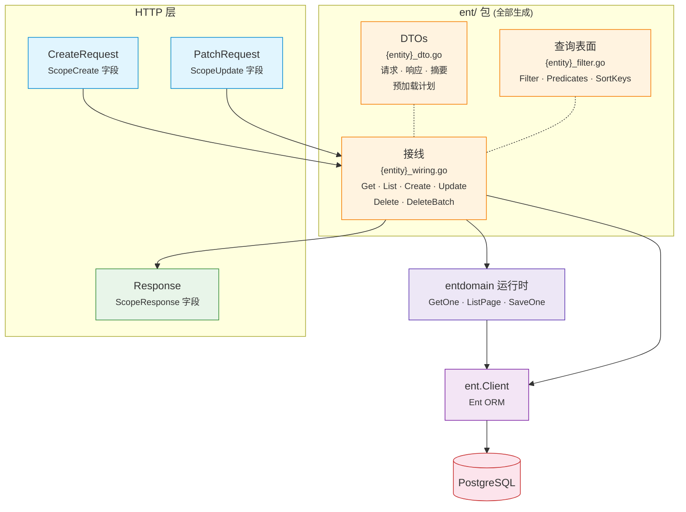

# EntDomain

[](https://pkg.go.dev/github.com/githonllc/entdomain)
[](https://goreportcard.com/report/github.com/githonllc/entdomain)
[](https://opensource.org/licenses/MIT)

一个 [Ent](https://entgo.io) 扩展，从带注解的 schema 自动生成 HTTP 请求/响应 DTO、查询表面，以及每个操作一个的接线函数。


> ### 状态：原型，正在重新设计
>
> 这个库能用，但它的形态正在被重新考虑。方向已定，**尚未实现任何一部分**——
> 下面记录的是**当前已有的东西**，不是计划中的东西。
>
> - **方向与理由** — [`DESIGN-v2.md`](DESIGN-v2.md)。里面同时记录了初稿自己搞错的断言，
>   因为「哪些直觉在这个代码库里不成立」本身就是设计资料。
> - **已知缺陷** — [`QUALITY-REVIEW.md`](QUALITY-REVIEW.md)，三次独立评审的 41 条发现。
> - **整体结构** — [`ARCHITECTURE.md`](ARCHITECTURE.md)。
> - **工作项** — epic [#23](https://github.com/githonllc/entdomain/issues/23)。
>
> 采用之前请先读[已知限制](#已知限制)。其中有几条是陷阱而不是缺口，
> 并且**有一个注解描述了它并不提供的保证**。
>
> `go test ./...`、`make check`、`gofmt -l .` 与 `make lint` 在干净 checkout 上**全绿**。
> 这一行过去警告的红色测试套件已在 [#2](https://github.com/githonllc/entdomain/issues/2) 修复。

## 特性

- **注解驱动** — 使用简洁的构建器标记字段作用域（`DefaultField`、`InputOnlyField`、`OutputOnlyField` 等）
- **HTTP DTO** — 为每个实体生成 `CreateRequest`、`PatchRequest`、`Response`、`ListResponse`
- **显式的存在性（presence）** — patch 请求能区分「键缺席」「显式 null」「有值」三种状态；create 时省略的字段根本不会被写入，schema 的 `Default()` 因此依然生效
- **查询表面** — 过滤器结构体（每个 ent 推导出的操作符一个参数）、全文检索 `q`，以及排序白名单
- **接线** — 每个操作一个自由函数，函数体是对「只写一次的泛型运行时」的一次调用
- **任意标识符类型** — id 在每个模板里都来自 schema，到运行时则是一个类型参数
- **ent 层软删除** — 嵌入 `entdomain.SoftDeleteMixin`，在构造 client 处注册一行，被删除的行就从**每一条**读路径消失，包括完全不经过本项目生成物的 `client.User.Query()`
- **来源追溯** — 生成的文件包含 schema 名称、模板路径和重新生成命令

## 环境要求

- Go 1.23+
- [Ent](https://entgo.io) v0.14+

## 安装

```bash
go get github.com/githonllc/entdomain
```

一个 module，**两条导入路径**，用哪条取决于文件在做什么：

| 导入路径 | 使用方 | 会链接进来的东西 |
|---|---|---|
| `github.com/githonllc/entdomain` | `entc.go` 与 schema 文件——注解构建器、`Edge()`、`SoftDeleteMixin`、扩展本体 | ent 的 codegen 包、源码格式化器、嵌入的模板 |
| `github.com/githonllc/entdomain/runtime` | 生成的代码，以及你自己的 service / handler 代码——`ListPage`、`GetOne`、`SaveOne`、`ListRequest`、错误哨兵、`ErrorMapper`、`WithSoftDeleted` | 只有标准库 |

runtime 包的**包名仍然是** `entdomain`，所以无论从哪条路径进来，调用点都还是写
`entdomain.ListPage`。同时需要两边的文件就两条都导入，给其中一条起个别名。

## 配置

在 `entc.go` 中注册扩展：

```go
//go:build ignore

package main

import (
    "log"

    "entgo.io/ent/entc"
    "entgo.io/ent/entc/gen"
    "github.com/githonllc/entdomain"
)

func main() {
    ext := entdomain.NewExtensionWithOptions(
        // RUNTIME 路径——这是生成文件里写的那一条。它同时也是默认值，
        // 这个选项只为 vendored 副本而存在。
        entdomain.WithEntDomainPackage("github.com/githonllc/entdomain/runtime"),
    )

    if err := entc.Generate("./schema", &gen.Config{
        Target:  "../ent",
        Package: "your/module/ent",
    }, entc.Extensions(ext)); err != nil {
        log.Fatal(err)
    }
}
```

然后运行：

```bash
go generate ./...
```

## 注解构建器

### 基础构建器

```go
entdomain.DefaultField()                      // 创建、更新、查询、响应
                                              // 同时把字段标为 searchable / filterable / sortable
entdomain.InputOnlyField()                    // 仅创建和更新（如密码）
entdomain.OutputOnlyField()                   // 仅响应（如时间戳、状态）
entdomain.CreateOnlyField()                   // 创建 + 响应（创建后不可变）
entdomain.NewDomainField()                    // 无作用域（ent 追踪但不在任何 HTTP 结构体中）
entdomain.DomainFieldWithScopes(scopes...)    // 自定义作用域组合
```

### 流式构建器 API

```go
field.String("email").
    Annotations(
        entdomain.DefaultField().
            WithRequired(entdomain.ScopeCreate),
    )
```

### 从 `AsSensitive()` 迁移

**安全相关。** `DomainField.Sensitive` 与 `AsSensitive()` **已删除**。它们从来
没有起过任何作用：响应字段选择只读 scope 列表，别的一概不看，所以标了 sensitive
的字段照样被生成进 `Response` 结构体并序列化成 JSON。如果你在一个同时带
`ScopeResponse` 的字段上调用了 `AsSensitive()`——而 `DefaultField()` 就会授予
`ScopeResponse`——那个字段一直都在你的 API 响应里。**请据此审计你的响应；删掉这个
调用不会改变任何行为，因为它本来就没有行为。**

```go
// 之前——能编译，只有承诺，照样泄露
field.String("password").
    Annotations(entdomain.DefaultField().AsSensitive())

// 之后——scope 列表就是机制，而且它真的生效
field.String("password").
    Annotations(entdomain.InputOnlyField())
```

`InputOnlyField()` 只授予 `ScopeCreate` 和 `ScopeUpdate`。让字段不出现在响应里，
靠的是不给它 `ScopeResponse`，而且从来只有这一条路。自定义组合同理：
`entdomain.DomainFieldWithScopes(entdomain.ScopeCreate)`。

选择删除而不是实现，是因为在一维 scope 模型下它只添加承诺、不添加能力。它唯一
能表达而 scope 表达不了的语义——「对一部分调用者可见、对另一部分不可见」——需要
一个本包并不存在的受众维度
（[#3](https://github.com/githonllc/entdomain/issues/3)）。

### 从 `WithValidation()` 迁移

`DomainField.Validation` 与 `WithValidation()` **已删除，且没有替代品**——因为生成的
请求类型上的 `Validate()` 是它的后继。

```go
// 之前——一条本包从不执行的规则
field.String("name").
    Annotations(entdomain.DefaultField().
        WithValidation(map[string]interface{}{"min": 1, "max": 100}))

// 之后——删掉这次调用；规则应该写在 Validate() 里
field.String("name").
    Annotations(entdomain.DefaultField())
```

删掉调用不会改变任何行为，因为它本来就没有行为：没有任何代码读过那个 map。规则现在
的去处是生成的 `{Entity}CreateRequest` / `{Entity}PatchRequest` 上的 `Validate()`，
它是通往 `Valid{Entity}…Request` 的 `Apply` 的唯一入口
（[#26](https://github.com/githonllc/entdomain/issues/26)）——所以写在那里的规则**绕
不过去**，而这恰恰是一个被忽略的注解无法承诺的。

### `WithDescription()` 与 `WithExample()` 迁到了 metadata 块

**两个构建器都还在，也照样支持链式调用。变的只是值存在哪里**——从 `DomainField` 移到
了 `FieldMetadata`。schema 代码无需改动：

```go
// 不变——照样编译，照样链式
field.String("email").
    Annotations(entdomain.DefaultField().
        WithDescription("主要联系地址").
        WithExample("user@example.com"))
```

变的是读取侧，只影响直接检视注解的代码：

```go
d := entdomain.DefaultField().WithDescription("主要联系地址")

d.Description            // 之前
d.Metadata.Description   // 之后
```

它们迁移，是因为二者都是 OpenAPI schema 字段，而它们的每一个同类——`Title`、
`Format`、`Pattern`、`Enum`、`ReadOnly` 等等——早已在 `FieldMetadata` 上，处于那段
「保留给 spec 生成」的文档注释之下。与同类分居是不一致，不是一个放置决策；这也让它们
处于「被接受并被默默忽略」的状态，而不是被一条明示的前向契约覆盖。和其余 metadata
构建器一样，它们每次调用都新分配一个 `*FieldMetadata`，所以从同一个基注解分叉出的两条
链彼此独立（[#5](https://github.com/githonllc/entdomain/issues/5)）。

### `DomainConfig` 已删除

实体级注解 `DomainConfig` **已删除**，没有替代品。请把它从任何 `Annotations()` 调用里
去掉：

```go
// 之前
func (User) Annotations() []schema.Annotation {
    return []schema.Annotation{entdomain.DomainConfig{}}
}

// 之后——如果这是唯一一项，整个方法都可以删掉
```

它早已一无所有：`EntityName` 在
[#17](https://github.com/githonllc/entdomain/issues/17) 被删（生成器一律用 schema 自己的
名字命名每个产出类型），[#29](https://github.com/githonllc/entdomain/issues/29) 又随
base service / base handler 模板删掉了那两个开关。剩下的是一个 schema 可以挂上、却产生
不了任何可观察效果的注解。今天生成流程不读取任何实体级配置；若将来需要，新注解会和赋予
它意义的读取方一起到来。

### 边注解

边有自己的注解。此前边的暴露与否是从它的外键字段推导的，那把两个不同的决定
混成了一个——"把 `author_id` 放进响应"和"把嵌套的 `author` 对象放进响应"
——并且让暴露与否取决于哪张表持有该列。一对多边在本实体上根本没有字段，
所以在那条规则下永远无法暴露。

```go
entdomain.Edge()                       // 无作用域
entdomain.Edge().InResponse()          // 嵌套对象出现在 Response 中
entdomain.Edge().InResponse().As("written_by")  // 覆盖 JSON key
```

```go
func (Post) Edges() []ent.Edge {
    return []ent.Edge{
        // author_id（标量）由字段注解控制，author（嵌套对象）由这条边注解
        // 控制。两者互相独立。
        edge.From("author", User.Type).
            Ref("posts").Unique().Required().Field("author_id").
            Annotations(entdomain.Edge().InResponse()),
    }
}
```

和字段构建器一样，每个边构建器都是值接收者并返回副本，因此一个配置了一半的
注解可以安全地当作基底复用。

> **陷阱，现已拒绝**：用链式写法声明自引用边对
> `edge.To("children", X.Type).From("parent")...Annotations(a)`，注解**只会
> 挂到反向边上**。正向边被留成裸边——而裸边恰好也是「不要暴露这条边」的写法
> ——所以过去 `children` 会从响应类型和预加载计划里一起消失，且没有任何提示。
>
> 现在，**只标注了一端**的自引用边对会直接让生成失败，错误信息点名两端并给出
> 修法。请把两条边分开声明，各自标注：
>
> ```go
> edge.To("children", X.Type).
>     Annotations(entdomain.Edge().InResponse()),
> edge.From("parent", X.Type).Ref("children").Unique().Field("parent_id").
>     Annotations(entdomain.Edge().InResponse()),
> ```
>
> 若确实**只想暴露一端**，就给另一端标一个裸的 `entdomain.Edge()`。它不授予任何
> 作用域，因此输出与不标注完全相同；它带来的唯一变化是把这个决定写了下来，
> 而这正是它与「链式写法遗漏的那一端」的区别所在。
>
> 该检查仅限于两端位于同一个 `Edges()` 切片中的边对——只有自引用边对如此。
> 跨两个实体时，只暴露一个方向是常态，永远不会被拒绝。

## 运行时：泛型 CRUD

```go
import "github.com/githonllc/entdomain/runtime" // 包名：entdomain
```

每个实体共有的算法在 Go 里只写一次，而不是在模板里每个实体写一遍。实体相关的
部分以类型参数和函数值的形式传入，因此**这一半不 import 任何 ent 包**，
标识符类型也不再被写死。

### 迁移到 runtime 子包

**运行时类型已从 `github.com/githonllc/entdomain` 移动到
`github.com/githonllc/entdomain/runtime`。根包不再声明它们，也没有任何过渡别名**
（[#15](https://github.com/githonllc/entdomain/issues/15)）。

```go
// 之前
import "github.com/githonllc/entdomain"

// 之后——生成的代码，以及任何调用运行时的文件
import entdomain "github.com/githonllc/entdomain/runtime"
```

这个别名是 `goimports` 会写进去的，因为包名已经和路径最后一段不一致了。编译并不
需要它——不写别名也照样绑定到 `entdomain`——但不写的话，下一次跑 `goimports` 就会
产生一个 diff。

除此之外什么都不变。新包仍然是 `package entdomain`，因此 `entdomain.ListPage`、
`entdomain.ErrValidation`、`entdomain.WithSoftDeleted` 的写法与之前完全一致；
整个迁移就是每个文件改一行 import。schema 文件与 `entc.go` 继续导入根路径，一个
字都不用动——注解构建器、`Edge()` 与 `SoftDeleteMixin` 没有移动。

生成的那一半重新生成一次即可：`WithEntDomainPackage` 的默认值已经是 runtime 路径。

**移动了的：** `ListRequest`、`Page`、`Query`、`Saver`、`ListPage`、`GetOne`、
`SaveOne`、`AppendIf`、`AppendIfSlice`、`ErrNotFound`、`ErrAlreadyExists`、
`ErrValidation`、`IsNotFound`、`IsAlreadyExists`、`IsValidation`、`ErrorMapper`、
`NewErrorMapper`、`DefaultPageSize`、`MaxPageSize`、`Ptr`、`PtrOrNil`、
`PtrNilSafe`、`WithSoftDeleted`、`SoftDeletedIncluded`、`WithHardDelete`、
`HardDeleteRequested`。

**留下的：** `DomainField` 及其全部构建器、`DomainEdge`/`Edge()`、`Scope*` 常量、
`SoftDeleteMixin`、`DomainSoftDelete`、`SoftDeleteField`、`Extension` 与各选项。
它们全部只在生成期被读取，所以原本导入根路径的 schema 一行都不用改。

**为什么不留别名。** 一个把运行时再导出一遍的根包，会原样保留这次拆分要消除的那个
耦合：为了 `ErrNotFound` 而导入它的消费者，照样会链接 ent 的 codegen 包、源码格式
化器和五个嵌入模板，照样会在包初始化阶段跑一遍模板加载器。本 module 没有任何版本
tag，也就没有已发布的表面需要保。现在 `go list -deps` 对 runtime 包给出的
`entgo.io` 包数是 **0**（总共 62 个，全是标准库），对生成器则是 **15**；
`TestRuntimePackageIsGeneratorFree` 是签入仓库的守卫，并且带一个对照组——探针本身
失效时它会失败。

```go
// Query 是分页所需的 ent query builder 子集。Q 是自引用的，因为 ent 的链式
// 方法返回的是具体 builder 类型。
type Query[Q, P, O, E any] interface {
    Where(...P) Q
    Order(...O) Q
    Limit(int) Q
    Offset(int) Q
    All(context.Context) ([]*E, error)
    Count(context.Context) (int, error)
}

type Page[R any] struct {
    Data  []*R `json:"data"`
    Total int  `json:"total"`
    Page  int  `json:"page"`
    Size  int  `json:"size"`
}

func ListPage[Q Query[Q, P, O, E], P, O, E, R any](
    ctx context.Context, q Q, ps []P, os []O, r ListRequest,
    to func(*E) (*R, error),
) (*Page[R], error)

func GetOne[E, R, ID any](
    ctx context.Context,
    get func(context.Context, ID) (*E, error),
    to func(*E) (*R, error),
    id ID,
) (*R, error)

// Saver 是变更构建器的子集。*<T>Create 与 *<T>UpdateOne 都满足它，
// 所以创建与更新共用同一个例程。
type Saver[E any] interface {
    Save(context.Context) (*E, error)
}

func SaveOne[B Saver[E], E, R any](
    ctx context.Context, b B, to func(*E) (*R, error),
) (*R, error)
```

类型实参在调用点由推导得出，一个都不用手写：

```go
// 这里 ID 是 uuid.UUID……
user, err := entdomain.GetOne(ctx, db.User.Get, NewUserResponse, id)

// ……这里是 int。同一个函数。
tag, err := entdomain.GetOne(ctx, db.Tag.Get, NewTagResponse, tagID)

page, err := entdomain.ListPage(ctx, db.User.Query(),
    filter.Predicates(), orderOpts, req, NewUserResponse)
```

### 分页上界

`ListPage` 使用**偏移分页**。代价直说不粉饰：深翻是 O(n)，每页要付一次
`COUNT`，并且在并发写入下可能跳过或重复行。

```go
const (
    entdomain.DefaultPageSize = 20    // 请求没给出可用的 size 时采用
    entdomain.MaxPageSize     = 1000  // 上界——只在这里决定，别处没有
)

func (r ListRequest) Limit() int   // 请求的 size 夹取到 MaxPageSize；永不 <= 0
func (r ListRequest) Offset() int  // (Page-1) * Limit()；永不为负
func (r ListRequest) SortKey(allow []string, def string) (key string, desc bool, err error)
func (r *ListRequest) Validate() error
```

`ListRequest` 的零值开箱可用。**没有 `SetDefaults()`**——一个没人强制你调的
默认值填充调用，就是一个你会忘记调的调用，而忘记它正是零 size 直达查询的
成因。生效值一律通过 `Limit()` / `Offset()` 读取，不要直接读字段；`ListPage`
调的就是这两个。

`MaxPageSize` 是这个上界唯一的落脚点，越界也只有一种反应：**`Limit()` 夹取**。
`Validate()` 对 `Size` 和 `Page` 一言不发，因为 `Limit()` / `Offset()` 位于
通往 `ListPage` 的唯一路径上，不管有没有人调 `Validate()` 都会生效——只在
主动调用时才触发的上界是建议不是上界。`Page.Size` 会报出真正生效的 size，
所以夹取是可见的；如果在你的 API 里超限就该是 `400`，自己拿它和
`MaxPageSize` 比即可。

`Size`、`Page`、`Order` 的 `validate` tag 里**故意一条规则都不写**。tag 既
引用不了常量，也表达不了大小写不敏感的比较，所以写在那里的每条规则都是第二份
拼写，只会与真正执行它的代码漂开——`max=100` 早就与 `MaxPageSize`=1000 漂开
了，`oneof=asc desc` 也早就与 `SortKey()` 的大小写不敏感比较漂开了。
`Validate()`、`Limit()`、`Offset()` 才是这些规则的落脚点。

`Validate()` 只剩下游修不了的那些：`Order` 必须是 `asc`、`desc` 或空，且
**按大小写不敏感比较**。`SortKey()` 用 `EqualFold` 读 `Order`，又位于通往
`ListPage` 的唯一路径上，所以方向其实是它定的——`Validate()` 因此恰好拒绝
`SortKey()` 不认的那些，不多不少。`"DESC"` 会按降序执行，所以它通过校验；
`"descc"` 被拒绝，因为 `SortKey()` 会把它静默读成升序，把结果倒过来。
返回的错误包装了 `ErrValidation`。

### 从 `SetDefaults()` 迁移

`ListRequest.SetDefaults()` **已删除**。`ListRequest` 的零值现在开箱可用。

```go
// 之前
req.SetDefaults()
if err := req.Validate(); err != nil { /* ... */ }

// 之后——没有需要调的东西
if err := req.Validate(); err != nil { /* ... */ }
```

默认值填充和夹取由 `Limit()` / `Offset()` 自己完成，就在通往 `ListPage` 的
唯一路径上。生效值请通过它们读取，不要直接读字段：`req.Size` 可能仍是 `0`，
但 `req.Limit()` 永远不是 `0`。如果你依赖 `SetDefaults()` 就地改写请求再序列化
回去，请显式写 `req.Size = req.Limit()`。

`Validate()` 也不再拒绝超范围的 `Size` / `Page`——它们是被夹取而不是被拒绝。
如果你的 API 此前对 `size=5000` 返回 `400`，请自己拿它和 `MaxPageSize` 比较。

### 从游标编解码器与 `PageInfo` 迁移

**`Cursor`、`PageInfo`、`EncodeCursor`、`DecodeCursor` 以及 `ListRequest.Cursor`
字段全部删除，生成的 `{Entity}ListResponse` 也不再带 `PageInfo` 字段。**
本包发布的分页只有偏移分页，没有第二种
（[#6](https://github.com/githonllc/entdomain/issues/6)）。

它们从来没有起过作用。没有任何生成代码调用过这套编解码器；唯一会编码游标的生成
lister——base service 上的 `ListWithCursor`——已经随 base service 一起消失。
`ListRequest.Cursor` 的注释写着「当 `Cursor` 被设置时使用 keyset 分页」，而
**没有任何代码分支读过它**：设了它的调用方每次都静默拿到偏移分页的第一页。这正是
这次删除针对的失败。`DecodeCursor` 另有 2^53 以上的精度损失——`ID any` 经
`json.Unmarshal` 回来已是 `float64`，而用来修复它的 `f == float64(int64(f))` 判据
对已经截断的值同样成立，所以它检测不到自己的缺陷。

```go
// 之前
req := entdomain.ListRequest{Cursor: token, Size: 20}   // token 被忽略
page, err := ent.ListArticles(ctx, db, filter, req)

// 之后
req := entdomain.ListRequest{Page: 2, Size: 20}
page, err := ent.ListArticles(ctx, db, filter, req)
```

**线格式。** `{Entity}ListResponse` 少了第五个字段：

```jsonc
// 之前                                  // 之后
{                                      {
  "data": [ /* … */ ],                   "data": [ /* … */ ],
  "total": 42,                           "total": 42,
  "page": 1,                             "page": 1,
  "size": 20,                            "size": 20
  "pageInfo": {                        }
    "hasNextPage": true,
    "endCursor": "eyJpZCI6…"
  }
}
```

该字段是 `json:"pageInfo,omitempty"`，而**没有任何生成代码给它赋过值**，所以本库
实际发出的响应里从未出现过 `pageInfo` 键。这次破坏针对的是已发布的 Go 结构体，
不是任何真正发出过的报文：读 `resp.PageInfo` 的代码编译不过，读 JSON 的代码毫无
变化。`{Entity}ListResponse` 保持与 `entdomain.Page[{Entity}Response]` 相同的四个
字段，而后者正是 `ent.List{Entities}` 的返回类型。

**如果你确实需要 keyset 分页**，自己写那条查询——生成的 filter、排序选项与转换器
都还在，可以直接交给它，写法见
[从 `BaseService` 与 `BaseHandler` 迁移](#从-baseservice-与-basehandler-迁移)。
不要复活被删的编解码器：它从来没有需要兼容的调用方，而日后再加回游标是纯加法改动
——正是这个不对称使得「删掉」是便宜的那个方向。

### 错误映射

`ErrorMapper` 把持久层的错误翻译成本包的哨兵值。它以函数值的形式接收谓词，
因此运行时仍然不 import 任何 ent 包。

**你不需要自己构造它。** 生成会为整个包写出一个 `ent/entdomain_errors.go`，
里面就是每个生成操作返回时都会经过的那个映射器：

```go
// 生成的
var ErrorMap = entdomain.NewErrorMapper(IsNotFound, IsConstraintError)
```

那里的 `IsNotFound` 与 `IsConstraintError` 是 **ent 自己的**，生成在同一个包里
——框架并不导出它们，因为 `NotFoundError` 与 `ConstraintError` 是逐项目生成的。
这一行是两半唯一能相遇的地方。

一个包一个变量、而不是每次调用一个参数，正是"哪个操作失败都读作同一个哨兵"
的来源：

```go
_, err := ent.GetArticle(ctx, db, id)
if entdomain.IsNotFound(err) { /* 404 —— Update、Delete… 完全一样 */ }
```

**唯一性需要自己的谓词**，这不是为了方便——`ent.IsConstraintError` 对重复键
和外键冲突一视同仁地返回 true：

```
UNIQUE constraint failed: tags.name (2067)
FOREIGN KEY constraint failed (787)
```

因此把它直接映射成 `ErrAlreadyExists`，等于把外键冲突报成重复键。区别只存在
于被 `*ent.ConstraintError` 包裹的 driver error 里，且与方言相关，所以库不猜
——要么你把它装到生成的映射器上，要么就得不到 already-exists 分类：

```go
func init() {
    ent.ErrorMap = ent.ErrorMap.WithUniqueViolation(func(err error) bool { // SQLite
        return strings.Contains(err.Error(), "UNIQUE constraint failed")
    })
}
```

**漏掉这一行是安全的，这正是整个设计的落点。** not-found 照常工作，放弃的只有
already-exists：重复键会以未分类的形式回来，HTTP 层给出 `500` 而不是 `409`。
这个方向是刻意的——重复键上的 `500` 可以补救，外键冲突上的 `409` 会把调用方
指去修一个根本没错的东西。请在构造 client 的地方、第一个请求之前赋值：它就是
一个普通的包级变量，自身不带任何同步。

映射器判不出来的一切——包括种类未识别的约束冲突——原样返回：不分类、不吞掉、
也绝不贴上一个并未被确立的哨兵。哨兵和原错误同时留在错误链上，`errors.Is`
两边都找得到。

`SortKey` 会把请求的字段与白名单核对。白名单正是要点所在：未经校验的排序字段
是注入点、是全表扫描的触发器，并且与分页组合起来还是一个对调用方本不该读到的
列的排序预言机。未知字段返回 `ErrValidation`。

## Schema 示例

```go
package schema

import (
    "time"

    "entgo.io/ent"
    "entgo.io/ent/schema/field"
    "github.com/githonllc/entdomain"
)

type User struct {
    ent.Schema
}

func (User) Fields() []ent.Field {
    return []ent.Field{
        field.String("name").
            NotEmpty().
            Annotations(
                entdomain.DefaultField().
                    WithRequired(entdomain.ScopeCreate),
            ),

        field.String("email").
            Optional().
            Annotations(entdomain.DefaultField()),

        field.Time("created_at").
            Default(time.Now).
            Immutable().
            Annotations(entdomain.OutputOnlyField()),
    }
}
```

## 架构



**核心原则**：作用域仅控制 HTTP 层结构体生成。生成的任何东西都不限制消费者自己的代码怎么使用 ent 实体。

## 生成的代码

为每个带注解的 schema 生成三个文件（均在 `ent/` 包中）：

| 文件 | 内容 |
|------|------|
| `{entity}_dto.go` | `CreateRequest`、`PatchRequest`、它们的 `Validate()`/`Apply` 组合，以及下述响应部分 |
| `{entity}_filter.go` | `{Entity}Filter` 及其 `Predicates()`、`{Entity}SortKeys`、`{Entity}Order`——下述查询部分 |
| `{entity}_wiring.go` | 每个操作一个自由函数，把本实体的产物交给运行时——下述接线部分 |

以前还有两个文件，藏在可选开关 `WithBaseService` / `WithBaseHandler` 后面。两者都已删除，
见[从 `BaseService` 与 `BaseHandler` 迁移](#从-baseservice-与-basehandler-迁移)。
生成运行会**删除**目标目录里遗留的 `{entity}_base_service.go` 与
`{entity}_base_handler.go`，所以升级不会留下一堆「编译得过、但本库已不再描述」的代码。

另外为整个 schema 生成两个文件，各自仅在确实有内容可写时才生成：

| 文件 | 生成条件 | 内容 |
|------|---------|------|
| `entdomain_errors.go` | 至少有一个实体带注解 | `ErrorMap`——每个生成操作返回时都经过的分类器，见[错误映射](#错误映射) |
| `entdomain_softdelete.go` | 至少有一个实体嵌入 `entdomain.SoftDeleteMixin` | `RegisterSoftDelete`、查询 traverser 与改写删除的 hook——见[软删除](#软删除) |

每个生成文件的**首行**都是 `// Code generated by entdomain extension …`——正是这一行、
且只有这一行，标记该文件归本扩展所有（可被覆写或删除）。

**这个 marker 就是全部的所有权判据，所以要清楚它的爆炸半径。** 写完本轮产物后，
生成运行会扫描目标目录（**仅直接子文件**，绝不进入 ent 在其下生成的子包），
删除其中每一个首行带 marker、且本轮未写过的 `.go` 文件。正因如此，从 schema 里
删掉一个实体只需一次生成即可收敛，而不会留下一个引用 ent 已不再生成的 builder 的
`{entity}_dto.go`。它同样覆盖已无模板可写的那两个文件
（`{entity}_base_service.go`、`{entity}_base_handler.go`），所以升级过
[#29](https://github.com/githonllc/entdomain/issues/29) 时会自动清理干净。
不带 marker 的文件永远不是候选，且每一个被跳过的文件都会记入日志。

**想把某个生成文件据为己有：删掉它的首行。** 不带 marker 的文件不归本扩展所有，
既不会被覆写也不会被删除——从那一刻起它归你，包括维护它能编译过的责任。

**`{entity}_dto.go` 的文件头在 [#66](https://github.com/githonllc/entdomain/issues/66)
中修正**：它此前指向 `backend/pkg/entdomain/templates/dto.tmpl` 与 `entschema/schema/`
下的 schema 路径，二者都是本扩展从原宿主仓库剥离时的残留，在任何消费者的仓库里都不存在。
重新生成会重写每个 DTO 文件的这两行；除此之外没有任何变化，消费者代码无需改动。

### 创建请求与 patch 请求

`{entity}_dto.go` 的请求部分是两个请求类型，各自配一个「已校验」形态——那是写
builder 的唯一入口：

| 声明 | 用途 |
|---|---|
| `{Entity}CreateRequest` | create 作用域字段；ent 要求且无法默认的字段是值类型，其余是 `*T` |
| `{Entity}PatchRequest` | update 作用域中 ent 的 update builder 真能设置的字段，全部是 `*T` |
| `(r) UnmarshalJSON(b) error` | 在常规解码之外，记录 payload 携带了哪些键 |
| `(r) Has<Field>() bool` | payload 是否携带了该键 |
| `(r) Validate() (*Valid{Entity}…Request, error)` | 获得已校验形态的唯一途径 |
| `(v) Apply(b) b` | 把请求写到 `{Entity}Create` / `{Entity}UpdateOne` 上 |

由此得到四条性质，每条都在 `internal/fixtures/presence` 中针对真实 ent builder
断言：

- **create 时省略的字段根本不会被写入**，schema 的 `Default()` 因此生效。这正是
  存在性必须被记录、而不能从零值推断的全部理由。
- **patch 区分缺席、显式 `null` 与有值。** 缺席表示不动该字段，`null` 生成
  `Clear<Field>()`，有值生成 `Set<Field>()`。只有 schema 声明为 `Optional()` 的
  字段可以被清空——ent 只为这类字段生成 `Clear<Field>()`；对其它字段的 `null`
  会被拒绝，并在错误信息里点名该字段。
- **不校验就拿不到 `Apply`，那是编译错误。** `Apply` 定义在
  `Valid{Entity}CreateRequest` / `Valid{Entity}PatchRequest` 上，而只有
  `Validate` 能构造它们。v1 的自由函数 `Apply{Entity}CreateRequest` /
  `Apply{Entity}UpdateRequest` 已删除：它们接收未校验的请求，正是校验被跳过的
  那条路径。
- **线格式没有变化。** 存在性存在一个不导出、且没有自己 marshaller 的 map 里，
  所以请求仍然按普通 JSON 序列化与反序列化，所有基于反射的消费者——校验库、表单
  绑定、spec 生成器——看到的还是原来那个结构体。泛型 `Optional[T]` 包装器正是因为
  丢掉这一点而被否决。

在 Go 里手工构造、而非解码得到的请求没有记录任何存在性，两个类型在这里的默认
方向是刻意相反的：创建请求把所有字段读作「已提供」，因为此时结构体是唯一的事实
来源；patch 请求把所有字段读作「缺席」，这样它的空指针永远不会被误读成清空整行的
指令。`UnmarshalJSON` 总会分配那个 map，所以这两个回退都不可能在解码得到的请求上
触发。

`Immutable()` 字段不会出现在 patch 请求里，因为 ent 的 update builder 遍历
`MutableFields`，不会为它生成 setter。调用方在 PATCH 正文里写上它只会得到沉默：
`encoding/json` 在任何校验器看到之前就丢弃了该键。要拒绝它需要
`DisallowUnknownFields`，那属于使用方的 handler——这是本切片里唯一无法在生成器
内部闭合的情况。

### 从大小写不敏感的 JSON 键迁移

**只在大小写上与字段 JSON tag 不同的 payload 键，现在是一个校验错误。** 它此前
会被接受，而它命名的那个字段被静默丢弃
（[#58](https://github.com/githonllc/entdomain/issues/58)、
[ADR-0001](docs/adr/0001-presence-follows-encoding-json-key-matching.md)）。

`encoding/json` 在精确匹配**或**大小写不敏感匹配时都会填充结构体字段，而存在性
是按原始 payload 键记录的。任何大小写变体都会让二者产生分歧：`{"Nickname":"sam"}`
解码进了带 `nickname` tag 的字段，`HasNickname()` 却仍是 `false`，`Apply` 什么都
没写——更新返回成功，却没有改动任何一行。同时携带两种拼写的 payload 更糟：后一个
键把字段覆盖成了 `nil`，而存在性看到的是精确键，于是一个携带了值的 patch 反而
**清空**了该字段。

```go
// 此前——没有错误，行也没有变化
_ = json.Unmarshal([]byte(`{"Nickname":"sam"}`), &req)  // req.Nickname == "sam"
req.Validate()                                          // 通过
valid.Apply(b)                                          // 什么都没写

// 此后——errors.Is(err, entdomain.ErrValidation)
// validation failed: unknown key "Nickname" (did you mean "nickname"?)
err := json.Unmarshal([]byte(`{"Nickname":"sam"}`), &req)
```

`UnmarshalJSON` 会点名拒绝该键并给出规范拼写，而且发生在解码进结构体之前，所以被
拒绝的请求保证不会碰到接收者。折叠后**不匹配任何** tag 的键保持原有行为、继续被
忽略——拒绝那些键是 `DisallowUnknownFields`，仍归使用方的 handler，与上面
`Immutable()` 的情况完全一致。迁移不需要改任何代码：大小写写错的客户端本来就在
丢数据，这个错误是它第一次得到的诚实回答。

### 响应类型、摘要类型与预加载计划

`{entity}_dto.go` 的响应部分由这几个声明构成：

| 声明 | 作用 |
|---|---|
| `{Entity}Response` | 完整响应：带 response 作用域的标量字段，外加每条标注了 `InResponse()` 的边 |
| `{Entity}Summary` | 相同的标量字段，且**不含任何边**；边字段承载的就是这个类型 |
| `New{Entity}Response(e) (*{Entity}Response, error)` | 转换函数；边的状态一律通过 `<Edge>OrErr()` 读取 |
| `New{Entity}Summary(e) *{Entity}Summary` | 转换函数；不会失败，因为摘要不读任何边 |
| `{Entity}QueryWithResponseEdges(q) q` | 预加载计划，由响应类型自己的边集合生成 |

由此得到三条性质，每一条都在 `internal/fixtures/edges` 中有断言：

- **已加载但无关联行 = 显式 `null`，不是缺字段。** 边字段一律不带 `omitempty`。
  `loadedTypes` 未导出，nil 指针区分不了「没加载」和「加载了但不存在」；这里把两者
  分开，客户端才能区分「没有关联行」和「没人去查」。
- **未加载的边返回 error。** `New{Entity}Response` 把它返回出来，而不是发出一个读起来
  像「这篇文章没有作者」的响应。这个 error 代价很低：预加载计划由同一个边集合生成，
  生成的接线里不可能漏掉某条边，它只会抓到手写查询。注意 `client.{Entity}.Get` 不加载
  任何边，因此无法服务于声明了边的响应类型——要走 `Query` 并套上该计划。
- **展开深度由类型系统封死，而非运行时计数器。** 摘要类型没有边字段，所以
  `New{Entity}Response` 调用摘要构造函数，而摘要构造函数不再调用任何东西，没有第二层
  供环闭合。代价明说而不掩盖：三层树只回来一层，更深的树每层需要一次额外往返。

```go
q := ent.PostQueryWithResponseEdges(client.Post.Query())
p, err := q.Where(post.IDEQ(id)).Only(ctx)
if err != nil {
    return err
}
resp, err := ent.NewPostResponse(p) // 仅当某条边未加载时 err 才非 nil
```

### 具名列表类型，以及它存在的理由

`List{Entities}` 返回 `*entdomain.Page[{Entity}Response]`，接线签名保持不变。与它
并列，`{entity}_dto.go` 还发射一个具名的、非泛型的孪生类型及其转换函数：

| 声明 | 作用 |
|---|---|
| `{Entity}ListResponse` | 同样的四个偏移分页字段，但类型名落在你自己的 `package ent` 里 |
| `New{Entity}ListResponse(p) *{Entity}ListResponse` | 转换函数；传 `nil` 得 `nil` |

要的就是这个名字。swaggo 一类的 OpenAPI 注解工具没有表达泛型实例化的语法——
`@Success` 那一行里写不出 `entdomain.Page[CourierResponse]`——所以 handler 在传输
边界上转换一次，再对具名类型下注解：

```go
// ListCouriers godoc
// @Success 200 {object} ent.CourierListResponse
func (h *Handler) ListCouriers(c echo.Context) error {
    page, err := ent.ListCouriers(c.Request().Context(), h.db, filter, req)
    if err != nil {
        return err
    }
    resp := ent.NewCourierListResponse(page)
    return c.JSON(http.StatusOK, resp)
}
```

转换在线格式上零代价：`{Entity}ListResponse(*p)` 是一次普通的 Go 类型转换，产出的
载荷与直接 marshal 那个 page 逐字节相同（`internal/fixtures/wiring/e2e` 中有断言）。
它同时承载形状契约——只有当两个结构体的字段集、类型、顺序都一致时转换才合法，所以
`Page` 与 `{Entity}ListResponse` 之间的任何漂移都会让**每一个**生成包编译失败。
类型转换唯一不检查的是 struct tag；那一半由 `internal/fixtures/basic` 的
golden JSON 测试守着。

### 过滤、全文检索与排序白名单

`{entity}_filter.go` 把一个列表端点的三个维度收进同一个产物。字段必须**同时**带有
`ScopeQuery` 和对应维度的标记才会参与；两者皆无的字段在三者中都不出现，也没有任何
运行时开关能把它加回来。

| 声明 | 用途 |
|---|---|
| `{Entity}Filter` | 每个 `Filterable` 字段按操作符各一个参数——字段若非同时 `Searchable`，则不含子串类；只要有 `Searchable` 字段就额外带 `Q` |
| `(*{Entity}Filter).Predicates() []predicate.{Entity}` | 生成 ent 谓词，由 `Where(...)` 合取组合 |
| `{Entity}SortKeys []string` | 排序白名单：恰好是那些 `Sortable` 字段 |
| `{Entity}Order(entdomain.ListRequest) ([]{entity}.OrderOption, error)` | 用白名单校验请求的排序键，返回 ent 自己的排序构建器，并总以主键收尾 |

**哪些操作符存在，仍然只由 ent 为该字段类型推导决定**，取自 `$field.Ops`，而不是本包
自备的一张表。而这些操作符中哪些会变成参数，由两个标记按两个类别决定
（[ADR-0005](docs/adr/0005-contains-operators-gated-by-searchable.md)）：

| 类别 | 标记 | 操作符 |
|---|---|---|
| 索引友好类 | `AsFilterable()` | EQ、NEQ、In、NotIn、GT、GTE、LT、LTE、`_prefix`（左锚定 `LIKE` 走索引），以及折叠后的 `_is_null` |
| 子串类 | `AsFilterable()` **且** `AsSearchable()` | `_contains`、`_icontains`、`_ieq`、`_suffix` |

所以只有 `Filterable` 的 string 得到 10 个参数，`Filterable`+`Searchable` 的得到 13 个；
enum 4 个，可选 `int` 8 + 1 个，`time.Time` 8 个。这样切分是因为 `LIKE '%x%'` 与
`LOWER(x) = LOWER(?)` 会像下文白名单所防的未校验排序一样彻底废掉 B-tree 索引——`_ieq`
在**语义**上是精确匹配，归入昂贵类是按**成本**。生成期多发一个操作符不花任何代价；
事后补一个则意味着改模板、重新生成，还可能打破消费者已经依赖的 URL 契约——这恰恰是
昂贵的那一类必须显式开启、而不能默认赠送的理由。

只有 `Searchable` 而没有 `Filterable` 的字段**不获得任何结构化参数**：开门的是
`Filterable`，`Searchable` 只是把一扇已经打开的门再开宽一点。

```go
type RecordFilter struct {
    Title             *string  `form:"title" json:"title,omitempty"`             // EQ
    TitleNEQ          *string  `form:"title_neq" json:"title_neq,omitempty"`
    TitleIn           []string `form:"title_in" json:"title_in,omitempty"`
    // … GT GTE LT LTE HasPrefix——又因为 title 同时是 Searchable，还有
    //   Contains HasSuffix EqualFold ContainsFold

    Ref    *string `form:"ref" json:"ref,omitempty"`               // 只有 Filterable：
    RefNEQ *string `form:"ref_neq" json:"ref_neq,omitempty"`       // 没有 ref_contains
    // … In NotIn GT GTE LT LTE HasPrefix，最后是 RefIsNull

    ScoreIsNull *bool `form:"score_is_null" json:"score_is_null,omitempty"`

    Q *string `form:"q" json:"q,omitempty"` // 在 Searchable 字段之间取析取
}
```

`IsNil` 与 `NotNil` 是「一个操作符一个参数」唯一的例外：它们是同一个布尔问题，拆成
两个参数会容许一个自相矛盾的请求。

**排序白名单是承重的安全机制，不是易用性糖。** 未经校验的排序字段是注入点、是全表
扫描的触发点，配合分页还是一个针对调用方本不该读到的列的排序预言机。调用方给的字符串
先与 `{Entity}SortKeys` 比对，然后被丢弃：真正进入查询的是 ent 为该列生成的
`By<Field>` 构建器，用一个已经校验过的键查出来。白名单之外的键返回 `ErrValidation`，
绝不静默降级。**仍然没有默认排序列**——调用方没指定时该按哪列排序是 schema 里不存在
的策略。

```go
os, err := ent.RecordOrder(req)          // req.SortBy 不在白名单内时返回 ErrValidation
if err != nil {
    return err
}
page, err := entdomain.ListPage(ctx, client.Record.Query(), filter.Predicates(), os, req, ent.NewRecordResponse)
```

有四种注解与 schema 的矛盾组合会在**生成期被拒绝**，而不是发出一个 ent 根本没写过的
调用：标记加在没有 `ScopeQuery` 的字段上、`Searchable` 加在没有 `Contains` 谓词的
类型上、`Filterable` 加在完全没有谓词的类型上，以及 `Sortable` 加在因不可比较而被
ent 排序构建器跳过的类型上。

### 从 `AsFilterable()` 赠送子串操作符迁移

**破坏性变更。** 过去只带 `Filterable` 的 string 字段会拿到 ent 推导出的全部操作符，
其中包括 `?name_contains=`、`?name_icontains=`、`?name_ieq=` 与 `?name_suffix=`。
这四个参数现在属于子串类，需要在**同一个字段**上再加 `AsSearchable()`
（[ADR-0005](docs/adr/0005-contains-operators-gated-by-searchable.md)、
[#64](https://github.com/githonllc/entdomain/issues/64)）。

重新生成之后，仍然发送 `name_contains=x` 的请求**不会报错**：form 与 JSON 绑定会直接
丢弃结构体上不存在的键，于是一个本来能用的查询变成了一个**不带过滤的**查询。重新生成
之前请先在调用方全仓 grep `_contains`、`_icontains`、`_ieq`、`_suffix`——编译器帮不了
你，它们是 URL 键，不是标识符。

要恢复它们，加上标记：

```go
field.String("name").
    Annotations(entdomain.DefaultField().AsFilterable().AsSearchable())
```

**这个耦合要明说，因为它就是代价：** `AsSearchable()` 同时会把该字段拉进全文检索 `q`
的析取式。两者无法分别表达，而这是有意的——为一个 `Searchable` 已经编码了的区分再加
第三个标记只是分类学膨胀。ADR-0005 是知情地接受这笔代价的。既需要结构化 `_contains`
参数、又必须让字段不进 `q` 的消费者，请直接对 ent 写自己的谓词。

其余一切不变：`_prefix` 仍归 `AsFilterable()`（左锚定 `LIKE` 走索引），null 问题仍在，
而只有 `Searchable` 的字段依旧不获得任何结构化参数。

### 从无序的列表结果迁移

**现在所有生成的列表查询都必带 `ORDER BY`；未请求排序的请求返回稳定的主键升序**，
而不再是引擎当时碰巧给出的顺序（[#59](https://github.com/githonllc/entdomain/issues/59)、
[ADR-0002](docs/adr/0002-deterministic-pagination-pk-tiebreak.md)）。

此前请求没指定排序键时 `{Entity}Order` 返回空的排序选项，`ListPage` 于是发出不带
`ORDER BY` 的 `LIMIT`/`OFFSET`。SQL 在没有 `ORDER BY` 时的行序是未定义的，所以翻页
可能把同一行发两次、另一行一次都不发——**且不需要任何并发写入**。请求了排序也一样：
只要排序列不唯一，相等键之间的相对次序就是未定义的，页边界每次查询都可能切在不同的
位置。

```go
// 之前：ORDER BY created_at        —— 相等键处的页边界不确定
// 之后：ORDER BY created_at, id    —— tiebreak 跟随请求的方向
os, _ := ent.RecordOrder(entdomain.ListRequest{SortBy: "created_at", Order: "desc"})

// 之前：完全没有 ORDER BY          —— 在未定义次序上做 offset 分页
// 之后：ORDER BY id ASC
os, _ = ent.RecordOrder(entdomain.ListRequest{})
```

主键唯一，因此任何前缀序追加主键之后即成为全序——这就是本改动正确性的全部论证。它是
**确定性下限，不是默认排序**：响应不声称调用者未请求的排序，只是不再随机，上面「没有
默认排序列」的政策不变。当请求的排序键本身就是主键时会跳过追加——绝不产生
`ORDER BY id, id`。

升级时会看到：生成的 `{entity}_filter.go` 变化，需要重新生成；钉住「未请求排序就没有
排序」的测试会失败，应改为断言主键项；原先无意中依赖插入顺序的列表端点将开始返回主键
序。想要别的默认顺序的消费者，仍然自己传 `SortBy`。

### 接线（wiring）

`{entity}_wiring.go` 把上面的产物接到运行时。它是**自由函数，不是生成结构体上的方法**：
没有东西要嵌入，没有自引用要安装，也没有一组固定的覆盖点。

| 声明 | 函数体 |
|---|---|
| `Get{Entity}(ctx, db, id)` | `entdomain.GetOne(ctx, {entity}ByID(db), New{Entity}Response, id)` |
| `List{Entities}(ctx, db, f, r)` | 先 `{Entity}Order(r)`，再 `entdomain.ListPage(ctx, {Entity}QueryWithResponseEdges(db.{Entity}.Query()), f.Predicates(), order, r, New{Entity}Response)` |
| `Create{Entity}(ctx, db, v)` | `entdomain.SaveOne(ctx, v.Apply(db.{Entity}.Create()), …)` |
| `Update{Entity}(ctx, db, id, v)` | `entdomain.SaveOne(ctx, v.Apply(db.{Entity}.UpdateOneID(id)), …)` |
| `Delete{Entity}(ctx, db, id)` | `db.{Entity}.DeleteOneID(id).Exec(ctx)` |
| `DeleteBatch{Entities}(ctx, db, ids)` | `db.{Entity}.Delete().Where({entity}.IDIn(ids...)).Exec(ctx)`，并返回受影响行数 |

标识符类型来自 schema，没有一处是为某一种类型写死的。创建与更新收的是**已校验**的
请求，因为 `Apply` 只定义在那个类型上——跳过校验是编译错误，不是纪律问题。读取走
`Query` 加生成的预加载计划，而不是 `{Entity}Client.Get`：后者不应用任何计划，因此
无法服务声明了边的响应类型；同理，带响应边的实体在保存后会把行重新读回来再转换。

除一个之外，所有函数体都是单次调用。`List` 是例外，原因值得写明而不是藏起来：
`{Entity}Order` 会失败，而 `ListPage` 收的是已解析的排序选项、不是一个可能失败的
生产者，所以白名单校验只能是独立的一条语句。

**要替换某一个操作，就写自己的函数并停止调用生成的那个。** 其余操作照常工作，没有
契约要满足，也没有东西要重新注册：

```go
func listMyArticles(ctx context.Context, db *ent.Client, f *ent.ArticleFilter, r entdomain.ListRequest) (*entdomain.Page[ent.ArticleResponse], error) {
    q := ent.ArticleQueryWithResponseEdges(db.Article.Query())
    ps := append(f.Predicates(), article.TenantID(tenantFrom(ctx)))   // schema 里不可能有的策略
    return entdomain.ListPage(ctx, q, ps, []article.OrderOption{article.ByTitle()}, r, ent.NewArticleResponse)
}
```

以上每个函数都把错误经由本包的 `ErrorMap` 返回，且**恰好映射一次**，所以缺行无论
出自哪个操作都是 `entdomain.ErrNotFound`。哨兵是加进错误链而不是替换掉它，
ent 自己的错误仍然可以用 `errors.As` 取到。见[错误映射](#错误映射)——特别是
唯一性需要你写一行，在拿到它之前没有任何东西会声称 `ErrAlreadyExists`。
### 软删除

软删除位于 ent 自己的 interceptor 与 hook 层，而不是生成的 service 层。这不是偏好问题。
`Base{Entity}Service.DB` 是导出的 `*Client`，所以在 service 内部做的任何过滤，
一行普通的消费者代码就绕开了：

```go
s.DB.User.Query().All(ctx)   // 调用链里没有任何生成的方法
```

只有 ORM 层的 interceptor 能看到这条查询；也只有按 `OpDelete|OpDeleteOne` 注册的
mutation hook 能看到每一次删除。

**两步，没有第三步。**

```go
// 1. ent/schema/doc.go —— 嵌入 mixin，它带来 deleted_at 列。
func (Doc) Mixin() []ent.Mixin {
    return []ent.Mixin{entdomain.SoftDeleteMixin{}}
}
```

```go
// 2. 在构造 client 的地方 —— 装上它。
client := ent.NewClient(ent.Driver(drv))
ent.RegisterSoftDelete(client)
```

`RegisterSoftDelete` 生成在你的 `ent` 包里，整个 schema 只有一份，内容是对嵌入了 mixin
的实体做类型分支。装上之后，所有读路径都会排除已删除行——直接的 client 查询、`Count`、
`Exist`、`Only`、`Get`，以及为预加载边构造的子查询——而 `Delete()` / `DeleteOneID()`
会写入 `deleted_at` 而不是删掉行。本项目生成的所有删除都走这同一个 hook，自己**不**写墓碑：
上面接线里的 `Delete{Entity}`，以及 base service 上的 `Delete` / `DeleteBatch`。
`internal/softdeleteproof` 对每一个都断言了行仍在盘上。

**代价，明说而不藏着。** 没有这一行的 client 什么都不过滤，删除就是真删除，
而且漏写它不会有编译错误。把它放在你自己的接线代码里是故意的：一个会从进程内每条查询里
悄悄抹掉行的过滤器，应该出现在 setup 代码里，而不是靠嵌一个结构体装上。

**怎么读回来，怎么真正删掉。** 两个 context 开关，各只做一件事：

```go
all, _ := client.Doc.Query().All(entdomain.WithSoftDeleted(ctx))   // 包含墓碑
_ = client.Doc.DeleteOneID(id).Exec(entdomain.WithHardDelete(ctx)) // 真删
```

两者互不蕴含，且都是按调用生效：你原本的 context 不变。（ent 官方配方用同一个 key 表示
两件事，于是想读一条墓碑的调用方同时也悄悄给自己上了一发真 `DELETE`。）

**不需要空导入，而这是设计的直接结果。** ent 的 schema 缝合运行时有两种生成格式
（`entc/gen/template/runtime.tmpl:12-17,50-63`）：当任何 schema 带 hook、policy 或
interceptor 时，生成独立的 `ent/runtime` 包，并且**必须在 main 包里空导入**
（`import _ "yourproject/ent/runtime"`）；都没有时，生成在 `ent` 包内。
一个自带 hook 与 interceptor 的软删除 mixin 会把你的项目切到第一种格式——
于是采用这个特性就改变了整个项目的生成方式，并多出一个你多半要靠运行时 panic
（`ent: uninitialized interceptor (forgotten import ent/runtime?)`）才发现的导入。

因此 `entdomain.SoftDeleteMixin` **只声明字段和一个标记注解**——没有 `Hooks()`，
没有 `Interceptors()`。两半都改由 `RegisterSoftDelete` 装在 client 上。
如果你的 schema 因为别的原因带了 hook，空导入的要求对你依然成立；只是采用软删除
不会新增这项义务。

**什么决定一个实体是可软删除的。** 嵌入 mixin，仅此而已。早先的版本靠「有一个 `Nillable`
且字面名为 `deleted_at` 的字段」来判定——于是仅仅拥有同名列的实体就获得了它从未申请过的
行级过滤，而两种情况之间只差一个修饰符。自己声明了 `deleted_at` 而没有嵌 mixin 的实体，
就是普通的硬删除实体。

**下游的 `OpDelete` hook 不会触发。** 改写后的 mutation 携带 `OpUpdate`，而且改写是通过
client 重新派发而不是调用下一个 mutator，所以在 `RegisterSoftDelete` 之后按
`OpDelete|OpDeleteOne` 注册的 hook 永远不会跑。请改按 `OpUpdate` 注册并检查
`deleted_at` 非 nil，或者把它们装在 `RegisterSoftDelete` 之前。

### 从 `BaseService` 与 `BaseHandler` 迁移

**`Base{Entity}Service`、`Base{Entity}Handler`、`{Entity}EntToResponse`，以及选项
`WithBaseService` / `WithBaseHandler` 已全部删除。** 两个开关的默认值都是 `false`，
所以从未传过它们的消费者不受影响；删掉调用即可重新编译。

每个成员都有替代品，其中一个不是改名而是修 bug：

| 已删除 | 改用 |
|---|---|
| `svc.GetByID(ctx, id)` | `ent.Get{Entity}(ctx, db, id)`——而且它会应用预加载计划，`Client.Get` 从来不会 |
| `svc.Create(ctx, req)` | `ent.Create{Entity}(ctx, db, v)`，其中 `v, err := req.Validate()` |
| `svc.Update(ctx, id, req)` | `ent.Update{Entity}(ctx, db, id, v)` |
| `svc.Delete(ctx, id)` | `ent.Delete{Entity}(ctx, db, id)` |
| `svc.DeleteBatch(ctx, ids)` | `ent.DeleteBatch{Entities}(ctx, db, ids)`，并且会返回受影响行数 |
| `svc.ListWithCursor(ctx, limit, cursor, order)` | `ent.List{Entities}(ctx, db, filter, req)`——**偏移分页**，见下 |
| `ent.{Entity}EntToResponse(e)` | `ent.New{Entity}Response(e)`——**见下** |
| `h.ToResponse(e)` / `h.ToResponseList(es)` | `ent.New{Entity}Response(e)`，或直接用已返回 `*entdomain.Page[…]` 的 `ent.List{Entities}` |
| `h.PartialUpdate(ctx, svc, id, req)` | `ent.Update{Entity}(ctx, db, id, v)` |
| `SetSelf` 与 `Before*` / `After*` 钩子 | 你自己的函数。没有契约要满足，也没有东西要注册 |

**`{Entity}EntToResponse` 不只是冗余——它会吞掉错误。** 对于响应声明了边的实体，
它调用 `New{Entity}Response`，出错时**返回 `nil`**。于是「查询没有加载边」在调用点
表现为一个空指针，而不是一个点名了那条边的错误。`New{Entity}Response` 返回
`(*{Entity}Response, error)`，请处理那个 error。即使你从未用过钩子，这一条也足以
构成迁移的理由。

**游标分页不再被生成。** `ListWithCursor` 是按 ID 排序的键集分页，且在 `limit == 0`
时有一个已记录的 panic；`ent.List{Entities}` 是走 `entdomain.ListPage` 的偏移分页，
页大小上界在唯一一处被 clamp。如果你依赖键集分页，请自己写查询——生成的过滤器、
排序与转换函数都还在，直接交给它就行：

```go
q := ent.ArticleQueryWithResponseEdges(db.Article.Query()).
    Where(article.IDGT(after)).
    Order(article.ByID()).
    Limit(size)
```

**钩子变成普通代码。** 过去的 `BeforeCreate` 就是调用前的一行，过去的 `AfterCreate`
就是调用后的一行：

```go
func createArticle(ctx context.Context, db *ent.Client, req *ent.ArticleCreateRequest) (*ent.ArticleResponse, error) {
    if err := authorize(ctx, req); err != nil {   // 原 BeforeCreate
        return nil, err
    }
    v, err := req.Validate()
    if err != nil {
        return nil, err
    }
    resp, err := ent.CreateArticle(ctx, db, v)
    if err != nil {
        return nil, err
    }
    publish(ctx, resp)                            // 原 AfterCreate
    return resp, nil
}
```

旧机制不可能是这个形状：派发要经过 `SetSelf`，因此忘记调用它——或者把钩子方法名
拼错——都能正常编译，而钩子静默地永不执行
（[#16](https://github.com/githonllc/entdomain/issues/16)）。

**`Base{Entity}Handler` 存在的理由是「让 handler 代码不必导入 `ent`」，而它从未做到**：
嵌入 `ent.Base{Entity}Handler` 本身就是一次 `ent` 导入。这个目标是对的，但它应当由
DTO 包所在的位置来兑现，而不是由一个要求嵌入的基类型。

**软删除不再靠字段名检测。** 过去只要实体拥有一个 Nillable 的 `deleted_at` 字段，
生成的 `Delete` 就会把自己改写成 `UpdateOneID().SetDeletedAt(now)`。那是只写的——
没有任何东西在读取时过滤掉墓碑行——并且它静默废掉了消费者按删除操作注册的每一个钩子，
因为它发出的是一次更新（[#12](https://github.com/githonllc/entdomain/issues/12)）。
现在 `ent.Delete{Entity}` 调用 ent 自己的删除 builder，于是「删除意味着什么」由 ent
mixin 或拦截器决定，读路径也一并遵守
（[#18](https://github.com/githonllc/entdomain/issues/18)）。

## 类型化错误

运行时导出生成的校验与错误映射器会产生的哨兵值：

```go
var (
    entdomain.ErrNotFound      // 实体未找到
    entdomain.ErrAlreadyExists // 唯一约束冲突
    entdomain.ErrValidation    // 验证失败
)
```

## 字段作用域

作用域控制 HTTP 层 DTO 中包含哪些字段。它们**不会**限制服务层的访问。

| 作用域 | 说明 |
|--------|------|
| `ScopeCreate` | 字段出现在 `CreateRequest` 中 |
| `ScopeUpdate` | 字段出现在 `PatchRequest` 中 |
| `ScopeResponse` | 字段出现在 `Response` 中 |
| `ScopeQuery` | 字段可以被查询 API 触及：它有资格进入 `{Entity}Filter`、全文检索与排序白名单。**有资格不等于已暴露**——具体进入哪一维由 `Filterable` / `Searchable` / `Sortable` 标记决定，只有作用域而没有标记的字段三者皆不进 |

## 注解表面：哪些被消费，哪些没有

下面列出了每一个导出的注解设置，而且这份清单不是手工维护的。
`TestEveryAnnotationKnobIsConsumedOrDeclaredPending` 用反射从注解类型推导出所有设置，
再逐个开关、检查是否有任何**已注册**的模板函数返回了不同结果，以此判定可达性。
于是「到达生成」和「没到达生成」的设置从外部就能区分——这正是重点，因为
默默接受一个设置然后忽略它，正是这张表要防住的事。

**今天真正被生成消费的：**

| 设置 | 效果 |
|---|---|
| `DomainField.Scopes` | 决定字段进入哪个请求/响应结构体 |
| `DomainField.Required` | `WithRequired(ScopeCreate)` 让创建请求强制要求一个 ent 本可以默认或允许缺席的字段；`WithRequired(ScopeUpdate)` 则把该字段从「显式 null 可清空」的集合里拿掉 |
| `DomainEdge.Scopes`，由 `Edge().InResponse()` 设置 | 把嵌套对象放进响应类型 |
| `DomainEdge.JSONKey`，由 `.As("key")` 设置 | 覆盖该边的 JSON 键 |
| `DomainField.Filterable`，由 `.AsFilterable()` 设置 | 按 ent 为该字段类型推导出的每个操作符各生成一个过滤参数，但不含子串类（`_contains`、`_icontains`、`_ieq`、`_suffix`） |
| `DomainField.Searchable`，由 `.AsSearchable()` 设置 | 把字段加入 `q` 全文检索的析取式；字段若同时是 `Filterable`，还会额外生成子串类参数 |
| `DomainField.Sortable`，由 `.AsSortable()` 设置 | 把字段加入排序白名单 `{Entity}SortKeys` |

二十六个设置中的十一个（作用域常量分开计数）。下面其余的全部只是被接受并存储，
不改变任何生成结果。

**已接受但尚未消费。** 每一项都有明确的保留理由与跟踪 issue；一旦某项悄悄变得可达
而本表未同步，上面那个测试就会失败：

| 设置 | 等待 |
|---|---|
| `Metadata` 及 `FieldMetadata` 全部字段（`Title`、`Description`、`Format`、`Pattern`、`Minimum`、`Maximum`、`MinLength`、`MaxLength`、`Enum`、`Example`、`ReadOnly`、`WriteOnly`、`Deprecated`、`Tags`），经由 `WithTitle`、`WithDescription`、`WithFormat`、`WithPattern`、`WithRange`、`WithLength`、`WithEnum`、`WithExample`、`AsReadOnly`、`AsWriteOnly`、`AsDeprecated`、`WithTags` 设置 | OpenAPI/Swagger spec 生成，目前尚无 issue 实现。`annotations.go` 中已标注 RESERVED ——**仅存储，模板不消费（[#17](https://github.com/githonllc/entdomain/issues/17)）** |

共十五项，全部属于 metadata 块。没有第三类：每一个导出设置要么在上面那张表里，要么在
这张表里。

该行列出的每个 builder 的 godoc 首行都写着同一句话，因此调用 `WithDescription` 的
schema 作者不必读到本表也能看见（[#67](https://github.com/githonllc/entdomain/issues/67)）。
将其中某个 knob 真正接线时，必须在同一个 commit 里删掉该声明——只要还留着陈旧声明，
`TestPendingKnobBuildersDeclareNoOp` 就会红。

**已删除。** `AsUniqueLookup()` / `AsRangeLookup()` 及其 `UniqueLookup` / `RangeLookup`
字段已删除，整个 `DomainConfig` 注解与 `DomainField.Validation` 亦然。这两个 lookup
标记本意是生成 `FindByX`
方法，但从来没有任何东西生成过它们；而 [#27](https://github.com/githonllc/entdomain/issues/27)
的操作符集合直接取自 ent 自己的按类型操作符表，因此它们是**冗余**而不只是未实现。
删掉这些调用不会改变任何行为，因为它们本来就没有行为。`Validation` 与 `DomainConfig`
的迁移说明见上文。

## 字段形态：ent 修饰符与作用域如何相互作用

作用域决定字段出现在 HTTP 层的哪里；ent 修饰符（`Optional()`、`Nillable()`、
`Immutable()`、`GoType`）决定 ent 自己生成什么。两者相遇时的结果只有两种，
并且可以从下表预测。

总规则：**凡是能正确生成的一律生成；只有根本不存在正确输出的组合才被拒绝，
而拒绝时会点名实体、字段以及相互冲突的两个事实。**

| Schema 形态 | 生成结果 |
|---|---|
| `Optional()` | 创建/patch 请求与响应中均为 `*T`。在 patch 中可清空：显式 `null` 会生成 `Clear<X>()` |
| `Optional().Nillable()` | 处处都是 `*T`，包括标了 `WithRequired(ScopeCreate)` 的创建请求——此时「必填」由生成的 `Validate()` 拒绝空指针来保证，而不是靠去掉指针 |
| 带 schema `Default()` 的字段 | 创建请求中为 `*T`。省略它就什么都不写，ent 的默认值因此生效；无条件写入零值正是过去默认值失效的原因 |
| ent 要求且无法默认的字段 | 创建请求中为值类型 `T`，总是写入；`Validate()` 会拒绝没有携带该字段的请求——依据是存在性而不是与零值比较，所以 `0` 和 `false` 是值而不是省略 |
| `Immutable()` **+ `ScopeUpdate`** | **生成失败。** ent 的 update builder 遍历 `MutableFields`，其中不含 immutable 字段，因此 `<Entity>UpdateOne` 上根本没有 `Set<X>`，任何模板都写不出能编译的调用。改用 `CreateOnlyField()` / `OutputOnlyField()`，或去掉 `Immutable()` |
| `Immutable()` 但无 `ScopeUpdate` | 正常生成：可在创建时设置，可在响应中读取 |
| `field.Enum(...)`，可选或必填 | 正常生成；Go 类型是实体自身包内的枚举类型 |
| 底层为切片或映射的 `field.JSON(...)` | 正常生成；可选字段用 `entdomain.PtrNilSafe` 转换，因为 `entdomain.PtrOrNil` 约束是 `[T comparable]` |
| 底层为切片或映射的具名 `GoType` | 同上。判定依据是类型的 reflect kind 而不是它的书写形式，因此 `type Tags []string` 会被识别为切片 |
| 底层可比较的具名 `GoType`（string、int、成员皆可比较的 struct） | 正常生成，走 `entdomain.PtrOrNil` |
| 任意类型的主键——`int`、`string`、`uuid.UUID`、具名 `GoType` | 正常生成。每个模板都通过 `$.ID.Type` 渲染 id，并按字段索取它的 import，因此 `int` 主键根本不需要任何 import。过去在启用 `WithBaseService` 或 `WithBaseHandler` 时这里是**拒绝**的，因为那两个模板把 `uuid.UUID` 写死进了每一个签名；两者现已删除（[#29](https://github.com/githonllc/entdomain/issues/29)）|

注意 `DefaultField()` 会授予 `ScopeUpdate`，所以带默认注解的 immutable 字段
必然触发上面的拒绝。这是有意的：另一种做法——悄悄把该字段从更新请求里剔除——
等于在无人知晓的情况下把它从 PATCH API 中移除，而 `encoding/json` 和生成的
`Validate()` 都观察不到一个没有对应结构体字段的键，最终由 API 调用方在生产环境发现。

表中每一行都有 `internal/fixtures/` 下的 fixture 覆盖，由 `TestCodegenFixtures`
先生成再编译。

## 本扩展保留的实体名

实体名同时也是生成代码所落包里的一个 Go 标识符，所以一个与本扩展生成符号同名的
实体，会让使用方自己的 `ent/` 包直接编译不过——`ErrorMap redeclared in this
block`，出现在两个没人写过的文件里，而且没有任何东西指向真正的原因。因此这类
schema **直接拒绝生成**（[#62](https://github.com/githonllc/entdomain/issues/62)）。

图级保留两个名字，各自的条件就是对应文件的发射条件：

| 名字 | 声明于 | 何时 |
|---|---|---|
| `ErrorMap` | `entdomain_errors.go` | 任一实体带 `DomainField` 注解 |
| `RegisterSoftDelete` | `entdomain_softdelete.go` | 任一实体嵌入 `entdomain.SoftDeleteMixin` |

其余保留名从带注解的实体自身派生。对实体 `Foo`，以下二十个名字被占用：

`FooCreateRequest`、`ValidFooCreateRequest`、`FooPatchRequest`、
`ValidFooPatchRequest`、`FooSummary`、`NewFooSummary`、`FooResponse`、
`NewFooResponse`、`FooQueryWithResponseEdges`、`FooListResponse`、
`NewFooListResponse`、`FooFilter`、`FooSortKeys`、`FooOrder`、`GetFoo`、
`ListFoos`、`CreateFoo`、`UpdateFoo`、`DeleteFoo`、`DeleteBatchFoos`。

因此同时含有 `Foo` 与 `FooResponse` 的 schema 会被拒绝，错误信息点名两个实体以及
碰撞落在哪个生成文件里。撞名的那个实体**不需要**带注解：ent 为 schema 里的每个
实体都生成类型，有个类型就足够撞车了。

修法永远是**改实体名**——生成名由实体名派生，不可配置。尤其 `ErrorMap` 是本包
published API 的一部分（[错误映射](#错误映射)一节的 `init()` 示例就是给它赋值的），
挪动它会破坏所有已经引用它的使用方。

保留列表是有意取最大集合的。即使该实体当前的作用域并不会发射某个名字——没有
create 作用域字段的实体今天不生成 `FooCreateRequest`——该名字同样被拒绝，因为以后
加一个作用域就会生成，而「因一次无关的注解改动才突然出现的拒绝」比一个稳定的拒绝
更糟。

## 扩展选项

```go
entdomain.WithEntDomainPackage("custom/path") // 覆盖写进生成文件的 RUNTIME 导入路径
                                              // （默认：github.com/githonllc/entdomain/runtime）
```

就这一个。`WithBaseService` 与 `WithBaseHandler` 已随它们所选择的模板一起删除——
其余产物一律为带注解的实体无条件生成，因为一个「有时不存在」的产物，是下一个生成
文件无法依赖的东西。

## 已知限制

以下全部核对过源码，不是从文档推断的。每条附带跟踪它的 issue。

**二十七个导出的注解设置里，有二十个被接受、存储、然后忽略。** 但哪些有效不再需要猜：上面的「注解表面」一节列出了每一个，
而且这份清单由测试推导而非手工维护，所以任何设置都无法悄悄进出它
（[#17](https://github.com/githonllc/entdomain/issues/17)）。

**没有任何预设构建器授予查询标记。** 它们过去三个全给，在无人消费时是无害的；如今
它们会生成真实的查询参数与真实的白名单，默认全开等于让几乎每个可见于响应的字段都能
排序——而按任意列排序是全表扫描的触发点，配合分页还是一个排序预言机。因此
`AsFilterable()`、`AsSearchable()`、`AsSortable()` 一律按字段显式开启。预设仍然授予
`ScopeQuery`：有资格不等于已暴露（[#27](https://github.com/githonllc/entdomain/issues/27)）。

**软删除会废掉下游的删除钩子。** 改写后的 mutation 携带更新操作标志，
所以在 `RegisterSoftDelete` 之后按删除操作注册的消费者钩子不会触发。
现在它是写下来的而不是静默的（见[软删除](#软删除)），并且这是「改写」本身的性质，
与改写放在哪一层无关（[#18](https://github.com/githonllc/entdomain/issues/18)）。

**软删除必须注册，漏了就默认放行。** `RegisterSoftDelete` 是构造 client 时的一行，
没有任何东西强制它——没装的 client 会返回已删除行，`Delete()` 也是真删。
另一条路是让 mixin 自带 hook 与 interceptor，那会要求每个消费者空导入 `ent/runtime`，
并且需要反射才能拿到 mutation 的 client；这笔取舍记录在
[#18](https://github.com/githonllc/entdomain/issues/18)。

**在你装上方言谓词之前，already-exists 不会被分类。** 生成的接线在所有操作上都把缺行
映射成 `ErrNotFound`，但 `ent.IsConstraintError` 对重复键和外键冲突一视同仁，
所以在 `ErrorMap.WithUniqueViolation` 拿到判定之前，没有任何东西声称
`ErrAlreadyExists`——见[错误映射](#错误映射)。漏掉它的代价是少一个 `409`，
而不会多一个错的 `409`（[#13](https://github.com/githonllc/entdomain/issues/13)）。

**分页只有偏移分页，全库如此。** `ent.List{Entities}` 走 `entdomain.ListPage`，
深翻是 O(n)，每页还要付一次 `COUNT`，并发写入下还可能跳过或重复行。包内没有 keyset
这条替代路径：导出的游标编解码器（`Cursor`、`EncodeCursor`、`DecodeCursor`、
`PageInfo`）与 `ListRequest.Cursor` 字段，在生成代码不再引用它们之后已被删除
（[#6](https://github.com/githonllc/entdomain/issues/6)）——见
[从游标编解码器与 `PageInfo` 迁移](#从游标编解码器与-pageinfo-迁移)。

**生成器包仍然会在包初始化阶段加载全部模板。** `template_index.go` 声明了五个调用
`mustLoadTemplate` 的包级变量，因此只要 import `github.com/githonllc/entdomain`，
无论是否真的要生成，加载器都会跑。这件事现在被限制在 `entc.go` 与 schema 文件里：
运行时已经搬进自己的包，它不嵌入任何东西，也够不到加载器和 ent
（[#15](https://github.com/githonllc/entdomain/issues/15)）——见
[迁移到 runtime 子包](#迁移到-runtime-子包)。查找本身用的是 `path.Join` 而非
`filepath.Join`，所以本条过去描述的那个 Windows panic 已经不存在
（[#4](https://github.com/githonllc/entdomain/issues/4)）。

**只有带 fixture 的字段形态才是「已知能编译」的。** `TestCodegenFixtures` 会生成并
编译 `internal/fixtures/` 下的每个 schema，现已覆盖上表中的 nillable、immutable、
枚举、JSON/映射与具名 `GoType` 形态，以及边、自引用边、presence 模型、查询表面、
`int` 主键、接线与软删除 mixin
（[#8](https://github.com/githonllc/entdomain/issues/8)、
[#10](https://github.com/githonllc/entdomain/issues/10)）。其中两项除编译证明外还有
行为证明，各自是一个带 SQLite 驱动的独立 module：`internal/fixtures/wiring/e2e`
把每个生成的操作都对着真实数据库跑一遍，`internal/softdeleteproof` 则验证直接的
`client.Doc.Query()` 会排除已删除行，以及两个生成的删除操作都把行留在磁盘上。

## 贡献

请参阅 [CONTRIBUTING.md](CONTRIBUTING.md) 了解开发配置和指南。

## 许可证

[MIT](LICENSE)
