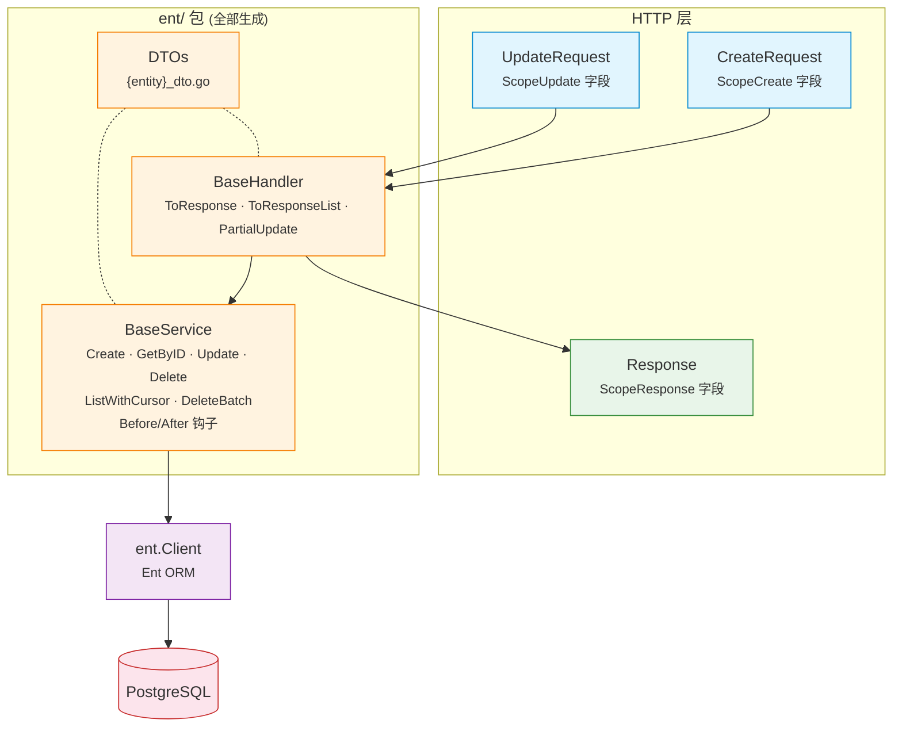

# EntDomain

[](https://pkg.go.dev/github.com/githonllc/entdomain)
[](https://goreportcard.com/report/github.com/githonllc/entdomain)
[](https://opensource.org/licenses/MIT)

一个 [Ent](https://entgo.io) 扩展，从带注解的 schema 自动生成 HTTP 请求/响应 DTO、基础服务和基础处理器。


> ### 状态：原型，正在重新设计
>
> 这个库能用，但它的形态正在被重新考虑。方向已定，**尚未实现任何一部分**——
> 下面记录的是**当前已有的东西**，不是计划中的东西。
>
> - **方向与理由** — [`DESIGN-v2.md`](DESIGN-v2.md)。里面同时记录了初稿自己搞错的断言，
>   因为「哪些直觉在这个代码库里不成立」本身就是设计资料。
> - **已知缺陷** — [`QUALITY-REVIEW.md`](QUALITY-REVIEW.md)，三次独立评审的 41 条发现。
> - **整体结构** — [`ARCHITECTURE.md`](ARCHITECTURE.md)。
> - **工作项** — epic [#23](https://github.com/githonllc/entdomain/issues/23)。
>
> 采用之前请先读[已知限制](#已知限制)。其中有几条是陷阱而不是缺口，
> 并且**有一个注解描述了它并不提供的保证**。
>
> `go test ./...` 在干净 checkout 上是**红的**（[#2](https://github.com/githonllc/entdomain/issues/2)）。

## 特性

- **注解驱动** — 使用简洁的构建器标记字段作用域（`DefaultField`、`InputOnlyField`、`OutputOnlyField` 等）
- **HTTP DTO** — 为每个实体生成 `CreateRequest`、`UpdateRequest`、`Response`、`ListResponse`
- **BaseService** — 带 Before/After 钩子的 CRUD 操作、构建器辅助和实体→响应转换
- **BaseHandler** — 响应转换辅助和部分更新支持
- **软删除检测** — 自动为包含 `deleted_at` 字段的实体生成 `UpdateOneID().SetDeletedAt(now)`
- **游标分页** — BaseService 中基于 ID 的键集分页
- **来源追溯** — 生成的文件包含 schema 名称、模板路径和重新生成命令

## 环境要求

- Go 1.23+
- [Ent](https://entgo.io) v0.14+

## 安装

```bash
go get github.com/githonllc/entdomain
```

## 配置

在 `entc.go` 中注册扩展：

```go
//go:build ignore

package main

import (
    "log"

    "entgo.io/ent/entc"
    "entgo.io/ent/entc/gen"
    "github.com/githonllc/entdomain"
)

func main() {
    ext := entdomain.NewExtensionWithOptions(
        entdomain.WithEntDomainPackage("github.com/githonllc/entdomain"),
        entdomain.WithBaseService(true),
        entdomain.WithBaseHandler(true),
    )

    if err := entc.Generate("./schema", &gen.Config{
        Target:  "../ent",
        Package: "your/module/ent",
    }, entc.Extensions(ext)); err != nil {
        log.Fatal(err)
    }
}
```

然后运行：

```bash
go generate ./...
```

## 注解构建器

### 基础构建器

```go
entdomain.DefaultField()                      // 创建、更新、查询、响应
                                              // 同时把字段标为 searchable / filterable / sortable
entdomain.InputOnlyField()                    // 仅创建和更新（如密码）
entdomain.OutputOnlyField()                   // 仅响应（如时间戳、状态）
entdomain.CreateOnlyField()                   // 创建 + 响应（创建后不可变）
entdomain.NewDomainField()                    // 无作用域（ent 追踪但不在任何 HTTP 结构体中）
entdomain.DomainFieldWithScopes(scopes...)    // 自定义作用域组合
```

### 流式构建器 API

```go
field.String("email").
    Annotations(
        entdomain.DefaultField().
            WithRequired(entdomain.ScopeCreate),
    )
```

### 边注解

边有自己的注解。此前边的暴露与否是从它的外键字段推导的，那把两个不同的决定
混成了一个——"把 `author_id` 放进响应"和"把嵌套的 `author` 对象放进响应"
——并且让暴露与否取决于哪张表持有该列。一对多边在本实体上根本没有字段，
所以在那条规则下永远无法暴露。

```go
entdomain.Edge()                       // 无作用域
entdomain.Edge().InResponse()          // 嵌套对象出现在 Response 中
entdomain.Edge().InResponse().As("written_by")  // 覆盖 JSON key
```

```go
func (Post) Edges() []ent.Edge {
    return []ent.Edge{
        // author_id（标量）由字段注解控制，author（嵌套对象）由这条边注解
        // 控制。两者互相独立。
        edge.From("author", User.Type).
            Ref("posts").Unique().Required().Field("author_id").
            Annotations(entdomain.Edge().InResponse()),
    }
}
```

和字段构建器一样，每个边构建器都是值接收者并返回副本，因此一个配置了一半的
注解可以安全地当作基底复用。

> **陷阱**：用链式写法声明自引用边对
> `edge.To("children", X.Type).From("parent")...Annotations(a)`，注解**只会
> 挂到反向边上**。不会报任何错，正向边就这么静默地永不出现。请把两条边分开声明。

## 运行时：泛型 CRUD

每个实体共有的算法在 Go 里只写一次，而不是在模板里每个实体写一遍。实体相关的
部分以类型参数和函数值的形式传入，因此**这一半不 import 任何 ent 包**，
标识符类型也不再被写死。

```go
// Query 是分页所需的 ent query builder 子集。Q 是自引用的，因为 ent 的链式
// 方法返回的是具体 builder 类型。
type Query[Q, P, O, E any] interface {
    Where(...P) Q
    Order(...O) Q
    Limit(int) Q
    Offset(int) Q
    All(context.Context) ([]*E, error)
    Count(context.Context) (int, error)
}

type Page[R any] struct {
    Data  []*R `json:"data"`
    Total int  `json:"total"`
    Page  int  `json:"page"`
    Size  int  `json:"size"`
}

func ListPage[Q Query[Q, P, O, E], P, O, E, R any](
    ctx context.Context, q Q, ps []P, os []O, r ListRequest,
    to func(*E) (*R, error),
) (*Page[R], error)

func GetOne[E, R, ID any](
    ctx context.Context,
    get func(context.Context, ID) (*E, error),
    to func(*E) (*R, error),
    id ID,
) (*R, error)
```

类型实参在调用点由推导得出，一个都不用手写：

```go
// 这里 ID 是 uuid.UUID……
user, err := entdomain.GetOne(ctx, db.User.Get, NewUserResponse, id)

// ……这里是 int。同一个函数。
tag, err := entdomain.GetOne(ctx, db.Tag.Get, NewTagResponse, tagID)

page, err := entdomain.ListPage(ctx, db.User.Query(),
    filter.Predicates(), orderOpts, req, NewUserResponse)
```

### 分页上界

`ListPage` 使用**偏移分页**。代价直说不粉饰：深翻是 O(n)，每页要付一次
`COUNT`，并且在并发写入下可能跳过或重复行。

```go
const (
    entdomain.DefaultPageSize = 20    // 请求没给出可用的 size 时采用
    entdomain.MaxPageSize     = 1000  // 上界——只在这里决定，别处没有
)

func (r ListRequest) Limit() int   // 请求的 size 夹取到 MaxPageSize；永不 <= 0
func (r ListRequest) Offset() int  // (Page-1) * Limit()；永不为负
func (r ListRequest) SortKey(allow []string, def string) (key string, desc bool, err error)
func (r *ListRequest) Validate() error
```

`ListRequest` 的零值开箱可用。**没有 `SetDefaults()`**——一个没人强制你调的
默认值填充调用，就是一个你会忘记调的调用，而忘记它正是零 size 直达查询的
成因。生效值一律通过 `Limit()` / `Offset()` 读取，不要直接读字段；`ListPage`
调的就是这两个。

`MaxPageSize` 是这个上界唯一的落脚点，越界也只有一种反应：**`Limit()` 夹取**。
`Validate()` 对 `Size` 和 `Page` 一言不发，因为 `Limit()` / `Offset()` 位于
通往 `ListPage` 的唯一路径上，不管有没有人调 `Validate()` 都会生效——只在
主动调用时才触发的上界是建议不是上界。`Page.Size` 会报出真正生效的 size，
所以夹取是可见的；如果在你的 API 里超限就该是 `400`，自己拿它和
`MaxPageSize` 比即可。

`ListRequest.Size` 的 `validate` tag 里**故意不写** `max=` 子句——tag 引用
不了常量，写在那里的数字只会漂移。它此前写的是 `max=100`，而 `MaxPageSize`
是 `1000`。

`Validate()` 只剩下游修不了的那些：`Order` 必须是 `asc`、`desc` 或空，因为
`SortKey()` 会把无法识别的值读成升序，一个拼写错误会静默地把结果倒过来。
它返回的错误包装了 `ErrValidation`。

### 错误映射

`ErrorMapper` 把持久层的错误翻译成本包的哨兵值。它以函数值的形式接收谓词，
因此运行时仍然不 import 任何 ent 包。生成的 wiring 只有一行：

```go
var mapper = entdomain.NewErrorMapper(ent.IsNotFound, ent.IsConstraintError)

// ...
if err != nil {
    return nil, mapper.MapError(err)   // 缺行 -> ErrNotFound
}
```

**唯一性需要自己的谓词**，这不是为了方便——`ent.IsConstraintError` 对重复键
和外键冲突一视同仁地返回 true：

```
UNIQUE constraint failed: tags.name (2067)
FOREIGN KEY constraint failed (787)
```

因此把它直接映射成 `ErrAlreadyExists`，等于把外键冲突报成重复键。区别只存在
于被 `*ent.ConstraintError` 包裹的 driver error 里，且与方言相关，所以库不猜
——要么你给出判定，要么就得不到 already-exists 分类：

```go
var mapper = entdomain.NewErrorMapper(ent.IsNotFound, ent.IsConstraintError).
    WithUniqueViolation(func(err error) bool {              // SQLite
        return strings.Contains(err.Error(), "UNIQUE constraint failed")
    })
```

映射器判不出来的一切——包括种类未识别的约束冲突——原样返回：不分类、不吞掉、
也绝不贴上一个并未被确立的哨兵。哨兵和原错误同时留在错误链上，`errors.Is`
两边都找得到。

`SortKey` 会把请求的字段与白名单核对。白名单正是要点所在：未经校验的排序字段
是注入点、是全表扫描的触发器，并且与分页组合起来还是一个对调用方本不该读到的
列的排序预言机。未知字段返回 `ErrValidation`。

## Schema 示例

```go
package schema

import (
    "time"

    "entgo.io/ent"
    "entgo.io/ent/schema/field"
    "github.com/githonllc/entdomain"
)

type User struct {
    ent.Schema
}

func (User) Fields() []ent.Field {
    return []ent.Field{
        field.String("name").
            NotEmpty().
            Annotations(
                entdomain.DefaultField().
                    WithRequired(entdomain.ScopeCreate),
            ),

        field.String("email").
            Optional().
            Annotations(entdomain.DefaultField()),

        field.Time("created_at").
            Default(time.Now).
            Immutable().
            Annotations(entdomain.OutputOnlyField()),
    }
}
```

## 架构



**核心原则**：作用域仅控制 HTTP 层结构体生成。服务层直接操作 ent 实体，拥有完整的 ORM 能力。

## 生成的代码

为每个带注解的 schema 最多生成三个文件（均在 `ent/` 包中）：

| 文件 | 内容 |
|------|------|
| `{entity}_dto.go` | `CreateRequest`、`UpdateRequest`、`Response`、`ListResponse`、`Validate()` 方法 |
| `{entity}_base_service.go` | 带 CRUD、Before/After 钩子、`Apply*Request` 构建器、`EntToResponse` 的 `BaseService` |
| `{entity}_base_handler.go` | 带 `ToResponse`、`ToResponseList`、`PartialUpdate` 的 `BaseHandler` |

### BaseService 模式

生成的 `Base{Entity}Service` 提供带钩子扩展点的 CRUD 操作。嵌入它，覆盖钩子即可添加自定义逻辑：

```go
type myUserService struct {
    ent.BaseUserService
}

func NewMyUserService(db *ent.Client) *myUserService {
    s := &myUserService{
        BaseUserService: ent.BaseUserService{DB: db},
    }
    s.SetSelf(s) // 启用钩子分发到此结构体
    return s
}

func (s *myUserService) BeforeCreate(ctx context.Context, req *ent.UserCreateRequest) error {
    // 自定义验证
    return nil
}

func (s *myUserService) AfterCreate(ctx context.Context, entity *ent.User) (*ent.User, error) {
    // 发布事件等
    return entity, nil
}
```

## 类型化错误

BaseService 将 Ent 错误包装为标准哨兵值：

```go
var (
    entdomain.ErrNotFound      // 实体未找到
    entdomain.ErrAlreadyExists // 唯一约束冲突
    entdomain.ErrValidation    // 验证失败
)
```

## 字段作用域

作用域控制 HTTP 层 DTO 中包含哪些字段。它们**不会**限制服务层的访问。

| 作用域 | 说明 |
|--------|------|
| `ScopeCreate` | 字段出现在 `CreateRequest` 中 |
| `ScopeUpdate` | 字段出现在 `UpdateRequest` 中 |
| `ScopeResponse` | 字段出现在 `Response` 中 |

## 扩展选项

```go
entdomain.WithBaseService(true)              // 生成 BaseService（默认：false）
entdomain.WithBaseHandler(true)              // 生成 BaseHandler（默认：false）
entdomain.WithEntDomainPackage("custom/path") // 覆盖 entdomain 导入路径
```

## 已知限制

以下全部核对过源码，不是从文档推断的。每条附带跟踪它的 issue。

**一个名不副实的注解。** `Sensitive` 读起来像数据保护标记。**没有任何代码读它**——
响应字段选择器只看 scope，所以标了 sensitive 的字段照样出现在响应里。不要依赖它。
它会被**删除**而不是实现：在一维 scope 模型下，「永不出现在响应里」本来就可以靠
不给 response scope 表达，这个注解只添加了承诺、没有添加能力
（[#3](https://github.com/githonllc/entdomain/issues/3)）。

**大约二十个导出的注解字段被接受、存储、然后忽略。** API 照单全收不报错，
所以从外面看不出哪些是有效的。只有 scope 列表和 required 映射真正到达模板
（[#17](https://github.com/githonllc/entdomain/issues/17)）。

**`ScopeQuery` 被大多数预设构建器授予，却没有任何消费者。** 它被文档描述为
「把字段放进查询参数结构体」，而没有模板生成那个结构体。

**除 `InputOnlyField` 外，每个预设构建器都会把字段标成 searchable / filterable /
sortable。** 今天无害。但它对下一步有影响：按任意列排序是全表扫描的触发点，
配合分页还是一个排序预言机。这些标记一旦实现，默认全开会让白名单失去意义
（[#27](https://github.com/githonllc/entdomain/issues/27)）。

**软删除会静默废掉下游的删除钩子。** 生成的删除被改写成更新，携带的是更新操作标志。
消费者按删除操作注册的钩子因此**根本不会触发**——这不是两套机制打架，
是一套静默替换了另一套（[#12](https://github.com/githonllc/entdomain/issues/12)）。

**生成的 service 只支持一种主键类型。** 方法签名里硬编码了 `uuid.UUID`，
非 UUID 主键不受支持（[#29](https://github.com/githonllc/entdomain/issues/29)）。

**钩子派发用错时静默失败。** 忘记调用 `SetSelf`，或者钩子方法名拼错，
都能正常编译，而钩子永远不执行（[#16](https://github.com/githonllc/entdomain/issues/16)）。

**在 Windows 上导入本包会 panic。** 模板查找用操作系统分隔符拼路径，
而嵌入文件系统恒用正斜杠，因此在包初始化阶段就加载失败
（[#4](https://github.com/githonllc/entdomain/issues/4)）。

**本仓库没有任何测试会编译生成的代码。** 模板改动在这里实际上是未测试的；
已知有多种字段与边的形态会产出无法编译的输出
（[#8](https://github.com/githonllc/entdomain/issues/8)、
[#10](https://github.com/githonllc/entdomain/issues/10)）。

## 贡献

请参阅 [CONTRIBUTING.md](CONTRIBUTING.md) 了解开发配置和指南。

## 许可证

[MIT](LICENSE)
