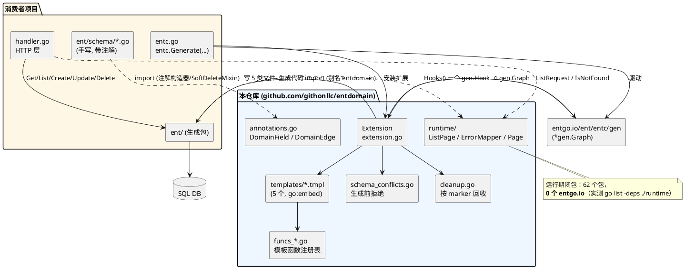
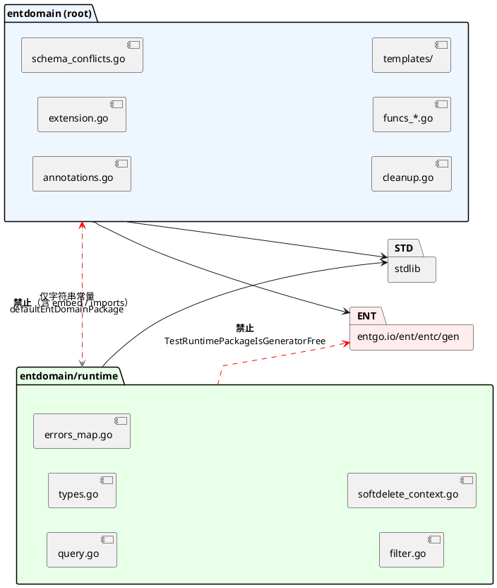
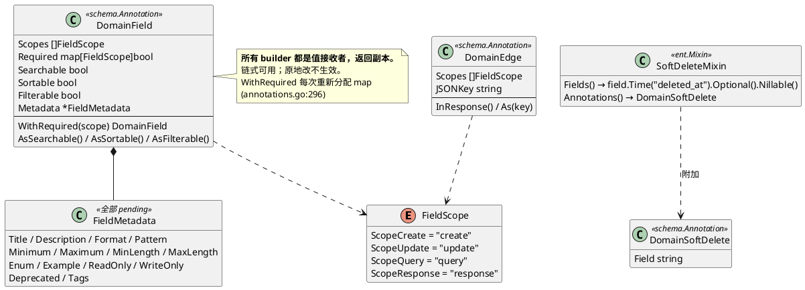
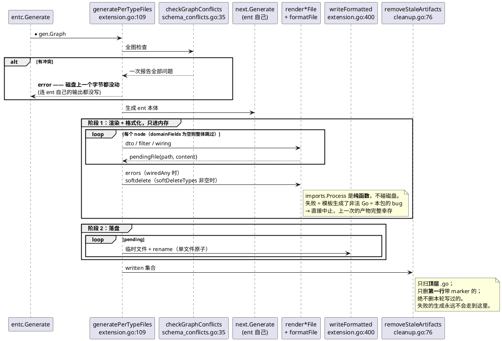
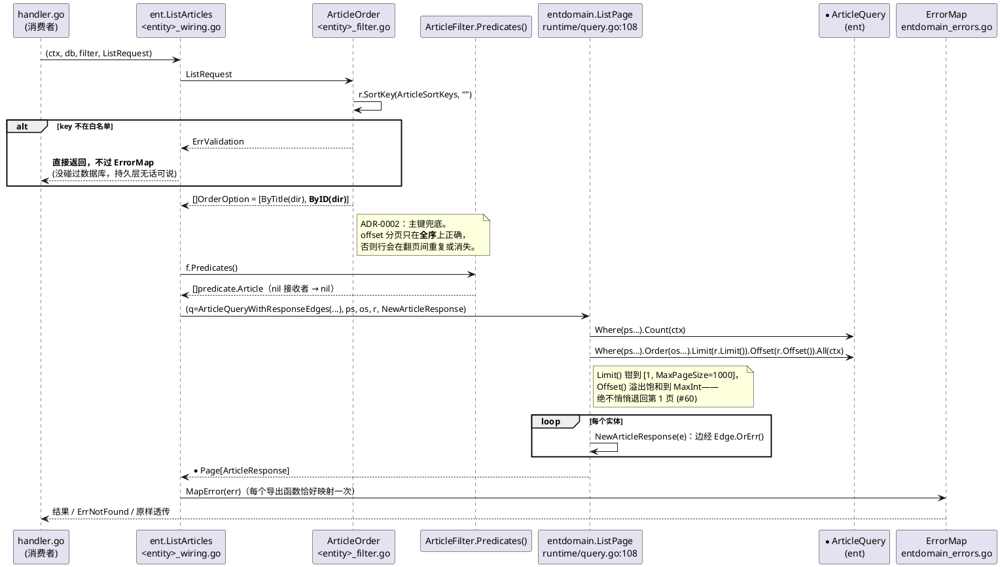

# EntDomain — 架构理解文档

> 本文的每条断言都锚定到源码位置（`file.go` — `符号名`）。文档、注释、README 不作为证据；
> 与代码冲突时以代码为准。文末「已核实/未核实」一节列出本文实际跑过的验证命令。

---

## 1. 项目概览

**一句话**：一个 [Ent](https://entgo.io) 扩展——你在 ent schema 的字段上标注「HTTP 层可以拿它做什么」，
它把请求类型、响应类型、查询面（filter/search/sort）和每个操作一个的 wiring 函数生成进你自己的
`ent/` 包，运行期只依赖标准库。

| 维度 | 事实 | 证据 |
|---|---|---|
| 语言 / 版本 | Go 1.23（`toolchain go1.23.3`） | `go.mod` |
| 核心依赖 | `entgo.io/ent v0.14.4`、`golang.org/x/tools v0.30.0`（goimports）、`github.com/google/uuid` | `go.mod` |
| 存储 / 中间件 | **无**。本库不含 SQL driver，也不含 HTTP 框架 | `go.mod` 无 driver 依赖；`Makefile` — `test-modules` 注释 |
| 部署形态 | 库（`go get`）。无 `main`、无示例 app、无下游 ent 项目 | 仓库无 `main` 包 |
| 包数 | **2 个 Go 包**（都叫 `package entdomain`）+ 5 个模板 + 3 个嵌套模块 | `extension.go` / `runtime/` / `templates/` |
| 手写非测试代码量 | 生成器 3032 行、runtime 623 行、模板 997 行 | `wc -l`（实测） |
| 测试规模 | 全仓 246 个 `Test*` 函数（根包 150、runtime 29），其余在 fixture 模块 | `grep -c '^func Test'`（实测） |
| 测试基线 | `go test ./...` 退出 0；跑完 `git status --porcelain` 只剩本文档的变更 | 实测 |
| 覆盖目标 | `CONTRIBUTING` 定 >85%，由 `make cover` 报告 | `Makefile` — `cover` |

**"两个包"是按"代码何时运行"切的，不是按层次切的**，这是整个仓库最承重的一条约束（见 §3）。

---

## 2. 架构总览



**风格**：不是分层框架，而是**一次性代码生成 + 一个泛型运行时**。没有 service 基类、没有可嵌入的
handler、没有 hook 契约——生成的 wiring 全是自由函数（`templates/wiring.tmpl:26-36` 把理由写死在
生成物的注释里：能被覆写的三十行方法体，是三十行「生成器可能猜错而调用方无法干预」的代码）。

**三条承重不变式**：

1. **运行期包不许碰 ent。** 生成的代码 import 的是 `entdomain/runtime`，不是本包。
   由 `runtime_isolation_test.go` — `TestRuntimePackageIsGeneratorFree` 用 `go list -deps -json`
   钉死，并配了**正向对照**（同一探针指向生成器，必须找到非空 `EmbedFiles`），避免探针坏掉时
   变成空洞的「不存在」断言。
2. **一次生成要么全成功要么什么都不写。** 两阶段（§5.1）。
3. **文件的归属由第一行的 marker 决定，不由 schema 决定。** 删掉那行注释，文件就永久归消费者
   （`cleanup.go` — `generatedMarker`，ADR-0004）。

---

## 3. 模块划分与边界

| 模块 | 路径 | 职责 | 公开接口 | 依赖 |
|---|---|---|---|---|
| 生成器 | `./*.go` | ent 扩展本体：注解定义、冲突检查、渲染、落盘、回收 | `NewExtension` / `NewExtensionWithOptions` / `DomainField` / `DomainEdge` / `SoftDeleteMixin` | `entc/gen`、`x/tools/imports`、`embed` |
| 模板 | `templates/*.tmpl` | 生成物的形状（5 个） | 经 `//go:embed` 由 `template_loader.go` 读入 | — |
| 模板函数 | `funcs_*.go`、`annotations_edge.go` | 模板能问的所有问题 | `templateFuncs()`（`funcs.go`）**唯一注册处** | `entc/gen` |
| 运行时 | `runtime/*.go` | 生成代码在生产环境调用的算法 | `ListPage` / `SaveOne` / `GetOne` / `ErrorMapper` / `ListRequest` / `Page` / `AppendIf` / soft-delete 上下文开关 | **仅标准库** |
| codegen fixtures | `internal/fixtures/<dir>/<dir>ent/` | 生成 + 编译的证明 | — | 本模块 |
| spike 规格 | `internal/fixture/`（**单数**） | #22 手写目标，是生成物的规格 | 独立 go.mod | ent + SQLite |
| 行为证明 | `internal/fixtures/wiring/e2e`、`internal/softdeleteproof` | 编译证明答不了的问题 | 独立 go.mod | ent + SQLite |



**边界规则（全部有测试兜底，不是约定）**：

- `runtime/` 的传递闭包不得含 `entgo.io/ent/entc*`、`golang.org/x/tools/imports`、`embed`、
  以及生成器包本身 —— `runtime_isolation_test.go:65`。
- 根包**不 import** `runtime/`。二者的唯一连接是一个字符串常量
  `extension.go:46` — `defaultEntDomainPackage = "github.com/githonllc/entdomain/runtime"`，
  经 `templateFuncMap()` 的 `entdomainPkg` 闭包注入模板。
- 模板函数必须在 `funcs.go` — `templateFuncs()` 注册**且**被至少一个模板调用，双向由
  `template_funcs_consistency_test.go` — `TestTemplateInvocationsAreRegistered` 从解析后的模板树
  推导，注册了没人用会红。
- 注册表不得与 ent 内建函数重名 —— `TestTemplateFuncsDoNotShadowEntBuiltins`；因为
  `templateFuncMap()` 是「ent 的 `gen.Funcs` → 本包 → `entdomainPkg`」的叠加，后者静默覆盖前者。

**未发现循环依赖或跨层直调。** 唯一值得单列的边界事实是：`softdelete.go`（schema 期，import
`entgo.io/ent/schema`）留在根包，而 `WithSoftDeleted` / `WithHardDelete` 及其读取函数搬到了
`runtime/softdelete_context.go` —— 因为生成的 traverser 和 hook **每次查询、每次删除**都会调它们。
这是那条缝的样板（`runtime/softdelete_context.go:5-11`）。

---

## 4. 核心领域模型

领域对象就是**注解**——它们是 schema 作者写下的、生成器唯一读的输入。



### 预设构造器 = 纯粹的 scope 组合

`annotations.go` — `DefaultField` / `InputOnlyField` / `OutputOnlyField` / `CreateOnlyField` /
`IdField` / `AuditLogField`：

| 构造器 | create | update | query | response |
|---|:-:|:-:|:-:|:-:|
| `DefaultField()` | ✓ | ✓ | ✓ | ✓ |
| `InputOnlyField()` | ✓ | ✓ | | |
| `OutputOnlyField()` | | | ✓ | ✓ |
| `CreateOnlyField()` | ✓ | | ✓ | ✓ |

**没有任何预设授予 `Searchable`/`Filterable`/`Sortable`**（`annotations.go:191-205`）：#27 之后这三个
标记会生成真的 URL 参数和真的排序白名单，而一个宽松的默认值等于让几乎每个响应可见字段都可排序。

### 承重设计规则

> **scope 只控制 HTTP 层的结构体生成，从不限制 service 层能对 ent 实体做什么。**
> —— `annotations.go:3-7`，并在每个预设构造器的注释里重复。

### 「持久化模型」在这里是生成物的形状

本库不定义表结构。它定义的是**每个被标注实体在消费者 `ent/` 包里多出来的顶层声明**，这份清单
在 `schema_conflicts.go` — `derivedEntityDecls()` 里是可执行的：

```go
// schema_conflicts.go — derivedEntityDecls()
return []derivedName{
	// templates/dto.tmpl
	{n + "CreateRequest", dto},
	{"Valid" + n + "CreateRequest", dto},
	{n + "PatchRequest", dto},
	// ... Valid<n>PatchRequest, <n>Summary, New<n>Summary,
	//     <n>Response, New<n>Response, <n>QueryWithResponseEdges ...
	{n + "ListResponse", dto},
	{"New" + n + "ListResponse", dto},
	// templates/filter.tmpl
	{n + "Filter", filter},
	{n + "SortKeys", filter},
	{n + "Order", filter},
	// templates/wiring.tmpl
	{"Get" + n, wiring},
	{"List" + p, wiring},
	// ... Create<n>, Update<n>, Delete<n> ...
	{"DeleteBatch" + p, wiring},
}
```

这张表是 #62 的开关：实体名撞上其中任何一个 → 生成被拒绝（`reservedNameConflicts`）。
它会腐烂，所以 `derived_names_consistency_test.go` — `TestDerivedEntityNamesMatchTheTemplates`
渲染全部五个模板、用 `go/parser` 读回导出声明、**双向**比对。

---

## 5. 关键流程

### 5.1 一次生成（两阶段 + 回收）



阶段划分本身就是原子性的全部理由（`extension.go:92-108`，ADR-0003）。诚实交代的残留：阶段 2 的
rename 循环里被 SIGKILL 仍可能留下两代混合——毫秒级窗口，进程能活下来的失败都够不着。

**回收的三道围栏**（`cleanup.go` — `removeStaleArtifacts` / `removeIfStale`）：顶层 `os.ReadDir`
而非递归 walk（ent 的 `<entity>/`、`predicate/` 子包在下面，永不成为候选）；第一行含
`Code generated by entdomain extension`（**故意窄于** ent 自己的 `Code generated by ent`）；
不是本轮写过的路径。落榜的候选**被记录到日志**而不是静默忽略。

### 5.2 一次 `GET /articles?title_contains=go&sort_by=title` 落到 SQL



**为什么排序白名单是安全边界而不是人体工学**——直接引生成物的注释：

```gotemplate
// templates/filter.tmpl — {{ $.Name }}SortKeys
// This is the load-bearing part of the query surface. An unchecked sort field
// is an injection site, an unindexed-scan trigger and — combined with paging —
// an ordering oracle over columns the caller was never meant to read. An entity
// that marks nothing is orderable by nothing, which is the safe end of the
// default rather than an oversight.
var {{ $.Name }}SortKeys = []string{
{{- range $f := $queryFields }}{{ if isSortable $f }}"{{ $f.StorageKey }}", {{ end }}{{ end }}
}
```

`{{ $.Name }}Order` 校验完 key 之后**把字符串扔掉**，进查询的是按已验证 key 查表得到的 ent 自己的
order builder —— 没有任何调用方字符串被插值进 SQL（`templates/filter.tmpl:133-178`）。

### 5.3 软删除：为什么必须生成，且必须生成在消费者的包里

```go
// funcs_softdelete.go — 文件头注释（问题陈述，逐字引用）
//   - ent.Query is literally `Query any` (ent.go:390), so a traverser written
//     in this package receives an empty interface.
//   - *<T>Query has no WhereP. ... A query builder exposes
//     Where(...predicate.<T>), and predicate.<T> is a per-entity named type
//     this package cannot name.
//
// Generating into the consumer's ent package dissolves both: inside that
// package *DocQuery and doc.DeletedAtIsNil() are ordinary local names.
```

重写机制本身。`SetOp` 必须在前，因为 `Client().Mutate` 按 Op 分发；不能调 `next`，因为 delete 链的
下一环是 `sqlExec`，无论 Op 说什么都照发 DELETE（`templates/softdelete.tmpl:61-71`）：

```gotemplate
// templates/softdelete.tmpl — softDeleteHook()
if !m.Op().Is(OpDelete|OpDeleteOne) || entdomain.HardDeleteRequested(ctx) {
    return next.Mutate(ctx, m)
}
switch m := m.(type) {
{{- range softDeleteTypes $ }}
	{{- $f := softDeleteField . }}
case *{{ .Name }}Mutation:
    m.WhereP({{ .Package }}.{{ $f.StructField }}IsNil())
    m.SetOp(OpUpdate)
    m.Set{{ $f.StructField }}(time.Now())
    return m.Client().Mutate(ctx, m)
{{- end }}
}
```

代价被明写而非隐藏（`templates/softdelete.tmpl:29-31`）：**没调 `ent.RegisterSoftDelete(client)`
的 client 什么都不过滤，删除就是真删。** 这也是 `internal/softdeleteproof` 这个独立模块存在的唯一
理由——编译证明分不清「谓词被生成了」和「谓词到达了 SQL」。

---

## 6. 设计与约定

### 6.1 「生成失败是个特性」

`checkGraphConflicts` 在 `next.Generate(g)` **之前**跑。策略（`schema_conflicts.go:13-18`）：

> 与 ent schema 矛盾的注解 → 生成失败，并同时报告两个事实。能正确生成的 → 生成，不拒绝。

今天检查五类：`Immutable()` + `ScopeUpdate`；软删除墓碑字段不存在或非 `Optional`；自引用边两端
注解不对称（#22 的经典陷阱：链式 `edge.To(...).From(...).Annotations(...)` 会把注解给到 inverse
端）；查询标记与 ent 实际派生的算子矛盾（`Searchable` 但无 `Contains`、`Filterable` 但无任何 op、
`Sortable` 但类型不可比较）；实体名撞生成符号。

**每条消息都同时说出「注解怎么说」和「ent 怎么说」**，因为作者必须知道该改哪一边。全图检查完才
报告，一次看全（`schema_conflicts.go:22-26`）。

### 6.2 字段形状只有一个权威：ent

```go
// funcs_presence.go — isCreatePointer()
// A pointer is required exactly when ent can fill the field without the caller:
// an Optional field may be left unset, and a field with a Default() must be
// leavable unset or the default can never apply. ...
func isCreatePointer(f *gen.Field) bool {
	if f == nil {
		return false
	}
	return f.Optional || f.Default || f.Nillable
}
```

理由不是风格偏好：**ent 决定哪些 setter 存在**，本包形成的任何第二意见都会表现为「调用了一个
从未被生成的方法」（`funcs_presence.go:7-16`）。同理 `patchFields` 取的是
`node.MutableFields()` 与 `ScopeUpdate` 的交集，而不是自己重推一遍不可变性。

### 6.3 生成物里的限定符是有意为之的

| 位置 | 写法 | 为什么 |
|---|---|---|
| `dto.tmpl` 边处理 | `IsNotFound(err)` **不限定** | 文件落在消费者的 `package ent`，绑定到 ent 生成的谓词（解包 `*ent.NotFoundError`）。限定成 `entdomain.IsNotFound` 照样编译但**静默失配** |
| `errors.tmpl` | `NewErrorMapper(IsNotFound, IsConstraintError)` **不限定** | 同上 |
| 所有模板 | `entdomain.Err*` **必须限定** | `package ent` 里没有这些符号 |
| 所有模板 import | `entdomain "{{ entdomainPkg }}"` **必须带别名** | 路径末段是 `runtime`，不带别名 goimports 会当成 `package runtime`、发现没人用、**删掉它**——而格式化失败会中止整轮生成 |

由 `TestDTOTemplateResolvesIsNotFoundToEnt` 与 `TestTemplatesQualifyEntdomainSentinels` 两个方向钉死。

### 6.4 「死代码是测试失败，不是约定」

| 守卫 | 位置 | 防住什么 |
|---|---|---|
| `TestTemplateInvocationsAreRegistered` | `template_funcs_consistency_test.go:94` | 双向：模板调了没注册的；注册了没模板调的 |
| `TestTemplateFuncsDoNotShadowEntBuiltins` | 同上 `:159` | 静默覆盖 ent 内建函数 |
| `TestEveryEmbeddedTemplateIsLoaded` | `template_loader_test.go:57` | 嵌入了但没绑定的模板 |
| `TestEveryAnnotationKnobIsConsumedOrDeclaredPending` | `annotation_surface_test.go:587` | 反射枚举全部导出旋钮，逐个 toggle 看是否改变任何**已注册**模板函数的返回值 |
| `TestDerivedEntityNamesMatchTheTemplates` | `derived_names_consistency_test.go:58` | §4 那张派生名表与模板脱节 |
| `TestRuntimePackageIsGeneratorFree` | `runtime_isolation_test.go:65` | 包边界本身（带正向对照） |
| `TestNoAmbiguousEntPackages` | `ent_package_ambiguity_test.go:67` | `internal/fixtures` 下任何包叫 `ent`（#49：13 个 fixture 都叫 `package ent` 时，goimports 按包名解析、按模块索引缓存选胜者，把 `entgo.io/ent` 改写成了 `basic`） |

第 4 条的推理链值得单说：它**不渲染模板**。因为「某个已注册函数观察到这个旋钮」与
「每个已注册函数都被某模板调用」（第 1 条保证）复合起来，就等于「某模板观察到这个旋钮」——
这正是消费者问「这个注解到底干不干活」时想要的答案。

### 6.5 测试约定

- 两个包的测试都是**包内测试**（`package entdomain`）。生成器测试用 `test_helpers_test.go` 里的
  构造器手搓 `gen.Field`/`gen.Type`，不要手写字面量。
- **fixture 契约 = 一个目录 + 一行**：加 `internal/fixtures/<dir>/<dir>ent/schema/` 和
  `codegen_fixtures_test.go` 的 `fixtures` 表里一行 `{dir: "<dir>"}`。要求**必须失败**的
  schema 再加 `wantGenErr: []string{…}`——断言的不是「它失败了」，而是**错误消息的内容**，
  因为消息是 schema 作者能拿到的全部。当前 13 个表项，其中 4 个是拒绝用例
  （`immutable`、`selfref`、`queryconflict`、`reservednames`）。
- 目录必须叫 `<dir>ent` 而**不是** `ent`（#49，见上表）。`stale` 目录不在表里，由
  `codegen_fixtures_test.go:196-259` 的专门用例两次生成（annotated → plain）来证明回收行为。
- `TestCodegenFixtures` **故意写进仓库树**：生成的 ent 代码必须待在本模块内才能不靠 replace
  指令解析 `github.com/githonllc/entdomain`，而 `t.TempDir()` 在任何模块之外。产物已提交，
  所以 **`make check` 后 `git status` 变脏 = 生成结果变了**，去重新生成，绝不手改
  `internal/fixtures/<dir>/<dir>ent/` 下的任何东西。
- **`make test` 不覆盖三个嵌套模块**（独立 `go.mod`，`./...` 不下降）。`make check` 才跑。

---

## 7. 上手指南

### 7.1 worked example：加一个真正会影响生成的注解旋钮

以「给 summary 挑选字段」为例（这正是 §7.3 列的开放问题）：

| # | 动作 | 文件 |
|---|---|---|
| 1 | 在 `DomainField` 上加导出字段，或加 builder | `annotations.go` |
| 2 | 写读取它的纯函数（选择器/判定） | 对应的 `funcs_*.go`（按 §3 表选文件） |
| 3 | **在 `templateFuncs()` 注册** | `funcs.go` ← 漏这步 = 模板里根本调不到 |
| 4 | 在模板里调用它 | `templates/*.tmpl` ← 漏这步 = `TestTemplateInvocationsAreRegistered` 变红 |
| 5 | 新声明是导出顶层符号？加进派生名表 | `schema_conflicts.go` — `derivedEntityDecls()` |
| 6 | 输出多了新类型？确保 import 被**显式声明** | `funcs_imports.go` ← goimports 是安全网不是机制，它失败会中止整轮 |
| 7 | 矛盾的用法要能被拒绝 | `schema_conflicts.go` — `queryConflicts` 那一族 |
| 8 | 加 fixture 目录 + `fixtures` 表一行 | `internal/fixtures/<dir>/`、`codegen_fixtures_test.go` |
| 9 | 若旋钮暂不消费：`pendingKnobs` 加条目（必须带 `#issue`）+ builder 首行写 `No-op today:` 免责句 | `annotation_surface_test.go`、`annotations.go` |
| 10 | `make check`（含 `test-modules`），确认树是干净的 | — |

### 7.2 阅读顺序（Top 10，按理解价值）

1. `extension.go` — `generatePerTypeFiles`：整个入口，两阶段在这里。
2. `templates/wiring.tmpl`：生成物长什么样、以及「为什么是自由函数」。
3. `runtime/query.go` — `ListPage` / `ListRequest.Offset`：运行期那一半的全部算法。
4. `schema_conflicts.go` — `checkGraphConflicts`：拒绝策略与全部消息措辞。
5. `annotations.go`：注解模型 + 值接收者 builder 契约。
6. `funcs.go` — `templateFuncs()`：模板能问的问题的完整清单（一页看完）。
7. `templates/filter.tmpl` + `funcs_filter.go`：查询面，安全性最集中的地方。
8. `cleanup.go`：marker 归属契约（ADR-0004）。
9. `funcs_presence.go`：「字段形状只有一个权威」的三条判定。
10. `codegen_fixtures_test.go`：唯一证明产物**能编译**的测试，以及 fixture 契约。

配套：`docs/adr/0001`–`0005` 各自记录一条已定的、不打算再议的决定。

### 7.3 已知债务与风险区

| 风险 | 位置 | 现状 |
|---|---|---|
| **15 个已发布但不生效的注解旋钮** | `DomainField.Metadata` + `FieldMetadata` 全部 14 个字段 | 有测试兜底（`pendingKnobs` 必须带 issue 号，builder 首行必须写 `No-op today:`），但对调用方仍是「写了没用」。7 个真正到达模板的是：`DomainField.{Scopes,Required,Searchable,Sortable,Filterable}` + `DomainEdge.{Scopes,JSONKey}` |
| **阶段 2 的 rename 循环非原子** | `extension.go:102-108` | ADR-0003 明确接受。硬 kill 会留下两代混合 |
| **默认不分类唯一键冲突** | `templates/errors.tmpl:28-55` | `ent.IsConstraintError` 分不清 UNIQUE 和 FOREIGN KEY，所以默认**不装**唯一性谓词：重复键回落成 500 而不是 409。方向是有意选的——重复键报 500 可恢复，外键失败报 409 是错答案 |
| **`ErrorMap` 是包级可变全局量** | 同上 `:57-59` | 自身不带同步；必须在建 client 时、第一个请求之前赋值 |
| **summary 带哪些标量字段未定** | `templates/dto.tmpl:356` | 目前 = 全部 response-scoped 字段减去边。收窄需要新注解，是独立 issue |
| **软删除靠一行注册** | `templates/softdelete.tmpl:29-31` | 忘了 `RegisterSoftDelete(client)` 就静默退化成硬删除。测试里也必须调 |
| **`make test` 漏三个嵌套模块** | `Makefile` | 能过 `make test` 的改动仍可能被 `make test-modules` 抓住——这正是它存在的意义 |
| **fixtures 子树被 `make fmt` 排除** | `Makefile` — `FMT_FILES` | 但 `gofmt -l .` 覆盖全树。那两个前缀下的**手写**文件（fixture schema、生成目录里的手写 `_test.go`）必须手工保持 gofmt-clean |

---

## 附：本文的验证记录

**已验证**（本次实际执行的命令）：

| 断言 | 命令 | 结果 |
|---|---|---|
| runtime 闭包无 ent | `go list -deps ./runtime` | 62 个包，`grep -c entgo.io` = **0** |
| 生成器确实需要 ent | `go list -deps .` | `grep -c entgo.io` = **15** |
| 测试基线绿 | `go test ./...` | `exit=0` |
| 生成产物稳定 | 跑完测试后 `git status --porcelain` | 只剩本文档 |
| 代码量 | `wc -l`（非测试 .go） | 生成器 3032 / runtime 623 / 模板 997 |
| 测试规模 | `grep -c '^func Test'` | 全仓 246（根包 150、runtime 29） |
| 派生名表 / 模板顶层声明 | `grep '^type\|^func\|^var' templates/*.tmpl` | 与 `derivedEntityDecls()` 一致 |
| 旋钮数 | 数 `pendingKnobs` 与三个注解结构体的导出字段 | 22 个中 15 个 pending，7 个消费 |

**未验证 / 仅读代码得出**：`make lint`（golangci-lint v1）与 `make test-modules` 本次**未执行**，
关于它们的说法来自 `Makefile` 与 CLAUDE.md，属推断；覆盖率数字（CONTRIBUTING 的 >85%）未跑
`make cover` 复核。文中所有「消费者项目里会发生什么」的描述，证据来自 `internal/fixtures` 的生成
产物与三个嵌套模块的行为测试，本仓库没有真实下游 ent 项目。
