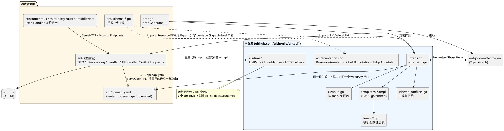
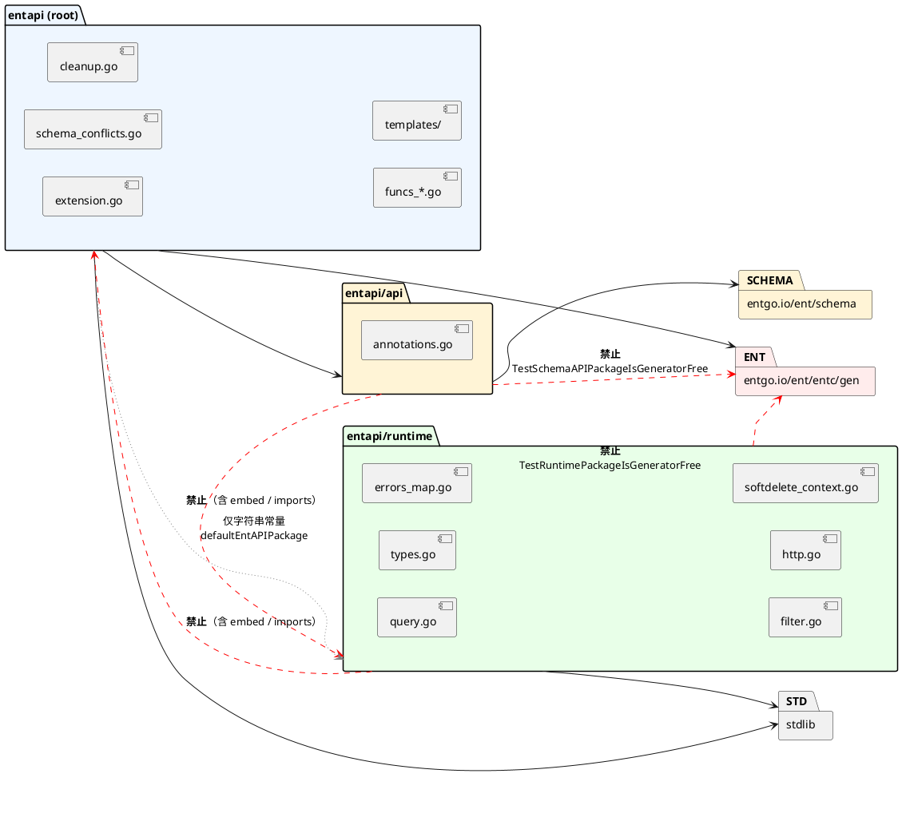
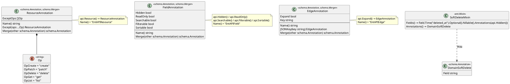
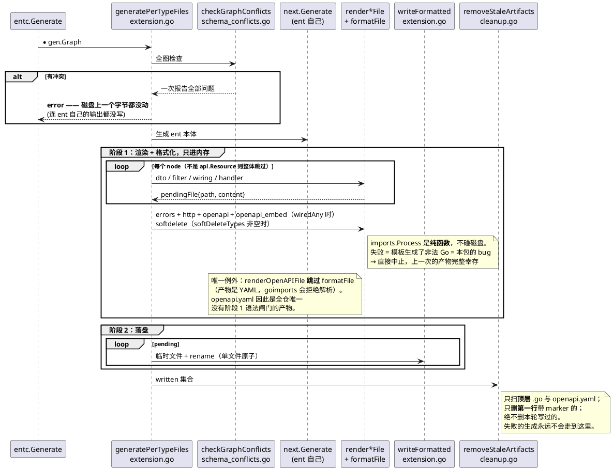
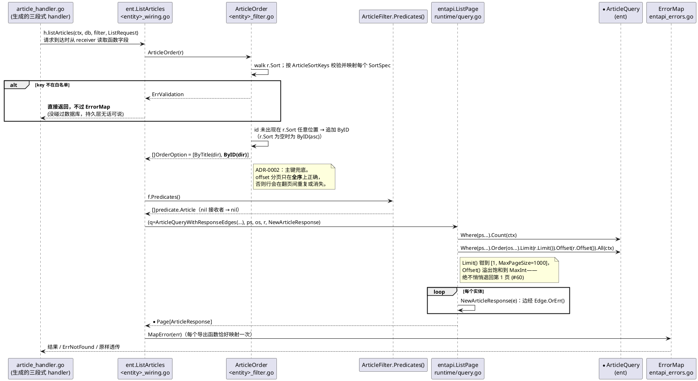
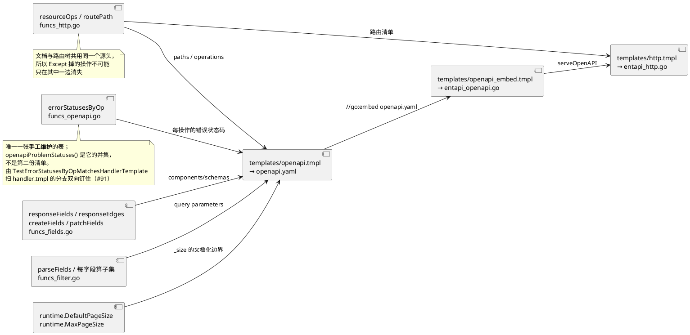

# EntAPI — 架构理解文档

> 本文的每条断言都锚定到源码位置（`file.go` — `符号名`）。文档、注释、README 不作为证据；
> 与代码冲突时以代码为准。文末「已核实/未核实」一节列出本文实际跑过的验证命令。

---

## 1. 项目概览

**一句话**：一个 [Ent](https://entgo.io) 扩展——`api.Resource()` 选择需要 HTTP 表面的实体，字段形状
默认由 Ent 的 `Optional`、`Default`、`Nillable`、`Immutable`、`Sensitive` 和类型派生，只有五个字段词与
`api.Expand()` 表达偏离。生成器把请求类型、响应类型、查询面（filter/search/sort）、每个操作一个的
wiring 函数、三段式 HTTP handler、`With` 定制点、`Endpoints()` 端点清单，以及描述这一切的 OpenAPI 3.1
文档生成进消费者自己的 `ent/` 包，运行期只依赖标准库。

| 维度 | 事实 | 证据 |
|---|---|---|
| 语言 / 版本 | Go 1.23（`toolchain go1.23.3`） | `go.mod` |
| 核心依赖 | `entgo.io/ent v0.14.4`、`golang.org/x/tools v0.30.0`（goimports）、`github.com/google/uuid` | `go.mod` |
| 存储 / 中间件 | **无**。本库不含 SQL driver，也不含 HTTP 框架 | `go.mod` 无 driver 依赖；`Makefile` — `test-modules` 注释 |
| 部署形态 | 库（`go get`）。无 `main`、无示例 app、无下游 ent 项目 | 仓库无 `main` 包 |
| 包数 | **3 个手写产品包**（`entapi`、`api`、`runtime`）+ 10 个模板 + 5 个嵌套模块 | `extension.go` / `api/` / `runtime/` / `templates/` / `internal/**/go.mod` |
| 手写非测试代码量 | 生成器 3518 行、api 173 行、runtime 810 行、模板 1796 行 | `wc -l`（实测于 `513c37f`） |
| 测试规模 | 全仓 290 个 `Test*` 函数（根包 113、api 6、runtime 47、`internal/` 124） | `grep '^func Test'`（实测于 `513c37f`） |
| 测试基线 | 根模块与五个嵌套模块测试均退出 0 | `Makefile` — `test-modules`；实测 |
| 覆盖目标 | `CONTRIBUTING` 定 >85%，由 `make cover` 报告 | `Makefile` — `cover` |

**三个产品包是按代码何时运行切的，不是按层次切的**：`api` 只在 schema 描述期出现，根包只在
生成期出现，`runtime` 才进入请求期。这是整个仓库最承重的一条约束（见 §3）。

---

## 2. 架构总览



**风格**：不是分层框架，而是**一次性代码生成 + 一个泛型运行时**。没有 service 基类、handler 内
定制点或注解式 interceptor chain。生成的 handler 固定为「绑定 → 调一个函数 → 写出」；中间函数
保存在 `APIHandler` 的未导出字段里并在请求到达时读取。生成的 wiring 仍全是自由函数
（`templates/wiring.tmpl` — 文件头设计说明），所以默认实现与定制实现具有同一份编译期签名；`With`
只在开始服务前给这些字段赋值，`Endpoints()` 则把同一份端点清单按值复制给消费者。

**三条承重不变式**：

1. **运行期包不许碰 ent。** 生成的代码 import 的是 `entapi/runtime`，不是本包。
   由 `runtime_isolation_test.go` — `TestRuntimePackageIsGeneratorFree` 用 `go list -deps -json`
   钉死，并配了**正向对照**（同一探针指向生成器，必须找到非空 `EmbedFiles`），避免探针坏掉时
   变成空洞的「不存在」断言。
2. **一次生成要么全成功要么什么都不写。** 两阶段（§5.1）。
3. **文件的归属由第一行的 marker 决定，不由 schema 决定。** 删掉那行注释，文件就永久归消费者
   （`cleanup.go` — `generatedMarker`，ADR-0004）。

---

## 3. 模块划分与边界

| 模块 | 路径 | 职责 | 公开接口 | 依赖 |
|---|---|---|---|---|
| schema API | `api/*.go` | schema 期选择资源、声明字段偏离与边展开 | `ResourceAnnotation` / `FieldAnnotation` / `EdgeAnnotation` / `Op` 及 builders | `ent/schema` |
| 生成器 | `./*.go` | ent 扩展本体：读取注解、冲突检查、渲染、落盘、回收 | `NewExtension` / `NewExtensionWithOptions` / `SoftDeleteMixin` | `api`、`entc/gen`、`x/tools/imports`、`embed` |
| 模板 | `templates/*.tmpl` | 生成物的形状（10 个） | 经 `//go:embed` 由 `template_loader.go` — `templateFS` 读入 | — |
| 模板函数 | `funcs_*.go`、`annotations_edge.go` | 模板能问的所有问题 | `templateFuncs()`（`funcs.go`）**唯一注册处** | `entc/gen` |
| 运行时 | `runtime/*.go` | 生成代码在生产环境调用的算法 | `ListPage` / `SaveOne` / `GetOne` / `ErrorMapper` / `WithValidation` / `WithUniqueViolation` / `HasUniqueViolation` / `UniqueViolation` / `ListRequest` / `Page` / `AppendEach` / `AppendEachSlice` / `WriteProblem` / `FieldError` / `Endpoint`（仅端点元数据）/ `WithActor` / `ActorFrom` / soft-delete 上下文开关 | **仅标准库** |
| codegen fixtures | `internal/fixtures/<dir>/<dir>ent/` | 生成 + 编译的证明 | — | 本模块 |
| spike 规格 | `internal/fixture/`（**单数**） | #22 手写目标，是生成物的规格 | 独立 go.mod | ent + SQLite |
| 行为证明 | `internal/fixtures/wiring/e2e`、`internal/fixtures/httpdemo/e2e`、`internal/softdeleteproof`、`internal/uniqueproof` | wiring、HTTP、OpenAPI 文档校验、软删除与真实 driver uniqueness channel 的行为证明 | 独立 go.mod | ent + SQL driver（`httpdemo/e2e` 另含 `pb33f/libopenapi{,-validator}`，全仓仅此一处） |



**边界规则（全部有测试兜底，不是约定）**：

- `api/` 只依赖 `entgo.io/ent/schema` 与标准库；其传递闭包不得含 `entc/gen`、
  `x/tools/imports`、`embed` 或 `runtime`。`api_isolation_test.go` —
  `TestSchemaAPIPackageIsGeneratorFree` 用生成器必含 `entc/gen` 作正向对照。
- `runtime/` 的传递闭包不得含 `entgo.io/ent/entc*`、`golang.org/x/tools/imports`、`embed`、
  以及生成器包本身 —— `runtime_isolation_test.go` — `TestRuntimePackageIsGeneratorFree`。
- 根包**不 import** `runtime/`。二者的唯一连接是一个字符串常量
  `extension.go` — `defaultEntAPIPackage = "github.com/githonllc/entapi/runtime"`，
  经 `templateFuncMap()` 的 `entapiPkg` 闭包注入模板。
- 模板函数必须在 `funcs.go` — `templateFuncs()` 注册**且**被至少一个模板调用，双向由
  `template_funcs_consistency_test.go` — `TestTemplateInvocationsAreRegistered` 从解析后的模板树
  推导，注册了没人用会红。
- 注册表不得与 ent 内建函数重名 —— `TestTemplateFuncsDoNotShadowEntBuiltins`；因为
  `templateFuncMap()` 是「ent 的 `gen.Funcs` → 本包 → `entapiPkg`」的叠加，后者静默覆盖前者。

**`funcs_*.go` 的分工**（模板能问的问题按关注点分文件，注册处只有 `funcs.go` — `templateFuncs()` 一处）：

| 文件 | 管什么 |
|---|---|
| `funcs_scope.go` | **归一化注解读取器** `getResourceAnnotation` / `getFieldAnnotation` / `getEdgeAnnotation`，以及 `isResource` / `resourceExcepts` / `blockedCreateFields` / `hasCreateFamily` |
| `funcs_fields.go` | 派生的字段与边选择：`createFields` / `patchFields` / `responseFields` / `responseEdges` |
| `funcs_presence.go` | 请求字段形状：`isCreatePointer` / `isCreateRequired` / `isPatchClearable` |
| `funcs_filter.go` | 整个查询面：`queryFields` / `parseFields` / `searchFields` / `isSortable` / 每字段的线上算子集与转换表达式 / `filterImports` |
| `funcs_http.go` | `resourceOps` / `routePath` / `idParseExpr` / `handlerImports` |
| `funcs_openapi.go` | 文档的 YAML 成形：`yamlQuote` / `openapiSchema` / `openapiPathGroups` / `openapiFilterParams` / `openapiReservedParams` / `openapiErrorStatuses` / `openapiProblemStatuses` / `openapiRequiredCreateFields` |
| `funcs_imports.go` | 产物必须自己声明的 import：`dtoImports` / `wiringImports` |
| `funcs_codegen.go` | `fieldValueExpr`——响应构造器的每字段表达式，也是 `isComplexFieldType` 的唯一调用方 |
| `funcs_typechecks.go` | `isComplexFieldType`，**故意不注册**：它是活代码，但没有模板按名字调它，而这张注册表的含义是「有模板调它」 |
| `funcs_softdelete.go` | `isSoftDeletable` / `softDeleteTypes` / `softDeleteField` / `softDeleteImports` |
| `funcs_strings.go` | 只有 `camelCase`——其余 `lower` / `hasPrefix` / `snake` / `plural` 用 ent 的 `gen.Funcs` |
| `annotations_edge.go` | `responseEdgeSet` / `edgeJSONKey` |

**未发现循环依赖或跨层直调。** 唯一值得单列的边界事实是：`softdelete.go`（schema 期，import
`entgo.io/ent/schema`）留在根包，而 `WithSoftDeleted` / `WithHardDelete` 及其读取函数搬到了
`runtime/softdelete_context.go` —— 因为生成的 traverser 和 hook **每次查询、每次删除**都会调它们。
这是那条缝的样板（`runtime/softdelete_context.go` — `WithSoftDeleted` / `WithHardDelete`）。

---

## 4. 核心领域模型

领域对象就是**注解**——实体、字段、边各有一个 schema 期类型。实体不写 `api.Resource()` 就完全
没有生成表面；字段不写词就完全服从 Ent；边不写 `api.Expand()` 就不进入响应。



### 无预设：沉默就是常见形状

`api/annotations.go` 只有五个字段词：`Hidden`、`ReadOnly`、`Searchable`、`Filterable`、`Sortable`。
后三个查询维度必须逐字段明示；`Immutable` 与 `Sensitive` 仍是 Ent field builder，因为注解无法诚实地
替代数据库模型事实。三个注解类型都实现 `schema.Merger`：布尔值与 `ExceptOps` 取并集，边的后一个
非空 `JSONKey` 胜出，所以同一字段分开写 `Annotations(api.Searchable(), api.Sortable())` 不会互相覆盖。

### 注解在物理上怎么到达生成器（#81 换模型时最容易踩的一条）

**同一个注解有两种到达形态，取决于 schema 是怎么加载的**，所以生成器里**绝不允许**直接读注解 map：

```go
// funcs_scope.go — getResourceAnnotation()
// Ent annotations are pointers while a schema is being described and
// map[string]interface{} values after the serialized-schema load path. The JSON
// round-trip keeps both paths on one reader contract.
```

`funcs_scope.go` — `getResourceAnnotation` / `getFieldAnnotation` / `getEdgeAnnotation` 是唯一入口，
`decodeAnnotation` 用 JSON round-trip 把两条路径归一。手搓 `gen.Type` 的单元测试走的是指针那条，
真实生成走的是 map 那条——直接读 map 的代码**能过全部单元测试、在真实 schema 加载时静默失效**。

这条约束反过来决定了 `Op` 的底层类型：

```go
// api/annotations.go — Op
// It is string-backed because Ent annotations cross a JSON serialization
// boundary. String values retain their meaning there; numeric enum values do
// not retain their Go type.
type Op string
```

int 枚举经 JSON 回来是 `float64`，丢掉 Go 类型；而 `Except` 是一个**删端点**的开关，它丢词的方向是
fail-open——「本该关掉的操作还开着」。string 值经同一次往返含义不变，所以这个类型选择消掉的不是
「更好地报错」，是**丢词这件事本身**。

### 承重设计规则

> **`Except` 关闭公开操作表面，不拿走 service 层能力：wiring 函数与 request DTO 仍生成。**

唯一例外是无法工作的 create family：required、无 default 的字段被 `Hidden` 或 `ReadOnly` 挡住时，
未 `Except(OpCreate)` 的 schema 在写盘前被拒绝；已 Except 的 schema 完全不生成 create family。

### 「持久化模型」在这里是生成物的形状

本库不定义表结构。它定义的是**每个 `api.Resource()` 实体在消费者 `ent/` 包里多出来的顶层声明**，这份清单
在 `schema_conflicts.go` — `derivedEntityDecls()` 里是可执行的：

```go
// schema_conflicts.go — derivedEntityDecls()
return []derivedName{
	// templates/dto.tmpl
	{n + "CreateRequest", dto},
	{"Valid" + n + "CreateRequest", dto},
	{n + "PatchRequest", dto},
	// ... Valid<n>PatchRequest, <n>Summary, New<n>Summary,
	//     <n>Response, New<n>Response, <n>QueryWithResponseEdges ...
	{n + "ListResponse", dto},
	{"New" + n + "ListResponse", dto},
	// templates/filter.tmpl
	{n + "Filter", filter},
	{"Parse" + n + "Query", filter},
	{n + "SortKeys", filter},
	{n + "Order", filter},
	// templates/wiring.tmpl
	{"Get" + n, wiring},
	{"List" + p, wiring},
	// ... Create<n>, Patch<n>, Delete<n> ...
	{"DeleteBatch" + p, wiring},
	// templates/handler.tmpl — maximum breadth, independent of Except
	{"List" + p + "Fn", handler},
	{"Create" + n + "Fn", handler},
	{"Get" + n + "Fn", handler},
	{"Patch" + n + "Fn", handler},
	{"Delete" + n + "Fn", handler},
}
```

这张表是 #62 的实体派生名开关：实体名撞上其中任何一个 → 生成被拒绝。图级名字
`ErrorMap`、`API`、`APIHandler`、`APIOption` 则由 `schema_conflicts.go` — `reservedNameConflicts` 单独保留。
两张表都会腐烂，所以 `derived_names_consistency_test.go` — `TestDerivedEntityNamesMatchTheTemplates`
渲染全部八个独立 Go 输出模板（四个 per-type、四个 graph-level），用 `go/parser` 读回导出声明并**双向**比对；
`templates/softdelete_config_init.tmpl` 是 Ent partial，不产生独立顶层文件，而
`templates/openapi.tmpl` 的产物是 YAML，`go/parser` 无从读起——两者都不在该语料里。

---

## 5. 关键流程

### 5.1 一次生成（两阶段 + 回收）



阶段划分本身就是原子性的全部理由（`extension.go` — `generatePerTypeFiles`，ADR-0003）。诚实交代的残留：阶段 2 的
rename 循环里被 SIGKILL 仍可能留下两代混合——毫秒级窗口，进程能活下来的失败都够不着。

**回收的三道围栏**（`cleanup.go` — `removeStaleArtifacts` / `removeIfStale` / `isCleanupCandidate`）：顶层 `os.ReadDir`
而非递归 walk（ent 的 `<entity>/`、`predicate/` 子包在下面，永不成为候选），候选是 `.go` 加**精确名** `openapi.yaml`；第一行含
`Code generated by entapi extension`（**故意窄于** ent 自己的 `Code generated by ent`）；
不是本轮写过的路径。落榜的候选**被记录到日志**而不是静默忽略。

### 5.2 一次 `GET /articles?title=like:go&_sort=title` 落到 SQL



`templates/http.tmpl` — `API` 构造一个持有 `*http.ServeMux` 与 `[]entapi.Endpoint` 的
`*APIHandler`：`GET /xs`、`POST /xs`、`GET/PATCH/DELETE /xs/{id}`，清单**最后**追加一条
`GET /openapi.yaml`（`templates/http.tmpl` — `API`）。放进清单而不是放在清单旁边，是为了让 `Endpoints()`
看得见它、让消费者能用包裹 CRUD 端点的同一个循环包裹或丢弃它。`ServeHTTP` 直接委托内部 mux，
`Mount` 遍历同一份未导出清单注册到消费者 mux；`Endpoints()` 按注册顺序返回一份新 slice，第三方路由器
可据此注册并用 `Request.SetPathValue` 注入路径参数。返回值是数据副本，不是增删或改写生成端点的 API。
前缀由外层 `http.StripPrefix` 处理。`Except` 同时关闭 handler、它那一行端点、`{Op}{Entity}Fn` 及其
`applyOption`，但不关闭 wiring 或 request DTO。

`APIOption` 只含未导出的 `applyOption(*APIHandler)`；每个未 Except 的 Fn 类型在同一模板条件下实现它。
因此消费者不能另造一条指向已删除定制点的构造路径。`With` 原地修改并返回 receiver，可变参数等价于
链式调用、同一点后者胜出，nil interface 与 typed-nil Fn 都在构造时 panic。它是接线期 API：开始服务
后再调用会与请求时字段读取形成 data race，模板不为此加锁。

这没有重建 `SetSelf` 的自引用分派：`With` 只是字段赋值，而该字段是 handler 到中间步骤的唯一请求时
路径，消费者不需要安装 self；被 `Except` 删除的定制点连 Fn 类型都不存在。它也没有重建
`Base{Entity}Handler` 的嵌入与局部遮蔽：自定义实现替换整个同类型操作，签名漂移直接编译失败。
`Endpoints()` 只是数据导出，框架调用图没有新增分派。

每个 `templates/handler.tmpl` 生成函数固定三步。绑定步骤为 POST/PATCH 施加不可配置的 1 MiB body 上限、
解析 `application/json` media type、按生成的 request tag 数据拒绝未知/Immutable key，再调用 `Validate`；
中间步骤在**请求时**读取 `h.<operation>`，默认字段值是同签名 wiring 函数；写出步骤返回裸 DTO/Page，
错误经 `runtime/http.go` — `WriteProblem` 写为 `application/problem+json`。横切逻辑只在外层
`http.Handler` 洋葱组合；也可读取 `Endpoints()` 的 `Method` 只包裹选中的 handler。router-level 404/405
保留 stdlib plain text。

**为什么排序白名单是安全边界而不是人体工学**——直接引生成物的注释：

```gotemplate
// templates/filter.tmpl — {{ $.Name }}SortKeys
// This is the load-bearing part of the query surface. An unchecked sort field
// is an injection site, an unindexed-scan trigger and — combined with paging —
// an ordering oracle over columns the caller was never meant to read. An entity
// that marks nothing is orderable by nothing, which is the safe end of the
// default rather than an oversight.
var {{ $.Name }}SortKeys = []string{
{{- range $f := $queryFields }}{{ if isSortable $f }}"{{ $f.StorageKey }}", {{ end }}{{ end }}
}
```

`{{ $.Name }}Order` 校验完 key 之后**把字符串扔掉**，进查询的是按已验证 key 查表得到的 ent 自己的
order builder —— 没有任何调用方字符串被插值进 SQL（`templates/filter.tmpl` — `Order` 生成段）。

### 5.3 软删除：为什么必须生成，且必须生成在消费者的包里

```go
// funcs_softdelete.go — 文件头注释（问题陈述，逐字引用）
//   - ent.Query is literally `Query any` (ent.go), so a traverser written
//     in this package receives an empty interface.
//   - *<T>Query has no WhereP. ... A query builder exposes
//     Where(...predicate.<T>), and predicate.<T> is a per-entity named type
//     this package cannot name.
//
// Generating into the consumer's ent package dissolves both: inside that
// package *DocQuery and doc.DeletedAtIsNil() are ordinary local names.
```

重写机制本身。`SetOp` 必须在前，因为 `Client().Mutate` 按 Op 分发；不能调 `next`，因为 delete 链的
下一环是 `sqlExec`，无论 Op 说什么都照发 DELETE（`templates/softdelete.tmpl` — `softDeleteHook`）：

```gotemplate
// templates/softdelete.tmpl — softDeleteHook()
if !m.Op().Is(OpDelete|OpDeleteOne) || entapi.HardDeleteRequested(ctx) {
    return next.Mutate(ctx, m)
}
switch m := m.(type) {
{{- range softDeleteTypes $ }}
	{{- $f := softDeleteField . }}
case *{{ .Name }}Mutation:
    m.WhereP({{ .Package }}.{{ $f.StructField }}IsNil())
    m.SetOp(OpUpdate)
    m.Set{{ $f.StructField }}(time.Now())
    return m.Client().Mutate(ctx, m)
{{- end }}
}
```

挂载由 `templates/softdelete_config_init.tmpl` 完成：它作为 Ent 的
`config/init/fields/*` partial 在 `newConfig` 内直接填入每实体的 hook/interceptor slice。
消费者不再调用注册函数。`internal/softdeleteproof` 以真实 SQLite 覆盖 `NewClient`、`Open`、
`enttest.Open`、双 client 与 deny-by-default privacy——编译证明分不清「谓词被生成了」和
「谓词到达了 SQL」。

### 5.4 OpenAPI 文档：派生物，不是第二份真相



四件承重的事：

1. **`renderOpenAPIFile` 是唯一跳过 `formatFile` 的 render\*File**，而且是被迫的：`imports.Process`
   按 Go 解析输入，而格式化失败会中止整轮生成（§5.1）。诚实的后果写在模板头里——**这一个文件没有
   落盘前的语法闸门**（`extension.go` — `renderOpenAPIFile` 的函数注释、`templates/openapi.tmpl` 头）。
2. **文档是派生的，`funcs_openapi.go` 里任何东西都不许是第二意见。** 模板或测试里写死一个字段名、
   一个操作或一个算子，是缺陷而不是捷径。唯一的例外是 `errorStatusesByOp`——它是**手工
   维护**的，所以 #91 给它配了 `openapi_status_drift_test.go` —
   `TestErrorStatusesByOpMatchesHandlerTemplate`：扫 `handler.tmpl` 的五个
   `eq $name "<op>"` 分支、把 `http.Status<Name>` 标识符映射成数字、双向比对。
   诚实的残余写在测试注释里——扫描只看得见拼成 `http.Status<Name>` 的状态码，所以
   **新增**方向可能漏，**删除**方向不会（那一侧读的是 Go 值不是文本）。
3. **两个模块都没有 YAML 库**，`yamlQuote` 就是全部机制：

   ```go
   // funcs_openapi.go — yamlQuote()
   // Every data-derived scalar in openapi.tmpl goes through here, INCLUDING map
   // keys. A storage key spelled "on", "no", "y" or "null" is a boolean or a null
   // to a YAML 1.1 parser if it is left bare, and a path key contains braces; a
   // quoted scalar is one of exactly one thing in every parser.
   ```

   依据是 YAML 1.2 是 JSON 的严格超集：JSON 字符串字面量就是 YAML 双引号标量，JSON flow mapping
   就是 YAML mapping。
4. **模板的迭代顺序是 `$.Nodes`、ent 的字段顺序与算子顺序，没有任何一处直接 range Go map。** 产物已提交，
   无序遍历会让 `TestCodegenFixtures` 隔轮把工作树弄脏。唯一遍历 map 的
   `openapiProblemStatuses` 先 `sort.Ints` 再返回（`funcs_openapi.go` — `openapiProblemStatuses`）。

`openapi.yaml` 与 `entapi_openapi.go` **共用同一个 `wiredAny` 闸门**，二者分开会让 `entapi_openapi.go`
`//go:embed` 一个不存在的路径（`extension.go` — `generatePerTypeFiles` 内联注释）。文档不描述它自己那条
`GET /openapi.yaml`——它不是资源表面的一部分。`_size` 只写 `minimum: 1` 而**不写 `maximum`**：
`ListRequest.Limit()` 是钳位而不是报错，写上 `maximum` 等于文档化一个 handler 永远不会返回的 400。

**「文件能解析」什么也证明不了，所以 `internal/fixtures/httpdemo/e2e/openapi_test.go` 从三个方向对现实
交叉验证**（外加 3.1 元 schema 校验）：

| 断言 | 方法 |
|---|---|
| `TestOpenAPIPathsMatchTheLiveEndpointManifest` | 与 `ent.API(client).Endpoints()` **比集合**（探测只能发现文档里 404 的路径，发现不了文档漏掉的活路由），再逐条打一遍拒绝 stdlib 的 text/plain 残余 |
| `TestOpenAPISchemasMatchTheGeneratedStructs` | 反射生成的 struct，比对 `components/schemas` |
| `TestOpenAPIFilterOperatorsMatchTheLiveParser` | 每个字段文档化的算子前缀 vs. 活的 `Parse{Entity}Query` 真正接受的 |
| `TestOpenAPIServedBytesAreTheFileOnDisk` | HTTP 响应体逐字节等于磁盘上的 `openapi.yaml` |

---

## 6. 设计与约定

### 6.1 「生成失败是个特性」

`checkGraphConflicts` 在 `next.Generate(g)` **之前**跑。策略（`schema_conflicts.go` —
`checkGraphConflicts`）：

> 与 ent schema 矛盾的注解 → 生成失败，并同时报告两个事实。能正确生成的 → 生成，不拒绝。

HTTP 矩阵只检查 `api.Resource()`：`Hidden` 与任何其他字段词冲突；`Sensitive` 与查询维度或
`ReadOnly` 冲突；required、无 default 的 create 字段被挡住；边被 Ent 标为 `Required()` 却没有声明
`edge.Field(…)`（create 家族仍可达时，#110）；PATCH 字段集为空；字段词与 `Expand`
放错位置或放在 ID；查询维度与 `Except(OpList)`、`_` 前缀 storage key 或 Ent 类型能力冲突；
`Expand` 指向非 Resource。另有图级检查：自引用边两端注解不对称（#79）、软删除声明不可用、实体名
撞生成符号。`ReadOnly` 与三个查询维度是允许组合。

**每条消息都同时说出「注解怎么说」和「ent 怎么说」**，因为作者必须知道该改哪一边。全图检查完才
报告，一次看全（`schema_conflicts.go` — `nodeConflicts` / `reservedNameConflicts`）。

### 6.2 字段形状只有一个权威：ent

```go
// funcs_presence.go — isCreatePointer()
// A pointer is required exactly when ent can fill the field without the caller:
// an Optional field may be left unset, and a field with a Default() must be
// leavable unset or the default can never apply. ...
func isCreatePointer(f *gen.Field) bool {
	if f == nil {
		return false
	}
	return f.Optional || f.Default || f.Nillable
}
```

理由不是风格偏好：**ent 决定哪些 setter 存在**，本包形成的任何第二意见都会表现为「调用了一个
从未被生成的方法」（`funcs_presence.go` — `isCreatePointer`）。同理 `patchFields` 取
`node.MutableFields()` 再去掉 `Hidden` / `ReadOnly`；`responseFields` 取全部字段再去掉 `Hidden` /
`Sensitive`。三者都是「从 ent 已有的集合里减」，没有任何一处由注解正面声明某字段属于哪个请求——
注解不对 Ent 的可变性作第二意见。

### 6.3 生成物里的限定符是有意为之的

| 位置 | 写法 | 为什么 |
|---|---|---|
| `templates/dto.tmpl` — response edge 段 | `IsNotFound(err)` **不限定** | 文件落在消费者的 `package ent`，绑定到 ent 生成的谓词（解包 `*ent.NotFoundError`）。限定成 `entapi.IsNotFound` 照样编译但**静默失配** |
| `templates/errors.tmpl` — `ErrorMap` 初始化 | `NewErrorMapper(IsNotFound, IsConstraintError)` **不限定** | 同上 |
| 所有模板 | `entapi.Err*` **必须限定** | `package ent` 里没有这些符号 |
| 所有模板 import | `entapi "{{ entapiPkg }}"` **必须带别名** | 路径末段是 `runtime`，不带别名 goimports 会当成 `package runtime`、发现没人用、**删掉它**——而格式化失败会中止整轮生成 |

由 `TestDTOTemplateResolvesIsNotFoundToEnt` 与 `TestTemplatesQualifyEntapiSentinels` 两个方向钉死。

### 6.4 「死代码是测试失败，不是约定」

| 守卫 | 位置 | 防住什么 |
|---|---|---|
| `TestTemplateInvocationsAreRegistered` | `template_funcs_consistency_test.go` | 双向：模板调了没注册的；注册了没模板调的 |
| `TestTemplateFuncsDoNotShadowEntBuiltins` | `template_funcs_consistency_test.go` | 静默覆盖 ent 内建函数 |
| `TestEveryEmbeddedTemplateIsLoaded` | `template_loader_test.go` | 嵌入了但没绑定的模板 |
| `TestArchitectureDocumentCountsTrackRepository` | `architecture_doc_test.go` | 本文的嵌入模板数、嵌套模块数与源码树脱节；缺少计数行也会失败，避免空洞通过 |
| `TestEveryAnnotationKnobIsConsumedOrDeclaredPending` | `annotation_surface_test.go` | 反射枚举三个 `api` 注解类型的全部导出字段，逐个 toggle 看是否改变任何**已注册**模板函数的返回值；`pendingKnobs` 必须为空 |
| `TestDerivedEntityNamesMatchTheTemplates` | `derived_names_consistency_test.go` | §4 那张派生名表与模板脱节 |
| `TestSchemaAPIPackageIsGeneratorFree` | `api_isolation_test.go` | schema API 包边界（带生成器正向对照） |
| `TestRuntimePackageIsGeneratorFree` | `runtime_isolation_test.go` | runtime 包边界（带正向对照） |
| `TestErrorStatusesByOpMatchesHandlerTemplate` | `openapi_status_drift_test.go` | OpenAPI 文档里唯一手工维护的那张错误状态码表与 `handler.tmpl` 的分支脱节（#91） |
| `TestNoAmbiguousEntPackages` | `ent_package_ambiguity_test.go` | `internal/fixtures` 下任何包叫 `ent`（#49：同名 fixture 包曾让 goimports 按模块索引缓存选错包） |

第 5 条的推理链值得单说：它**不渲染模板**。因为「某个已注册函数观察到这个旋钮」与
「每个已注册函数都被某模板调用」（第 1 条保证）复合起来，就等于「某模板观察到这个旋钮」——
这正是消费者问「这个注解到底干不干活」时想要的答案。

### 6.5 测试约定

- 三个产品包的测试都是**包内测试**（`package entapi` 或 `package api`）。生成器测试用 `test_helpers_test.go` 里的
  构造器手搓 `gen.Field`/`gen.Type`，不要手写字面量。
- **fixture 契约 = 一个目录 + 一行**：加 `internal/fixtures/<dir>/<dir>ent/schema/` 和
  `codegen_fixtures_test.go` 的 `fixtures` 表里一行 `{dir: "<dir>"}`。要求**必须失败**的
  schema 再加 `wantGenErr: []string{…}`——断言的不是「它失败了」，而是**错误消息的内容**，
  因为消息是 schema 作者能拿到的全部。当前 21 个表项，其中 9 个是拒绝用例。
- 目录必须叫 `<dir>ent` 而**不是** `ent`（#49，见上表）。`stale` 目录不在表里，由
  `codegen_fixtures_test.go` — `TestCodegenFixtureStaleArtifacts` 的专门用例两次生成
  （annotated → plain）来证明回收行为。
- `TestCodegenFixtures` **故意写进仓库树**：生成的 ent 代码必须待在本模块内才能不靠 replace
  指令解析 `github.com/githonllc/entapi`，而 `t.TempDir()` 在任何模块之外。产物已提交，
  所以 **`make check` 后 `git status` 变脏 = 生成结果变了**，去重新生成，绝不手改带 ent 或 entapi
  generated marker 的文件；生成目录内少数明确标为 hand-written 的契约测试见 `internal/fixtures/README.md`。
- **`make test` 不覆盖五个嵌套模块**（独立 `go.mod`，`./...` 不下降）。`make check` 才跑。

---

## 7. 上手指南

### 7.1 worked example：加一个真正会影响生成的注解旋钮

以「给 summary 挑选字段」为例（这正是 §7.3 列的开放问题）：

| # | 动作 | 文件 |
|---|---|---|
| 1 | 先判断它属于实体、字段还是边；在对应 `api` 注解类型上加导出字段与返回副本的 builder | `api/annotations.go` |
| 2 | 写读取它的纯函数（选择器/判定）。**读注解只能经 `funcs_scope.go` 的三个归一化读取器**，绝不直接读注解 map | 对应的 `funcs_*.go`（按 §3 的分工表选文件） |
| 3 | **在 `templateFuncs()` 注册** | `funcs.go` ← 漏这步 = 模板里根本调不到 |
| 4 | 在模板里调用它 | `templates/*.tmpl` ← 漏这步 = `TestTemplateInvocationsAreRegistered` 变红 |
| 5 | 新声明是导出顶层符号？加进派生名表 | `schema_conflicts.go` — `derivedEntityDecls()` |
| 6 | 输出多了新类型？确保 import 被**显式声明** | `funcs_imports.go` ← goimports 是安全网不是机制，它失败会中止整轮 |
| 7 | 矛盾的用法要能被拒绝 | `schema_conflicts.go` — `queryConflicts` 那一族 |
| 8 | 加 fixture 目录 + `fixtures` 表一行 | `internal/fixtures/<dir>/`、`codegen_fixtures_test.go` |
| 9 | 同一改动让 surface probe 证明新字段可达；`pendingKnobs` 永久为空，不发布任何无消费方的旋钮 | `annotation_surface_test.go` |
| 10 | `make check`（含 `test-modules`），确认树是干净的 | — |

### 7.2 阅读顺序（Top 12，按理解价值）

1. `extension.go` — `generatePerTypeFiles`：整个入口，两阶段在这里。
2. `templates/http.tmpl` + `templates/handler.tmpl`：路由树、三段式 handler 与请求时定制点读取。
3. `templates/wiring.tmpl`：默认中间步骤长什么样、以及「为什么是自由函数」。
4. `runtime/query.go` — `ListPage` / `ListRequest.Offset`：运行期查询算法。
5. `schema_conflicts.go` — `checkGraphConflicts`：拒绝策略与全部消息措辞。
6. `api/annotations.go` + `funcs_scope.go`：schema-time-only 注解模型、`schema.Merger` 与值接收者
   builder 契约，以及注解到达生成器的两种形态与唯一的归一化读取入口。
7. `funcs.go` — `templateFuncs()`：模板能问的问题的完整清单（一页看完）。
8. `templates/filter.tmpl` + `funcs_filter.go`：查询面，安全性最集中的地方。
9. `cleanup.go`：marker 归属契约（ADR-0004）。
10. `funcs_presence.go`：「字段形状只有一个权威」的三条判定。
11. `codegen_fixtures_test.go`：唯一证明产物**能编译**的测试，以及 fixture 契约。
12. `funcs_openapi.go` + `templates/openapi.tmpl`：文档如何从既有选择器派生，以及为什么没有 YAML 库。

配套裁决见 `docs/adr/README.md`；HTTP 拓扑与响应形状分别由 ADR-0008、ADR-0009 固定。

### 7.3 已知债务与风险区

| 风险 | 位置 | 现状 |
|---|---|---|
| **注解 API 没有 inert knob** | `api.{ResourceAnnotation,FieldAnnotation,EdgeAnnotation}` 共 8 个导出字段 | `pendingKnobs` 永久为空；surface probe 要求每个字段改变已注册模板函数，未接线的公开词不能合入 |
| **阶段 2 的 rename 循环非原子** | `extension.go` — `generatePerTypeFiles` | ADR-0003 明确接受。硬 kill 会留下两代混合 |
| **唯一键判定漏判时闭合为 500** | `runtime/errors_dialect.go` — `UniqueViolation` | `API(client)` 按 dialect 自动安装；unknown dialect、未识别文本与无方法的非英文旧 lib/pq 都保持未分类。PostgreSQL 一旦有 SQLSTATE，非 `23505` 就禁止文本回退 |
| **`ErrorMap` 是包级可变全局量** | `templates/errors.tmpl` — `ErrorMap` | 自身不带同步；必须在建 client 时、第一个请求之前赋值 |
| **`openapi.yaml` 没有阶段 1 语法闸门** | `extension.go` — `renderOpenAPIFile` | 被迫的：`imports.Process` 按 Go 解析，喂它 YAML 会中止整轮生成。模板 bug 会落到磁盘，靠 fixture 断言与 `httpdemo/e2e` 的 3.1 元 schema 校验事后抓 |
| **summary 带哪些标量字段未定** | `templates/dto.tmpl` — `Summary` 生成段 | 目前 = 全部非 `Hidden`、非 `Sensitive` 标量字段。收窄需要新注解，是独立决定 |
| **软删除依赖 Ent 未公开的 partial 扩展点** | `templates/softdelete_config_init.tmpl` | `softdelete_config_init_test.go` 钉住生成的 `newConfig` 注入块，并逐字节比较无 mixin 图与纯 Ent 的 `client.go` |
| **`make test` 漏五个嵌套模块** | `Makefile` — `test-modules` | 能过 `make test` 的改动仍可能被 `make test-modules` 抓住——这正是它存在的意义 |
| **HTTP 已知残余** | `templates/handler.tmpl`、`templates/http.tmpl`、`internal/fixtures/wiring/wiringent/article_update.go` | router-level 404/405 是 stdlib plain text；直接 builder 清除 required unique edge 产生裸错误且保持 500 |
| **fixtures 子树被 `make fmt` 排除** | `Makefile` — `FMT_FILES` | 但 `gofmt -l .` 覆盖全树。那两个前缀下的**手写**文件（fixture schema、生成目录里的手写 `_test.go`）必须手工保持 gofmt-clean |

---

## 附：本文的验证记录

**已验证**（本次实际执行的命令）：

| 断言 | 命令 | 结果 |
|---|---|---|
| runtime 闭包无 ent | `go list -deps ./runtime` | 186 个包，`grep -c entgo.io` = **0** |
| api 闭包不含生成器/runtime | `go list -deps ./api` | 2 个包，禁止依赖命中 **0** |
| 生成器确实需要 ent | `go list -deps .` | `grep -c entgo.io` = **15** |
| 测试基线绿 | 根模块与五个嵌套模块分别 `go test ./...` | 全部 `exit=0` |
| 代码量 | `git ls-files` 过滤后 `wc -l`（非测试 .go / `.tmpl`） | 生成器 3518 / api 173 / runtime 810 / 模板 1796 |
| 测试规模 | `grep '^func Test'` | 全仓 290（根包 113、api 6、runtime 47、`internal/` 124） |
| fixture 表规模 | `grep -c '{dir: "'` / `grep -c 'wantGenErr:'`，均对 `codegen_fixtures_test.go` | 21 项，其中 8 项带 `wantGenErr` |
| OpenAPI 与路由同源 | `grep -n 'resourceOps' funcs_openapi.go templates/http.tmpl` | `templates/http.tmpl` 三处 range 它；`openapiPathGroups`（`funcs_openapi.go:162`）也 range 它。同一个函数，不是同名的两份 |
| 模板无 map 遍历 | `grep -n 'range ' funcs_openapi.go templates/openapi.tmpl` | 20 处全是 slice / `$.Nodes`；唯一的 map range 在 `openapiProblemStatuses`，其后 `sort.Ints` |
| `_size` 无 `maximum` | `funcs_openapi.go:247-253` | 确认：`{"type": "integer", "minimum": 1}`，上界只写进 description |
| 派生名表 / 模板顶层声明 | `grep '^type\|^func\|^var' templates/*.tmpl` | 与 `derivedEntityDecls()` 一致 |
| 旋钮数 | 反射三个 api 注解结构体的导出字段 | 8 个全部消费，`pendingKnobs` 为空 |
| 旧注解模型无残留 | 全文 grep `DomainField` / `ScopeCreate` / `ScopeResponse` | 命中 **0**（本行自身除外）。唯一含 `scope` 的是现存文件名 `funcs_scope.go`。#81（`7501b12`）在同一 commit 里重写了本文 257 行（+139/−118） |
| 注解读取只有一条路径 | 读 `funcs_scope.go` — `decodeAnnotation` | `json.Marshal` + `json.Unmarshal` 的 round-trip，指针 / 值 / `map[string]interface{}` 三种形态归一 |
| `funcs_*.go` 分工表 | `grep -n '^func ' funcs_*.go annotations_edge.go` 与 `funcs.go` — `templateFuncs()` 对账 | 与 §3 的分工表一致；`isComplexFieldType` 确认未注册 |

**未验证 / 仅读代码得出**：覆盖率数字（CONTRIBUTING 的 >85%）未跑 `make cover` 复核。文中所有
「消费者项目里会发生什么」的描述，证据来自 `internal/fixtures` 的生成产物与五个嵌套模块的行为
测试，本仓库没有真实下游 ent 项目。
