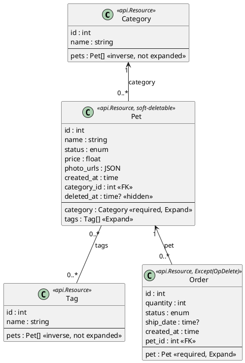
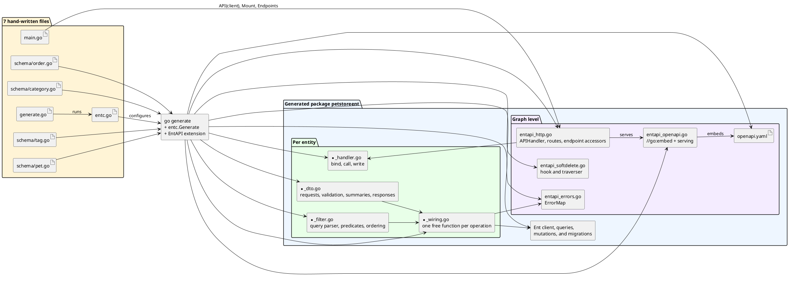
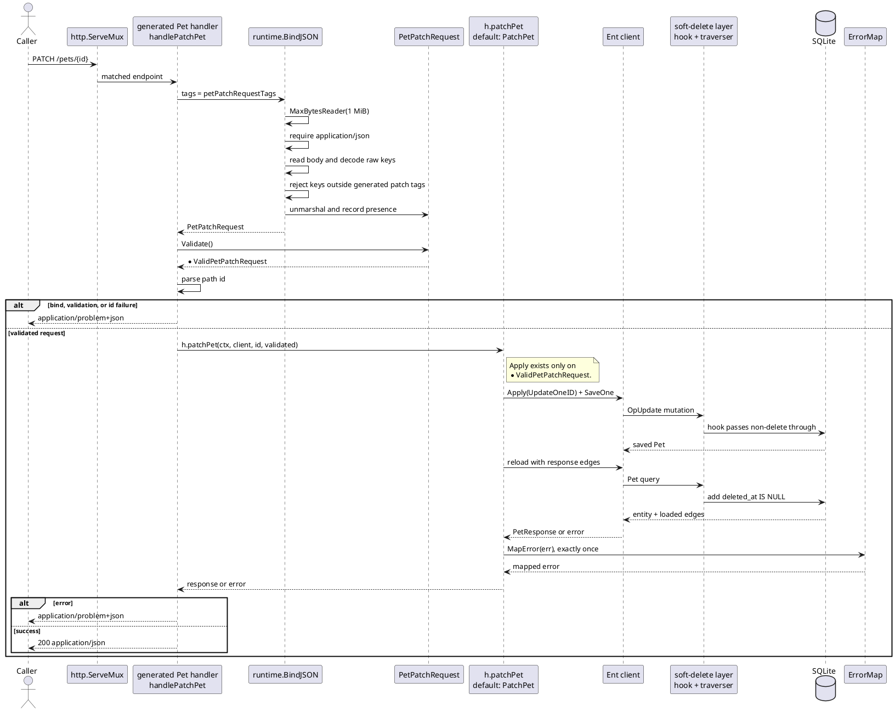

# EntAPI petstore architecture

This document explains how seven hand-written files become a complete HTTP API, from the Ent entity model through generated DTOs, query parsing, wiring, handlers, soft deletion, and OpenAPI. It also explains why the example uses these particular relationships and annotations: each one makes a generated behavior visible without adding application-specific layers.

## The entity model



Every pet belongs to exactly one category, while a category may contain any number of pets. This is a required many-to-one edge backed by `category_id`; `edge.Field("category_id")` makes that foreign key part of the reachable create family instead of leaving the generated request with no way to satisfy the edge.

Pets and tags use a many-to-many edge because labels cross category boundaries and neither side owns a foreign key. The pet side has `api.Expand()`, so pet responses contain tag summaries. The inverse `Category.pets` and `Tag.pets` edges exist for Ent traversal but are deliberately not expanded, so category and tag responses do not grow collections of pets.

Every order belongs to one pet, again as a required many-to-one edge with an explicit `pet_id` field. The order expands its pet, but the result is a `PetSummary`, not another full `PetResponse`. `Pet` is soft-deletable, while `Order` excludes the public delete operation with `Except(api.OpDelete)`.

## Hand-written versus generated



The schemas, `entc.go`, and `generate.go` describe and drive generation; `main.go` supplies the database, seed data, and outer mux. The four per-entity layers keep mechanical concerns separate: DTOs own wire shapes and validation, filters own the typed query surface, wiring owns the default operation, and handlers own HTTP binding and response writing. The graph-level files hold facts shared by every entity: the route tree, error classifier, soft-delete policy, and the embedded OpenAPI document.

Every file written by the EntAPI extension carries `Code generated by entapi extension` on its first line. That marker is the ownership contract used by stale-file cleanup. Delete the marker line from an EntAPI-generated file and the generator will treat the file as yours rather than replace or remove it.

## A request's path

The default `PATCH /pets/{id}` path is deliberately short:



The handler reads `h.patchPet` when the request arrives because `With` replaces the entire operation function. Capturing `PatchPet` while constructing the route would make that replacement ineffective. There is no hook chain inside the handler: it always binds, calls one function field, and writes. Cross-cutting HTTP behavior belongs in middleware around the returned handler; Ent hooks and interceptors remain at the persistence layer.

## Why the example is shaped this way

### Soft delete belongs to Ent, not wiring

`DeletePet` issues an ordinary `DeleteOneID`, and `DeleteBatchPets` issues an ordinary `Delete`; neither wiring function knows that Pet is soft-deletable. The generated Ent hook recognizes both `OpDeleteOne` and `OpDelete`, changes the operation to an update, and stamps `deleted_at`. The traverser adds `deleted_at IS NULL` to every Pet query, including hand-written queries and Pet queries created by eager loading.

The policy does not cascade. Deleting a pet leaves an order's `pet_id` intact, while the eager-loaded Pet query hides the tombstoned target. The README transcript's surviving order with `"pet": null` is the observable result of those two facts, not special handling in order wiring.

### Except removes dependencies on an absent endpoint

`Except(api.OpDelete)` removes `DELETE /orders/{id}`, `DeleteOrderEndpoint`, and the delete handler customization type. Code that tries to fetch or replace the removed endpoint therefore fails to compile. `DeleteOrder` and `DeleteBatchOrders` remain generated as free wiring functions for in-process use because `Except` narrows the public HTTP surface, not the service capability.

### Summaries stop expansion structurally

Expanded edges contain summaries, and every generated summary carries scalar fields but no edges. An order response can contain a pet summary, but that summary cannot recursively contain its category or tags. The generated type graph therefore bounds expansion at one level without a depth counter, a visited set, or a runtime recursion policy.

### Required edges expose their foreign keys

The create families for Pet and Order are reachable, and both entities have a required many-to-one edge. EntAPI requires such an edge to declare `edge.Field(...)`; otherwise the generated create request could not provide the required relationship. The explicit `category_id` and `pet_id` fields are therefore part of the API contract, not duplicate convenience fields.

## Regenerating

Run generation from the example directory:

```bash
go generate ./...
```

Then format from the repository root:

```bash
make fmt
```

After a successful run, marker-based cleanup scans the generated package and removes stale EntAPI outputs that were generated previously but not written this time. A file whose first-line marker was removed is outside that cleanup surface.

For runnable commands and complete request/response transcripts, see the petstore [`README.md`](README.md). For the generator's package boundaries, generation pipeline, and repository-wide design rules, see the root [`docs/ARCHITECTURE.md`](../../docs/ARCHITECTURE.md).
